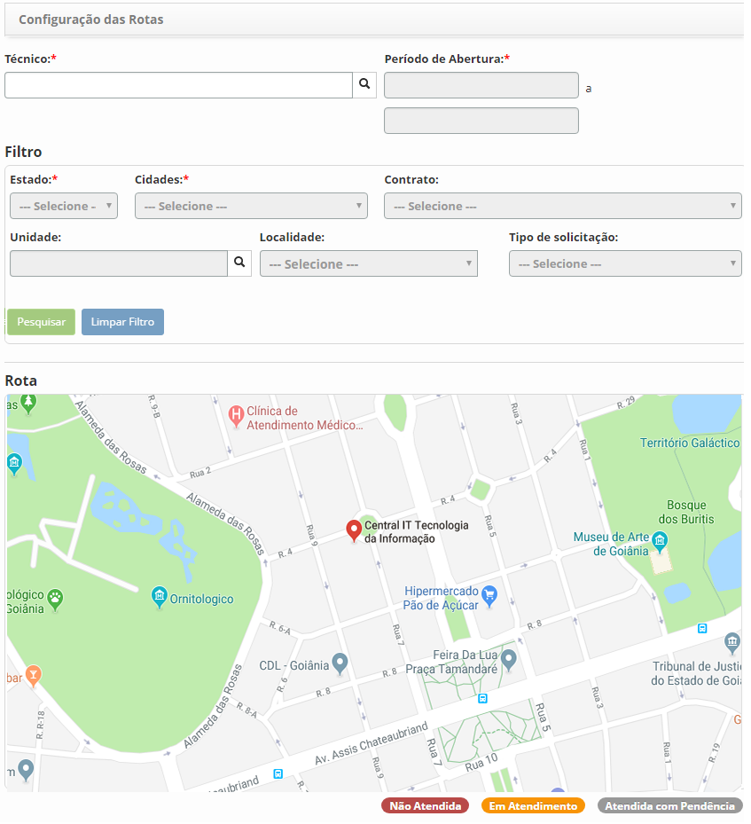
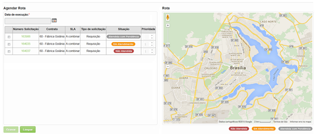
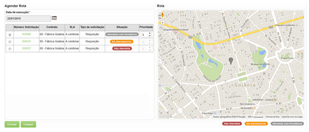

title: Configuração das rotas diárias
Description: Esta funcionalidade tem por objetivo configurar a agenda diárias dos técnicos de campo.

# Configuração das rotas diárias

Esta funcionalidade tem por objetivo configurar a agenda diárias dos técnicos de
campo. Após a configuração, o técnico terá uma lista de solicitações que serão
atendidas por ele via Mobile.

Como acessar
-----------

1.  Acesse a funcionalidade de Configuração de Rotas Diárias através da
    navegação no menu principal **Gestão Integrada > Gerência de Força de
    Atendimento > Gerência de Rotas Diárias**.

Pré-condições
------------

1.  Configurar a conexão do sistema com as API's do Google (ver
    conhecimento [Manual de configuração do servidor para uso do CITSmart ITSM
    Enterprise (iOS e Android)][1] - seções 5 a 7).

Filtros
-------

1.  Os seguintes filtros possibilitam ao usuário restringir a participação de
    itens na listagem padrão da funcionalidade, facilitando a localização dos
    itens desejados:

    -   **Técnico**: informar o nome do técnico responsável pelo atendimento de
    solicitações de serviços;

    -   **Período de Abertura**: informar o período de abertura das solicitações de
    serviços;

    -   **Estado**: informar o estado da unidade da solicitação de serviço;

    -   **Cidades**: informar a cidade da unidade da solicitação de serviço;

    -   **Contrato**: informar o contrato da solicitação de serviço;

    -   **Unidade**: informar a unidade de negócio do contrato da solicitação de
    serviço;

    -   **Localidade**: informar a localidade da unidade;

    -   **Tipo de solicitação**: informar o tipo de solicitação de serviço que
    deseja verificar.

    

    **Figura 1 - Tela de pesquisa de rota**

Listagem de itens
----------------

1.  Não se aplica.

Preenchimento dos campos cadastrais
----------------------------------

1.  Não se aplica.

Configuração das rotas
---------------------

1.  Será apresentada a tela de **Configuração das Rotas**, conforme ilustrada na
    figura a seguir. Nesta tela, permite realizar a pesquisa de solicitações de
    acordo com os filtros informados, ou seja, de acordo com sua necessidade, a
    fim de direcionar as solicitações abertas para serem atendidas pelo técnico
    de campo:

    
    
    **Figura 2 - Tela de configuração das rotas**

2.  Defina os filtros conforme sua necessidade;

3.  Após os filtros definidos para pesquisa das solicitações de serviços, clique
    no botão *Pesquisar*. Serão apresentadas as solicitações, as quais o técnico
    tem permissão de execução, com a seguinte situação:

    -   **Não Atendida**: solicitação que foi direcionada para um técnico e está
    disponível para o atendimento;

    -   **Em Atendimento**: solicitação que está em andamento, ou seja, que está
    sendo atendida pelo técnico;

    -   **Atendida com Pendência**: solicitação que está com o atendimento suspenso.

    
    
    **Figura 3 - Solicitações de serviços**

4.  Direcione a(s) solicitação(ões) de serviço(s) disponível(is) para o técnico
    realizar o atendimento:

    -   Caso seja necessário visualizar os detalhes de uma solicitação de serviço,
    clique sobre o número da mesma;

    -   Selecione a(s) solicitação(ões) que será(ão) atendida(s) pelo técnico;

    -   Informe a prioridade do atendimento da(s) solicitação(ões) de serviço(s);

    -   No campo **Data de execução**, informe a data prevista para execução da(s)
    solicitação(ões);

    -   Após selecionar a(s) solicitação(ões), será(ão) apresentado(s) no mapa o(s)
    marcador(es) da rota que o técnico deverá seguir.

    
    
    **Figura 4 - Solicitações de serviços**

   !!! note "NOTA"

       Ao clicar no marcador da rota, no mapa, serão apresentadas as informações
       da solicitação de serviço.

5.  Clique no botão *Gravar* para efetuar a operação, onde a data, hora e
    usuário serão gravados automaticamente para uma futura auditoria.

    !!! info "IMPORTANTE"

        Após a gravação, será enviada uma notificação para o técnico, onde ele
        poderá verificar pelo aplicativo CITSmart Enterprise ITSM Mobile a(s)
        solicitação(ões) que será(ão) atendida(s) por ele.

!!! tip "About"

    <b>Product/Version:</b> CITSmart | 8.00 &nbsp;&nbsp;
    <b>Updated:</b>07/22/2019 – Anna Martins

[1]:/pt-br/citsmart-platform-7/additional-features/mobile-and-field-service/configuration/app-android-ios.html
