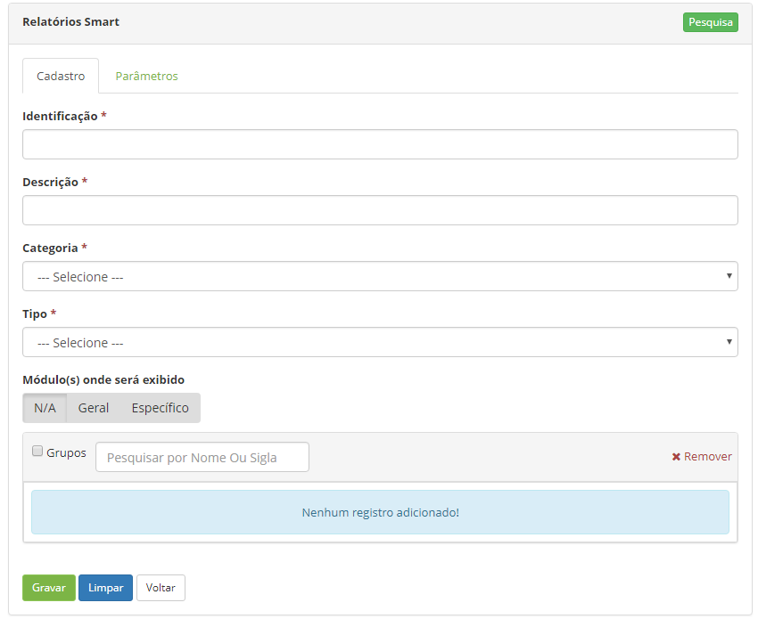

title: Gerador de relatórios Smart
Description: Esta funcionalidade tem o objetivo de prover a facilidade de elaboração de relatórios personalizados com os dados das funcionalidades requeridas.

# Gerador de relatórios Smart

Esta funcionalidade tem o objetivo de prover a facilidade de elaboração de
relatórios personalizados com os dados das funcionalidades requeridas, sem
necessidade de novas atualizações ou softwares adicionais.

Como acessar
-----------

1.  Acesse o menu principal **Relatórios > Relatórios Smart > Gerador de
    Relatórios Smart**.

Pré-condições
-------------

1.  Ter um sub relatório cadastrado.

Filtros
------

1.  O seguinte filtro possibilita ao usuário restringir a participação de itens
    na listagem padrão da funcionalidade, facilitando a localização dos itens
    desejados.

    -   Nome.

2.  Na tela de **Relatórios Smart**, é apresentado um campo de filtro para
    realizar a busca de determinados registros, conforme ilustrada na figura
    abaixo:

    
    
    **Figura 1 - Tela de pesquisa de relatórios**

3.  Para realizar a busca de um registro específico, informe o nome do
    relatório. Após isso, será exibido o determinado registro conforme o filtro
    informado.

Listagem de itens
-----------------

1.  Os seguintes campos cadastrais estão disponíveis ao usuário para facilitar a
    identificação dos itens desejados na listagem padrão da
    funcionalidade: ID, Nome, Categoria, Tipo de Consulta e Tipo de
    Relatório.

2.  Existem botões de ação disponíveis ao usuário em relação a cada item da
    listagem, são eles: *Editar* e *Excluir*.

    
    
    **Figura 2 - Tela de listagem de relatório smart**

3.  Para verificar e/ou alterar os dados do registro de relatório, clique no
    botão *Editar* e após isso, será direcionado para a tela de cadastro
    exibindo o conteúdo referente ao registro selecionado.

4.  Para importar um relatório (arquivo .citreport), clique no botão *Importar*.

Preenchimento dos campos cadastrais
----------------------------------

1.  Selecionado o botão *Novo* (conforme a figura anterior ), será exibida a
    tela de **Construção de Relatórios** **Smart**, conforme ilustrada na figura
    a seguir:

    !!! info "IMPORTANTE"

         A biblioteca D3 ([https://d3js.org](https://d3js.org/)/) de gráficos poderá
         ser utilizada na criação de relatórios do tipo JSP.

    
    
    **Figura 3 - Tela de construção de relatórios smart**

2.  Preencha os campos conforme orientações abaixo:

    -   **Identificação**: informe a identificação do relatório que deseja criar;

    -   **Descrição**: informe o nome do relatório que deseja criar;

    -   **Categoria**: selecione a categoria em que o relatório pertencerá;

    -   **Tipo**: selecione o tipo de consulta do relatório:

    !!! warning "ATENÇÃO"

        Para se criar um Sub Relatório o mesmo já deve estar cadastrado e o "Tipo
        de consulta" deverá ser SQL.

    -   **SQL** - Utilizar esse tipo para criar relatório que retorna as informações
    do Banco de Dados através de uma Query. Ao selecionar esse tipo serão
    exibidas as abas "Designer" e "SQL" e campo de "Regra de Negócio", ao
    selecionar essa opção serão apresentados novos campos, conforme figura
    abaixo:

    
    
    **Figura 4 - Tela de campos ao selecionar Tipo SQL**

    -   **RhinoScript** - Utilizar esse tipo para criar relatório que retorna as
    informações do Banco de Dados através de um Script. Ao selecionar esse tipo
    será exibido a aba "RhinoScript";

    -   **JSP** - Utilizar esse tipo para criar relatório com conteúdo dinâmico. Ao
    selecionar esse tipo será exibido a aba "JSP" na qual poderá informar o
    código JSP.

    -   **Tipo de relatório**: selecione o tipo de relatório que deseja criar:

    !!! warning "ATENÇÃO"

         Para se criar um Sub Relatório (Drill) o " Tipo de relatório" deverá
         ser "Gráfico de pizza" ou " Gráfico de Barra".

       -  **Template**- Utilizar esse tipo para criar um relatório com design e
    estrutura desejada. Para criação do relatório com esse tipo, basta
    selecionar o tipo, informar o RhinoScript ou SQL no campo referente,
    informar o FreeMarker (framework de template) no em "Template" e os
    parâmetros se for necessário;

       -   **Gráfico de linha**- Utilizar esse tipo para criar relatório que exibe
    as informações em gráfico de linha;

       -   **Gráfico de pizza**- Utilizar esse tipo para criar relatório que exibe
    as informações em gráfico de pizza:

       -   **Gráfico de barra**- Utilizar esse tipo para criar relatório que exibe
    as informações em gráfico de barra, ao selecionar a opção "pizza" ou
    "barra", serão apresentados novos campos, conforme figura abaixo:

    

    **Figura 5 - Tela de campos ao selecionar "Gráfico de pizza" ou "Gráfico de barra"**

       -  **Data table** - Utilizar esse tipo para criar relatório que inclua
    todos os dados de uma determinada tabela;

       -  **Cubo** - Utilizar esse tipo para criar uma consulta que permite o
    cruzamento de informações para fornecer dados ao relatório;

       -  **Retorna HTML** - Utilizar esse tipo para criar relatório com HTML.

    -   **Módulo onde será exibido**: escolha uma opção onde o relatório será
    exibido;

       -  **N/A**: selecione essa opção, caso queira que o relatório não seja exibido
    em nenhum módulo;

       -  **Geral**: selecione essa opção para exibição do relatório em um ou mais
    módulos, onde deseja que o relatório seja exibido;

       -  **Específico**: selecione um único módulo onde deseja que o relatório seja
    exibido.

    -   **Grupos**: informe o grupo que terá permissão para visualizar o relatório;

    -   Na aba "Parâmetros", informe os parâmetros referentes ao tipo de consulta e
    relatório selecionado.

3.  Após construção do relatório, clique no botão *Gravar* para efetuar o
    registro, neste caso a data, hora e usuário serão armazenados
    automaticamente para uma futura auditoria.

    !!! info "IMPORTANTE"

        Os relatórios criados serão exibidos na tela de Relatórios Smart, onde
        poderá visualizar os dados pertinentes de cada relatório.

Exportando relatório smart
------------------------

1.  Para exportar um relatório, é necessário, primeiramente realizar a consulta
    do relatório desejado, conforme descrito no item “Verificando os Registros
    de Relatórios Smart”.

2.  Após a consulta, basta clicar no botão *Exportar*.

!!! tip "About"

    <b>Product/Version:</b> CITSmart | 8.00 &nbsp;&nbsp;
    <b>Updated:</b>07/19/2019 – Anna Martins
