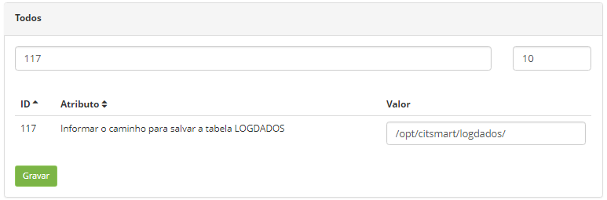
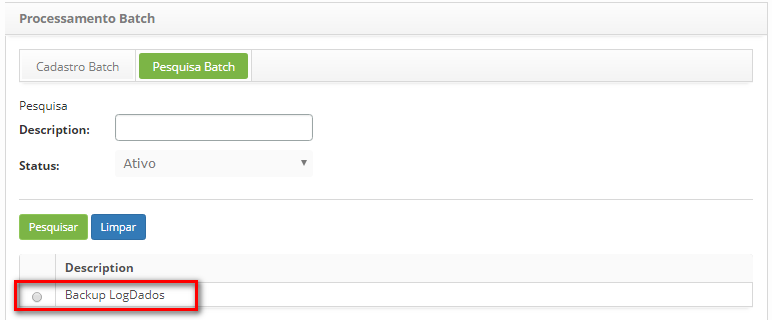
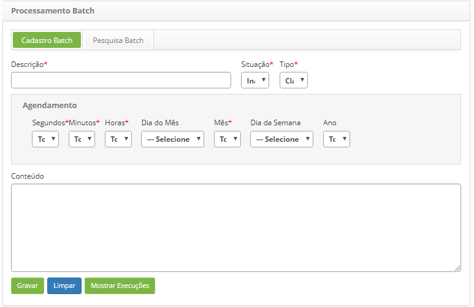
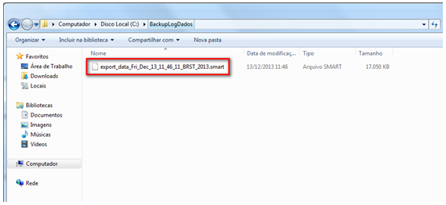

title: Manual de execução de backup da tabela Logdados

Description: Este documento tem o objetivo de fornecer as orientações necessárias para configurar a rotina de backup da Tabela LogDados.

# Manual de execução de backup da tabela Logdados

Tabela logdados
-------------

É uma tabela que contém o registro de eventos relevante do CITSmart. Esse
registro pode ser utilizado para auxiliar o suporte a restabelecer o estado
original do sistema ou para que um administrador conheça o seu comportamento no
passado. O arquivo de LogDados pode ser utilizado para auditoria e diagnóstico
de problemas no sistema.

Backup da tabela logdados
------------------------

Para realizar o backup da Tabela LogDados, proceda conforme os passos descritos
abaixo:

1.  Em **Sistema > Parâmetros CITSmart**, realize a pesquisa do parâmetro “117 –
    Informar o caminho para salvar a tabela LOGDADOS” (ver conhecimento [Regras
    de parametrização - Sistema](1));

    
    
    **Figura 1 - Parâmetro do LOGDADOS**

2.  Informe no campo Valor o caminho do diretório, onde será salvo o arquivo de
    LogDados e clique no botão Gravar para efetuar a operação;

    !!! info "IMPORTANTE"

        Caso não seja informado o caminho do diretório, o arquivo de LogDados será
        salvo na raiz do projeto, na pasta “exportXML.

3.  Após configuração do parâmetro, em **Sistema > Processamento Batch**,
    realize a pesquisa da rotina de Backup de LogDados e selecione a mesma,
    conforme indicado na imagem abaixo:

    
    
    **Figura 2 - Processamento BATCH**

4.  Será exibida a tela de Cadastro Batch para configuração do horário de
    execução da rotina de backup da Tabela LogDados;

    
    
    **Figura 3 - Processamento BATCH**

5.  Defina o horário desejado:

    -   Informe os segundos, minutos, horas, dia do mês, mês, dia da semana e ano
    para execução da rotina de backup da Tabela LogDados.

6.  Após fornecer as informações necessárias, clique no botão Gravar para
    efetuar a operação;

7.  Feito isso, no determinado horário configurado, será gerado o arquivo de
    LogDados e gravado no diretório que foi informado no parâmetro 177, conforme
    apresentado na imagem abaixo:

**Figura 4 - O arquivo**

[1]:/pt-br/citsmart-platform-7/plataform-administration/parameters-list/parametrization-system.html

!!! tip "About"

    <b>Product/Version:</b> CITSmart | 8.00 &nbsp;&nbsp;
    <b>Updated:</b>07/26/2019 – Anna Martins
