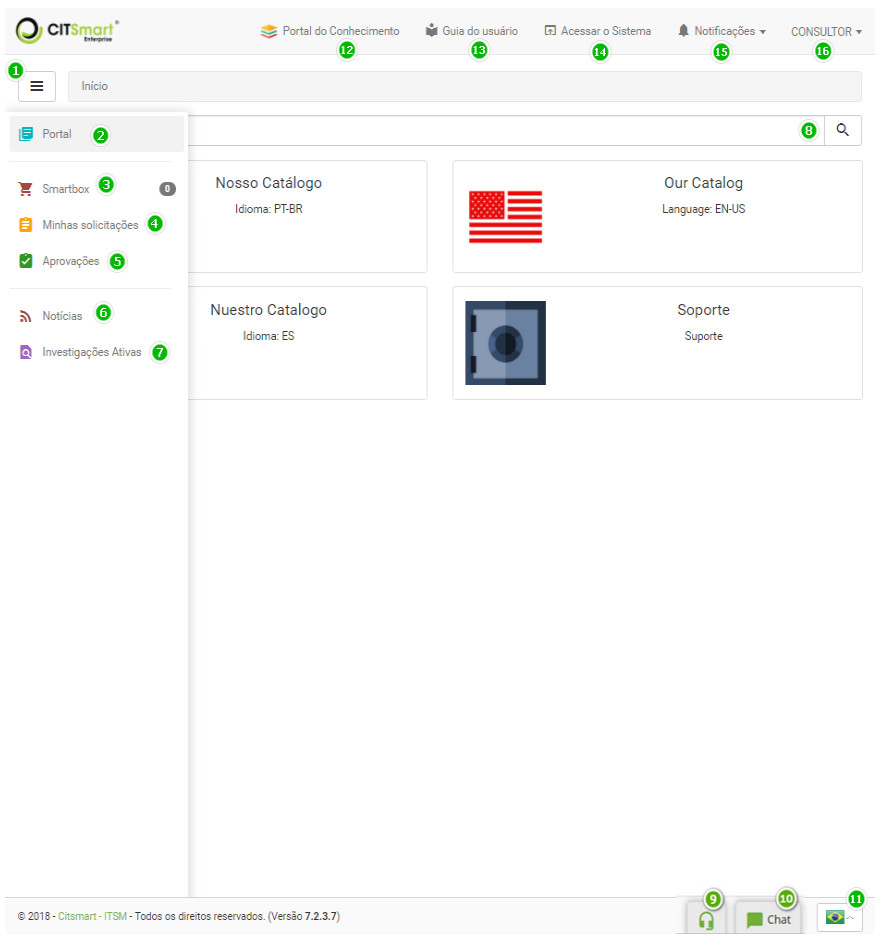

title:  Smart Portal (Portal de Serviços)
Description: O Smart Portal é um recurso da solução que disponibiliza o Catálogo de Serviços. 
# Smart Portal (Portal de Serviços)

O Smart Portal é um recurso da solução que disponibiliza o Catálogo de Serviços (Negócio e Apoio) aos usuários do sistema e entre 
outras informações, como:

- Solicitações de Serviços;
- Notícias referente ao sistema;
- Chat.

Pré-condições
-----------------

1. Para habilitar o Smart Portal como página principal do sistema, é necessário ativar o parâmetro **“Habilitar Portal como tela
inicial do CITSmart”**.

Conhecendo o Smart Portal
---------------------------

1. Após habilitar o Smart Portal, ao realizar o login será exibido o mesmo, conforme ilustrado na figura abaixo:

    
    
    **Figura 1 - Smart Portal**
    
     **Botão de menu**: ao clicar neste botão, permite esconder/exibir o menu do Smart Portal;
    
     **Barra de navegação**: permite navegar entre os serviços;
    
     **Portal**: permite voltar à tela inicial do Smart Portal;
    
     **Minhas solicitações**: permite ao usuário logado visualizar suas solicitações de serviços e 
    executar algumas ações nas mesmas;
    
     **Aprovações**: permite ao usuário logado visualizar somente as solicitações de serviços que requer
    aprovação;
    
     **Notícias**: local onde é disponibilizado as notícias, como por exemplo, referente à organização,
    ao sistema, etc.;
    
     **Investigações Ativas**: que permite buscar/acompanhar as atividades registradas ;
    
     **Pesquisa**: permite buscar os serviços disponíveis no portal;
    
     **WebRTC**: permite ao usuário ligar para o helpdesk usando a tecnologia Real-Time Communications
    (RTC), visível somente se os parâmetros Voip estiverem configurados;
    
     **Chat**: permite criar uma solicitação de serviço e interagir com o atendente sobre a mesma;
    
     **Idioma**: permite escolher o idioma que deseja para o sistema (Português, Inglês ou Espanhol), 
    o qual é representado pela bandeira do país.
    
     **Portal do Conhecimento**: ao clicar nesta opção, será apresentada a tela do portal do 
    conhecimento, onde permite realizar a busca de informações relevantes, como por exemplo, a respeito do uso do sistema;
    
     **Guia do Usuário**: ao clicar nesta opção, será apresentada a tela do portal do conhecimento,
    onde permite realizar a busca de informações relevantes, como por exemplo, a respeito de um produto específico;
    
     **Acessar o Sistema**: permite entrar no sistema;
    
     **Notificações**: local onde apresenta as mensagens de alerta do sistema;
    
     **Identificação do usuário**: ao clicar nesta opção, são exibidas as funções para alterar a 
    senha de acesso e sair do sistema.
    
!!! tip "About"

    <b>Product/Version:</b> CITSmart | 7.00 &nbsp;&nbsp;
    <b>Updated:</b>07/29/2019 - Larissa Lourenço
