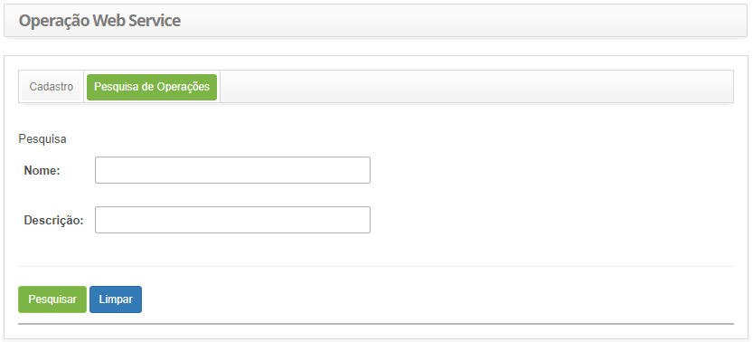
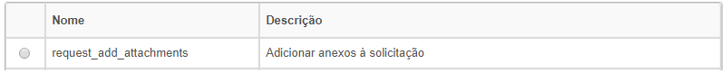
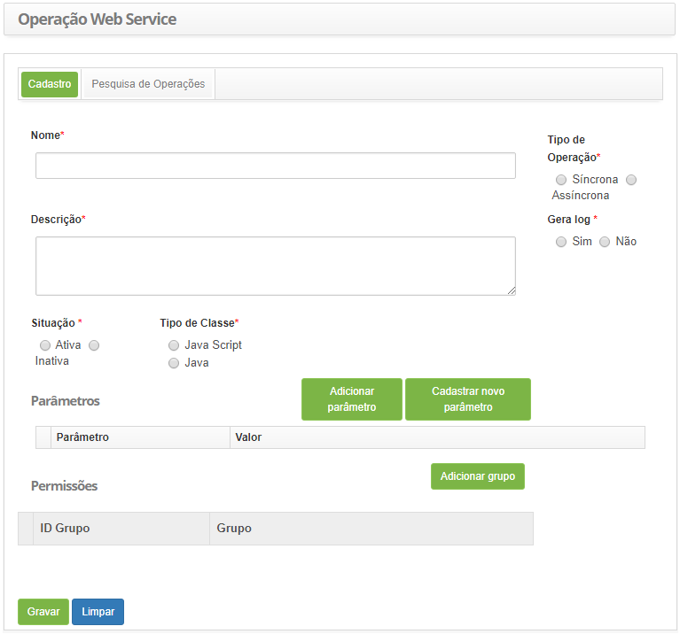
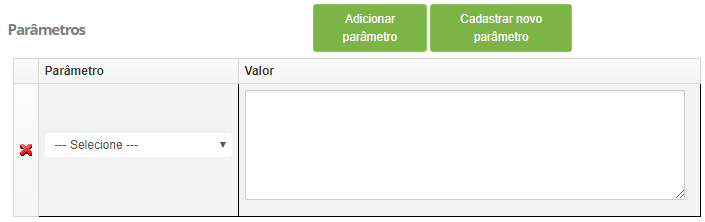
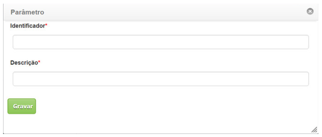

title: Cadastro e pesquisa de operações webservice
Description: Os Web Services do CITSmart estão configurados para inclusão, atualização, consulta e cancelamento de solicitações de serviço (incidentes e
requisições).

# Cadastro e pesquisa de operações webservice

Web Service é uma solução utilizada na integração de sistemas e na comunicação
entre aplicações diferentes, que permitem o envio e recebimento de dados no
formato XML. Os Web Services do CITSmart estão configurados para inclusão,
atualização, consulta e cancelamento de solicitações de serviço (incidentes e
requisições).

Como acessar
------------

1.  Acesse a funcionalidade de operação web service através da navegação no
    menu principal **Sistema > Web Service > Operação de Web Service**.

Pré-condições
------------

1.  Não se aplica.

Filtros
-------

1.  Os seguintes filtros possibilitam ao usuário restringir a participação de
    itens na listagem padrão da funcionalidade, facilitando a localização dos
    itens desejados:

    -   Nome;

    -   Descrição.

2.  Na tela de **Operação Web Service**, clique na guia **Pesquisa de
    Operações**, será apresentada a tela de pesquisa conforme ilustrada na
    figura abaixo:

    
    
    **Figura 1 - Tela de pesquisa de operações**

3.  Realize a pesquisa de operação;

4.  Informe o nome e/ou descrição da operação e clique no botão *Pesquisar*.
    Após isso, será exibido o registro conforme os dados informados;

5.  Caso deseje listar todos os registros de operações, basta clicar diretamente
    no botão *Pesquisar*.

Listagem de itens
----------------

1.  Os seguintes campos cadastrais estão disponíveis ao usuário para facilitar a
    identificação dos itens desejados na listagem padrão da
    funcionalidade: Nome e Descrição.

    
    
    **Figura 2 - Tela de listagem de operação web service**

2.  Após a pesquisa, selecione o registro desejado. Feito isso, será direcionado
    para a tela de cadastro exibindo o conteúdo referente ao registro
    selecionado;

3.  Para alterar os dados da operação, basta modificar as informações desejadas
    e clicar no botão *Gravar*.

Preenchimento dos campos cadastrais
---------------------------------

1.  Será apresentada a tela **Operação Web Service**, para realização do
    cadastro de operação web service, conforme ilustrada na figura abaixo:

    
    
    **Figura 3 - Tela de cadastro de operação Web Service**

2.  Preencha os campos conforme orientações abaixo:

    -   **Nome**: informe o nome da operação;

    -   **Tipo de Operação**: informe o tipo de operação, marcando umas das opções:
    Síncrona ou Assíncrona;

    -   **Descrição**: informe a descrição da operação;

    -   **Gera log**: informe se será gerado log, marcando umas das opções: Sim ou
    Não;

    -   **Situação**: selecione a situação da operação, marcando umas das opções:
    Ativo ou Inativa;

    -   **Tipo de Classe**: informe o tipo de classe, marcando umas das opções: Java
    Script ou Java;

    -   **Parâmetros**: se houver, defina os parâmetros da operação.

3.  Para adicionar um parâmetro, clique no botão *Adicionar Parâmetro*, e será
    apresentada a tabela para preenchimento do mesmo, conforme ilustração
    abaixo:

    
    
    **Figura 4 - Preenchimento de parâmetro**

    -   Selecione o parâmetro desejado;

    -   Informe um valor para o parâmetro;

    -   Se desejar excluir o parâmetro, basta clicar no ícone   e confirmar a
    exclusão do mesmo;

    -   Para cadastrar novo parâmetro, clique no botão *Cadastrar novo parâmetro*, e
    será apresentada a tela para cadastro de novo parâmetro, conforme ilustração
    abaixo:

    
    
    **Figura 5 - Tela de cadastro de parâmetro**

    -   **Identificador**: informe o identificador do parâmetro;

    -   **Descrição**: informe a descrição do parâmetro;

4.  Clique no botão *Gravar* para efetuar o registro de novo parâmetro.

    -   **Permissões**: vincule o(s) grupo(s) que poderá(ão) executar a operação do
    web service.

5.  Clique no botão *Adicionar Grupo*. Feito isso, será apresentada uma tela
    para pesquisa de grupos;

6.  Realize a pesquisa, selecione o grupo e o mesmo será apresentado no quadro
    de permissões;

7.  Para excluir o vínculo do grupo com a permissão, clique no ícone do mesmo;

8.  Clique no botão *Gravar* para efetuar o registro, onde a data, hora e
    usuário serão gravados automaticamente para uma futura auditoria.

!!! note "NOTA"
   
     Para inserir no sistema as operações default do web service, deve-se
     executar a carga dos scripts web service.

!!! tip "About"

    <b>Product/Version:</b> CITSmart | 8.00 &nbsp;&nbsp;
    <b>Updated:</b>7/26/2019 – Anna Martins
