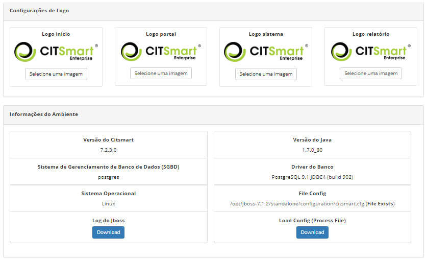

Title: Manual de configurações de ambiente
Descrição: Objetivo facilitar uma eventual intervenção (correção) direto no ambiente (servidor) e alterar os logos do sistema.
# Manual de configurações de ambiente

A funcionalidade de Configuração de Ambiente tem por objetivo facilitar uma eventual intervenção (correção) direto no ambiente
(servidor) e alterar os logos do sistema.

Como acessar
-------------

1. Acesse o menu principal **Sistema > Configurações > Configurações de Ambiente**.

Pré-condições
---------------

1. Não se aplica.

Filtros
---------

1. Não se aplica.

Listagem de itens
------------------

1. Não se aplica.

Preenchimento dos campos cadastrais
------------------------------------

1. Não se aplica.

Verificando as configurações do ambiente
------------------------------------------

1. Será apresentada a tela de **Configurações de Ambiente**, na qual poderá alterar o logo do sistema, verificar as informações do 
ambiente e realizar o download do Log do Jboss. A figura abaixo ilustra essa tela:

    
    
    **Figura 1 - Tela de configuração de ambiente**
    
2. Para trocar os logos do sistema (**logo início** - exibida na tela de login do sistema, **logo portal** - exibida no smart 
portal, **logo sistema** - exibida nas demais telas do sistema), basta clicar no botão "Selecionar uma imagem";

3. Para realizar o download do Log do Jboss, basta clicar no botão "Download" referente. O Log do Jboss possibilita uma correção
rápida de um eventual problema.

	
!!! tip "About"

    <b>Product/Version:</b> CITSmart | 7.00 &nbsp;&nbsp;
    <b>Updated:</b>07/23/2019 - Larissa Lourenço
