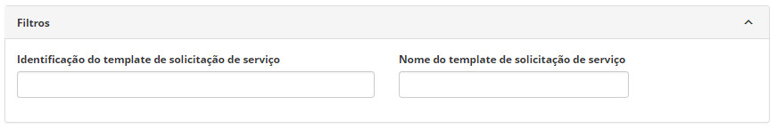
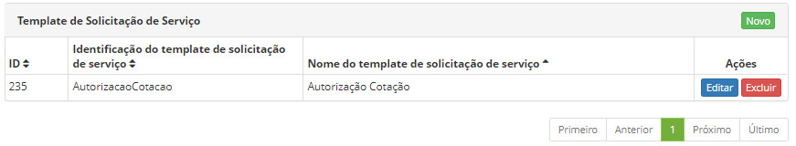
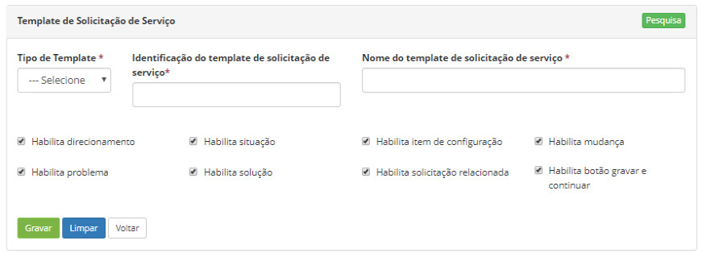
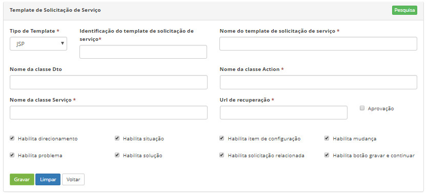
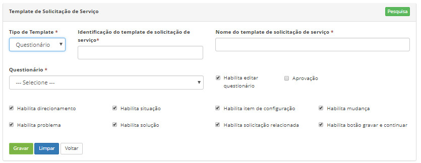
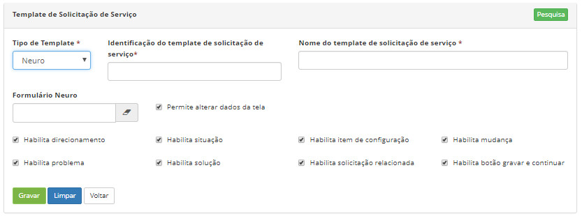

title: Cadastro e pesquisa de template de solicitação de serviço
Description: habilitar algumas funcionalidades na tela de solicitação de serviço (ticket).
# Cadastro e pesquisa de template de solicitação de serviço

Esta funcionalidade tem o objetivo de habilitar algumas funcionalidades na tela de solicitação de serviço (ticket).

Como acessar
-------------

1. Acesse a funcionalidade de Template de Solicitação de Serviço através da navegação no menu principal 
**Sistema > Template de Solicitação de Serviço**.

Filtros
---------

1. O seguinte filtro possibilita ao usuário restringir a participação de itens na listagem padrão da funcionalidade, facilitando a
localização dos itens desejados:

    - Identificação do template de solicitação de serviço;
    - Nome do template de solicitação de serviço.
    
    
    
    **Figura 1 - Pesquisa de template**
    
2. Realize a pesquisa de template digitando o nome ou a identificação do template desejado;

3. A tela da funcionalidade no seu estado inicial apresenta uma listagem dos templates de solicitação de serviço já cadastrados.

Listagem de itens
--------------------

1. Os seguintes campos cadastrais estão disponíveis ao usuário para facilitar a identificação dos itens desejados na listagem padrão
da funcionalidade: **ID, Identificação do template de solicitação de serviço** e **Nome do template de solicitação de serviço**.

2. Existem botões de ação disponíveis ao usuário em relação a cada item da listagem, são eles: "Editar" e "Excluir".

    
    
    **Figura 2 - Tela de listagem de template de solicitação de serviço**
    
3. Para alterar os dados do registro de template de solicitação de serviço, basta clicar no botão "Editar" e modificar as
informações desejadas e clicar no botão "Gravar".

Preenchimento dos campos cadastrais
-------------------------------------

1. Ao clicar no botão "Novo" (conforme a figura anterior), será apresentado a tela de **Cadastro de Template de Solicitação de 
Serviço**:

    
    
    **Figura 3 - Tela de cadastro de template**
    
2. Preencha os campos conforme orientações abaixo:

    - **Tipo de Template**: informe o tipo de template de solicitação de serviço:
        - **JSP**: ao selecionar esta opção, novos campos de cadastros deverão ser preenchidos;
        - **Questionário**: ao selecionar esta opção, novas opções de cadastros poderão ser escolhidas;
        - **Neuro**: ao selecionar esta opção, o campo de vinculação de formulário Neuro e página Neuro são disponibilizados. 
        Também é possível eleger a **versão** do formulário ao clicar no botão Versão específica do formulário.
        
3. Clique no botão "Gravar" para efetuar o registro, neste caso a data, hora e usuário serão armazenados automaticamente para uma 
futura auditoria;

4. Para retornar a tela de pesquisa, clique em "Pesquisa".

Template do tipo JSP
---------------------

Esta funcionalidade permite personalizar a tela de serviços com referência, principalmente, na gerência de compras e viagens. 
Dentro do tipo JSP existem sub-tipos previamente cadastrados. A utilidade deste tipo de template só é observada nas versões 
anteriores à 7.2.3.9.*

!!! warning "ATENÇÃO"

    Esta classe de template deverá ser manipulada por analista que possua conhecimento de programação JAVA.
    
Pré-condições
--------------

1. Não se aplica.

Preenchimento dos campos cadastrais
-------------------------------------

1. No campo **Tipo de Template**, ao selecionar a opção **JSP**, a seguinte tela será disponibilizada:

    
    
    **Figura 4 - Template do tipo JSP**
    
2. Preencha os campos conforme orientações abaixo:

    - **Identificação do template de solicitação de serviço**: informe a identificação do template de solicitação de serviço 
    (nome da identificação não permite espaçamento);
    - **Nome do template de solicitação de serviço**: informe o nome do template de solicitação de serviço (nome do template
    permite espaçamento);
    - **Nome da classe Dto**: informe o nome da classe DTO;
    - **Nome da classe Action**: informe o nome da classe Action;
    - **Nome da classe Serviço**: informe o nome da classe Serviço;
    - **Url de recuperação**: informe a URL de recuperação;
    - **Aprovação**: marque esta opção quando cadastrar template de solicitação de serviços que necessitam de aprovações de 
    instâncias superiores.
    - **Habilita direcionamento**: habilita a funcionalidade para direcionamento de um ticket a um grupo especifico;
    - **Habilita situação**: habilita a escolha da etapa em que se encontra o ticket na tela de solicitação de serviço 
    (Registrada/Em andamento; Resolvida e Cancelada);
    - **Habilita item de configuração**: habilita a vinculação de item de configuração ao ticket na tela de gerenciamento da
    solicitação de serviço;
    - **Habilita mudança**: habilita a funcionalidade de vinculação de uma mudança ao ticket na tela de gerenciamento da 
    solicitação de serviço;
    - **Habilita problema**: habilita a funcionalidade vinculação de um problema ao ticket na tela de gerenciamento da 
    solicitação de serviço;
    - **Habilita solução**: habilita o campo de solução resposta à solicitação de serviço resolvida;
    - **Habilita solicitação relacionada**: habilita a funcionalidade de vinculação de uma solicitação relacionada ao ticket na 
    tela de gerenciamento do mesmo;
    - **Habilita botão gravar e continuar**: habilita o botão "gravar e avançar o fluxo"  
    localizado no canto direito inferior da tela de gerenciamento de solicitação de serviço.
    
    !!! info "IMPORTANTE"
    
        Os campos de "habilitação" vem por default selecionados.
        
3. Clique no botão "Gravar" para efetuar o registro, neste caso a data, hora e usuário serão armazenados automaticamente para 
uma futura auditoria;

4. Para retornar a tela de pesquisa, clique em "Pesquisa".

Template do tipo Questionário
-------------------------------

Pré-condições
---------------

1. Ter ao menos um questionário cadastrado (ver conhecimento [Cadastro e pesquisa de questionários](/pt-br/citsmart-platform-7/plataform-administration/questionnaires/questionnaires-management/register-questionnaire.html)).

Preenchimento dos campos cadastrais
------------------------------------

1. No campo **Tipo de Template**, ao selecionar a opção **Questionário**, a seguinte tela será disponibilizada:

    
    
    **Figura 5 - Template do tipo Questionário**
    
2. Preencha os campos conforme orientações abaixo:

    - **Identificação do template de solicitação de serviço**: informe a identificação do template de solicitação de serviço;
    - **Nome do template de solicitação de serviço**: informe o nome do template de solicitação de serviço;
    - **Questionário**: informe o questionário a ser vinculado ao template de solicitação de serviço;
    
    !!! note "NOTA"
    
        Os campos descritos abaixo vem por default selecionados, com exceção do campo aprovação.
        
    - **Habilita editar questionário**: permite a edição do questionário na tela inicial de cadastro de um ticket;
    
    !!! info "IMPORTANTE"
    
        Mesmo que desabilitada a opção de "Habilita editar questionário", essa edição será possível quando ocorrer o cadastro do
        ticket.*
        
    - **Aprovação**: marque esta opção quando cadastrar template de solicitação de serviço que necessite de aprovações de
    instâncias superiores.*
    
    !!! warning "ATENÇÃO"
    
        Existem duas funções de aprovação que podem ser configuradas, na tela de template de solicitação de serviço ou na de 
        manutenção de fluxo. Via de regra, para o sistema, somente as configurações realizadas na tela de fluxo terão validade.
        
    !!! info "IMPORTANTE"
    
        A  função de aprovação existente na tela de template de solicitação de serviço só terá validade se vinculada ao cadastro
        de um formulário JSP nos modelos mais antigos do sistema.
        
    - **Habilita direcionamento**: habilita a funcionalidade para direcionamento de um ticket a um grupo especifico;
    - **Habilita situação**: habilita a escolha da etapa em que se encontra o ticket na tela de solicitação de serviço 
    (Registrada/Em andamento; Resolvida e Cancelada);
    - **Habilita item de configuração**: habilita a vinculação de item de configuração no ticket na tela de gerenciamento da 
    solicitação de serviço;
    - **Habilita mudança**: habilita a funcionalidade de vinculação de uma mudança no ticket na tela de gerenciamento da 
    solicitação de serviço;
    - **Habilita problema**: habilita a funcionalidade vinculação de um problema no ticket na tela de gerenciamento da 
    solicitação de serviço;
    - **Habilita solução**: habilita o campo de solução resposta na solicitação de serviço resolvida;
    - **Habilita solicitação relacionada**: habilita a funcionalidade de vinculação de uma solicitação relacionada no ticket na
    tela de gerenciamento do mesmo;
    - **Habilita botão gravar e continuar**: habilita o botão "gravar e avançar o fluxo"  
    localizado no canto direito inferior da tela de gerenciamento de solicitação de serviço.
    
    !!! note "NOTA"
    
        Os campos de habilitação citados acima apesar de selecionados por default, sua visualização não estará disponível no 
        momento de criação de ticket . Esta visualização ocorrerá com a efetivação do cadastro.
        
    !!! note "NOTA"
    
        No momento de cadastro do ticket que tenha um formulário do tipo padrão, estarão disponíveis no botão ![simbolo]
        (images/simb-menu.jpg), localizado no canto superior esquerdo, apenas as funcionalidades: IC do Solicitante, Anexos, 
        Agenda, Liberação, Projeto, Conhecimento e Leitura de e-mails.
        
    !!! info "IMPORTANTE"
    
        Todas as funcionalidades de habilitação que são apresentadas tanto na tela de template de solicitação de serviço quanto 
        na de manutenção de fluxo, só terão validade as marcações configuradas na tela de fluxo, pois a primeira mencionada é um
        complemento da segunda.
        
    !!! warning "ATENÇÃO"
    
        Se o template de solicitação de serviço estiver vinculado somente a atividades do portfólio o sistema vai subentender
        que o formulário é padrão, por isso ele não vai atender as normativas (habilitação ou não da funcionalidade) do template.
        
    !!! info "IMPORTANTE"
    
        Para a regra de reclassificação onde o template de serviço do tipo Questionário ou Neuro tiver que ser apresentado para a 
        resposta do usuário, é preciso que o template ou formulário esteja vinculado ao template de solicitação de serviço 
        concomitantemente com a tela de manutenção de fluxo e a atividade do portfólio.  
        
Template do tipo Neuro
------------------------

Pré-condições
---------------

1. Ter ao menos um formulário do tipo Neuro cadastrado (ver conhecimentos Formulário e Página de formulário).

Preenchimento dos campos cadastrais
------------------------------------

1. No campo **Tipo de Template**, ao selecionar a opção **Neuro**, a seguinte tela será disponibilizada:

    
    
    **Figura 6 - Template do tipo Neuro**
    
2. Preencha os campos conforme orientações abaixo:

    - **Identificação do template de solicitação de serviço**: informe a identificação do template de solicitação de serviço;
    - **Nome do template de solicitação de serviço**: informe o nome do template de solicitação de serviço;
    - **Formulário Neuro**: informe o formulário a ser vinculado ao template de solicitação de serviço. É um campo autocomplete;
    - **Permite alterar dados da tela**: habilita a edição do formulário neuro na tela de gerenciamento de ticket. Esta marcação
    é complementar a configuração de alteração de telas realiza na interface do fluxo;
    - **Habilita direcionamento**: habilita a funcionalidade para direcionamento de um ticket a um grupo especifico;
    - **Habilita situação**: habilita a escolha da etapa em que se encontra o ticket na tela de solicitação de serviço 
    (Registrada/Em andamento; Resolvida e Cancelada);
    - **Habilita item de configuração**: habilita a vinculação de item de configuração ao ticket na tela de gerenciamento da 
    solicitação de serviço;
    - **Habilita mudança**: habilita a funcionalidade de vinculação de uma mudança ao ticket na tela de gerenciamento da 
    solicitação de serviço;
    - **Habilita problema**: habilita a funcionalidade vinculação de um problema ao ticket na tela de gerenciamento da solicitação 
    de serviço;
    - **Habilita solução**: habilita o campo de solução resposta à solicitação de serviço resolvida;
    - **Habilita solicitação relacionada**: habilita a funcionalidade de vinculação de uma solicitação relacionada ao ticket na 
    tela de gerenciamento do mesmo;
    - **Habilita botão gravar e continuar**: habilita o botão "gravar e avançar o fluxo"  
    localizado no canto direito inferior da tela de gerenciamento de solicitação de serviço.
    
    !!! warning "ATENÇÃO"
    
        As regras do template do tipo Questionário são válidas para o template do tipo Neuro.
        
Veja também
--------------

- [Manutenção de fluxo de trabalho](/pt-br/citsmart-platform-7/workflow/workflow-management.html);

- [Cadastro da atividade de serviço](/pt-br/citsmart-platform-7/processes/portfolio-and-catalog/activity.html).

!!! tip "About"

    <b>Product/Version:</b> CITSmart | 7.00 &nbsp;&nbsp;
    <b>Updated:</b>07/24/2019 – Larissa Lourenço
