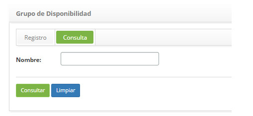
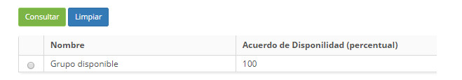
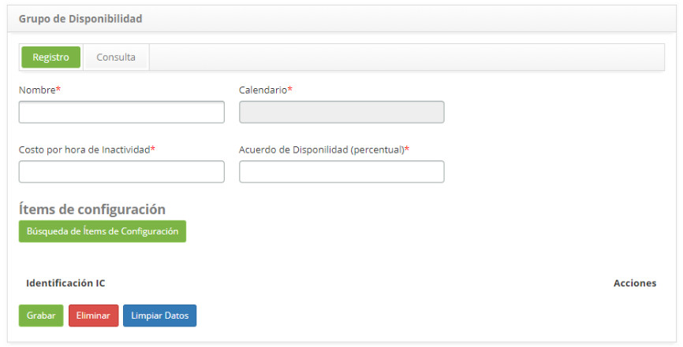
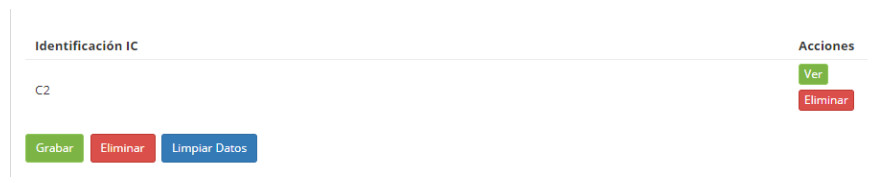
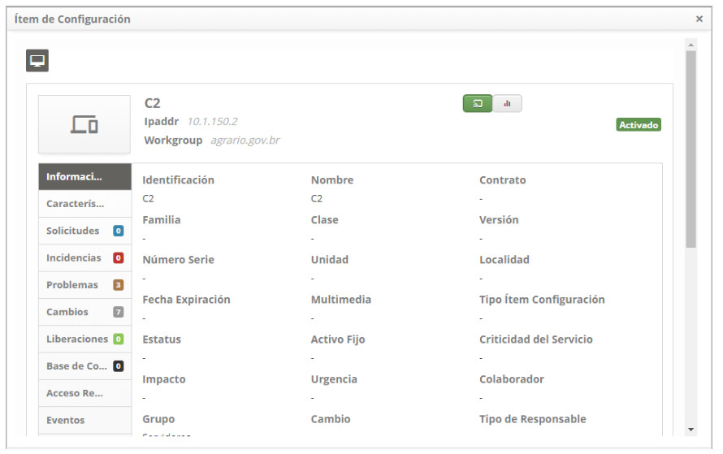

title: Registro y consulta del grupo de disponibilidad
Description: Esta funcionalidad tiene por objetivo agrupar ítems de configuración para generar índice de disponibilidad.
# Registro y consulta del grupo de disponibilidad

Esta funcionalidad tiene por objetivo agrupar ítems de configuración para generar índice de disponibilidad.

Cómo acceder
---------------

1. Acceda a la funcionalidad de grupo de disponibilidad mediante la navegación en el menú principal **Procesos ITIL > Gestión de Disponibilidad > Grupo de Disponibilidad**.

Condiciones previas
--------------

1. Registro de calendario (ver conocimiento [Registro y consulta de calendario](/es-es/citsmart-platform-7/plataform-administration/time/create-calendar)).

Filtros
----------

1. El siguiente filtro permite al usuario restringir la participación de ítems en el listado default de la funcionalidad, 
facilitando la localización de los ítems deseados:

    - Nombre.
 
 2. En la pantalla de **Grupo de disponibilidad**, haga clic en la pestaña Búsqueda. Se mostrará la pantalla de búsqueda como se 
 muestra en la figura siguiente:
 
     
     
     **Figura 1 - Pantalla de consulta de grupo de disponibilidad**
 
 3. Realice la búsqueda de grupo de disponibilidad;
 
     - Introduzca el nombre del grupo de disponibilidad que desea buscar y haga clic en el botón *Consultar*. Después de eso, se 
     mostrará el registro del grupo de disponibilidad según el nombre informado;
     
     - Si desea listar todos los registros de grupo de disponibilidad, simplemente haga clic directamente en el botón 
     *Consultar*.
     
Listado de ítems
-------------------

1. El(Los) siguiente (s) campo (s) de registro está (n) disponible (s) para facilitar al usuario la identificación de los 
elementos deseados en el listado default de la funcionalidad: **Nombre** y **Acuerdo de disponibilidad (percentual)**.

    
    
    **Figura 2 - Pantalla de lista de grupos de disponibilidad**
    
2. Después de la búsqueda, seleccione el registro deseado. Hecho esto, será dirigido a la pantalla de registro exhibiendo el 
contenido referente al registro seleccionado;

3. Para cambiar los datos del registro de grupos de disponibilidad, basta con modificar la información de los campos deseados y 
hacer clic en el botón *Grabar* para que se grabe el cambio realizado en el registro, donde la fecha, hora y usuario serán 
grabados automáticamente para una futura auditoría.

Completar los campos de registro
-------------------------------------

1. Se mostrará la pantalla de registro de **Grupo de Disponibilidad**, como se muestra en la figura siguiente:

    
    
    **Figura 3 - Pantalla de registro de grupo de disponibilidad**
    
2. Complete los campos según las instrucciones a continuación:

    - **Nombre**: introduzca el nombre del grupo de disponibilidad;
    - **Calendario**: informe el calendario del grupo de disponibilidad;
    - **Costo por hora de indisponibilidad**: informe el costo de la hora de indisponibilidad del grupo;
    - **Acuerdo de Disponibilidad (porcentual)**: informe el porcentaje de disponibilidad acordado;
    - **Ítems de configuración**: agregue los ítems de configuración al grupo de disponibilidad:
    
3. Haga clic en el botón *Búsqueda de ítems de configuración*, aparecerá la pantalla de búsqueda de IC, realice la búsqueda y 
seleccione el IC. Hecho esto, el IC será agregado al grupo, como ejemplo ilustrado en la figura abajo:

    
    
    **Figura 4 - Búsqueda de ítems de configuración**  
    
4. Para comprobar la información del IC, basta con hacer clic en el botón *Ver* del mismo;

    
    
    **Figura 5 - Detalle de ítem de configuración**
    
5. Haga clic en el botón *Grabar* para registrar, donde la fecha, la hora y el usuario se guardarán automáticamente para una 
futura auditoría;

!!! tip "About"

    <b>Product/Version:</b> CITSmart | 7.00 &nbsp;&nbsp;
    <b>Updated:</b>09/18/2019 – Larissa Lourenço
