title: Gerenciamiento de disponibilidad
Description: Esta funcionalidad tiene por objeto verificar la disponibilidad de ICs, disponibilidad del Grupo de IC.
# Gerenciamiento de disponibilidad

Esta funcionalidad tiene por objeto verificar la disponibilidad de ICs, disponibilidad del Grupo de IC, disponibilidad del Grupo 
de Disponibilidad y disponibilidad del Servicio de Negocio.

Cómo acceder
--------------

1. Acceda a la funcionalidad de Gerenciamiento de Disponibilidad mediante la navegación en el menú principal **Procesos ITIL > 
Gestión de Disponibilidad > Gerenciamiento de Disponibilidad**.

Condiciones previas
----------------------

Para verificar los gráficos de disponibilidad es necesario, primero, realizar los siguientes procedimientos:

1. Registrar el grupo de disponibilidad (ver conocimiento [Registro y consulta del grupo de disponibilidad](/es-es/citsmart-platform-7/processes/availability/availability-group.html));

2. Vincular el calendario, acuerdo de nivel de servicio del tipo "disponibilidad" y costo por hora de indisponibilidad al ítem de configuración (ver conocimiento [Gestión de ítems de configuración]/es-es/citsmart-platform-7/processes/configuration/IC-management.html));

3. Vincular el calendario, acuerdo de nivel de servicio del tipo "disponibilidad" y costo por hora de indisponibilidad al Grupo 
de ICs;

4. Vincular el calendario, acuerdo de nivel de servicio del tipo "disponibilidad" y costo por hora de indisponibilidad al 
Contrato del Servicio.

Gerenciamiento de disponibilidad
-----------------------------------

1. Se mostrará la pantalla de **Gerenciamiento de Disponibilidad**, como se muestra en la figura siguiente:

    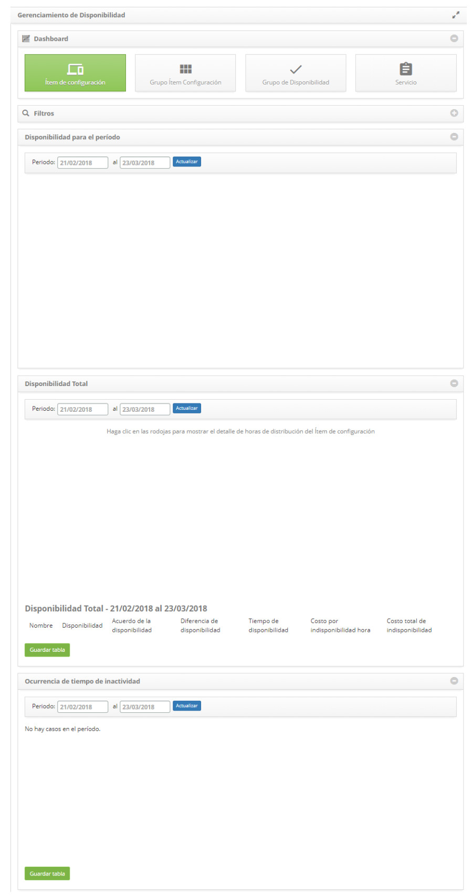

    **Figura 1 - Pantalla de administración de disponibilidad**

2. En esta pantalla de administración de disponibilidad, puede comprobar la disponibilidad de ICs, disponibilidad del grupo de 
IC, disponibilidad del grupo de disponibilidad y disponibilidad del servicio de negocio. En los próximos temas se abordará cómo 
realizar estas acciones.

Verificación de la disponibilidad de ítem de configuración
-------------------------------------------------------------

1. En la pantalla de **Gerenciamiento de Disponibilidad**, haga clic en *Ítem de configuración*. Hecho esto, se mostrará el 
filtro de IC, como se muestra en la figura siguiente:

    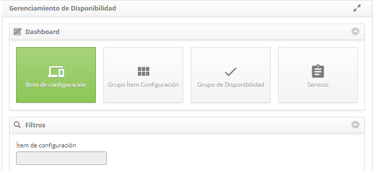

    **Figura 2 - Gestión de disponibilidad - Ítem de configuración**

2. Haga clic en el campo ítem de configuración, aparecerá la pantalla de investigación de IC. Realice la investigación y 
seleccione el IC deseado. Después de eso, el IC será agregado en la pantalla, como ejemplo ilustrado en la figura abajo:

    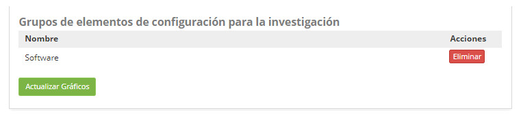

    **Figura 3 - Filtros de IC**

    !!! warning "ATENCIÓN"
    
        Se pueden añadir varios ítems, como desee, para la verificación.
        
3. Después del filtro definido, haga clic en el botón *Actualizar gráficos*. Hecho esto, se mostrará la información del (los) IC 
(s) en gráficos, como ejemplo ilustrado en la figura abajo:

    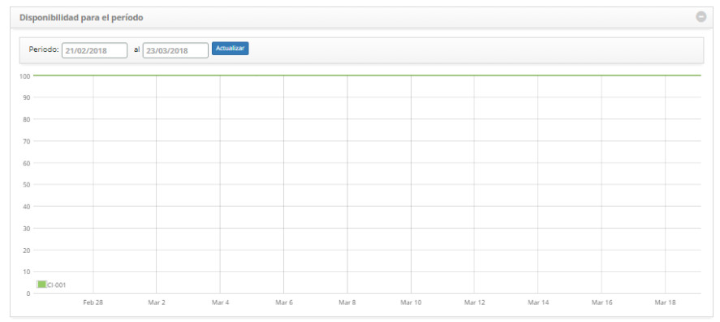

    **Figura 4 - Gráficos de disponibilidad por ítem de configuración**

    - **Disponibilidad para el Período**: presenta la disponibilidad por día de cada IC, dentro del período informado.
    - **Disponibilidad Total**: presenta la disponibilidad total de cada IC, dentro del período informado.
    - **Ocurrencia de tiempo de inactividad**: presenta las ocurrencias de indisponibilidad de cada IC, dentro del período 
    informado.
    - Para descargar la tabla de disponibilidad total y/o las instancias de indisponibilidad, simplemente haga clic en el botón 
    *Guardar tabla* correspondiente.
    - Para descargar la imagen o PDF de los gráficos, basta con hacer clic en el icono del 
    gráfico correspondiente.
    
Verificando la disponibilidad de grupo de ítem de configuración
----------------------------------------------------------------

1. En la pantalla de **Gerenciamiento de disponibilidad**, haga clic en **Grupo de ítem de configuración**. Hecho esto, se 
mostrará el filtro de grupo de ICs, como se muestra en la figura siguiente:

    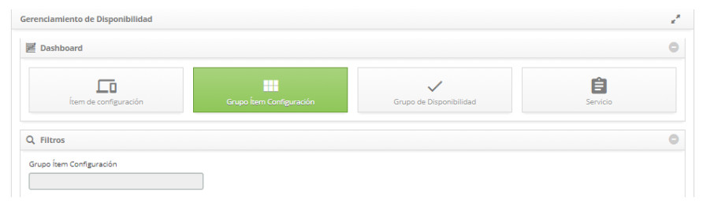

    **Figura 5 - Gestión de disponibilidad - ítem de configuración**

2. Haga clic en el campo **Grupo de ítem de configuración**, aparecerá la pantalla de investigación de grupo de IC. Realice la 
investigación y seleccione el grupo de ICs deseado. Después de eso, el Grupo de ICs será agregado en la pantalla como ejemplo 
ilustrado en la figura abajo:

    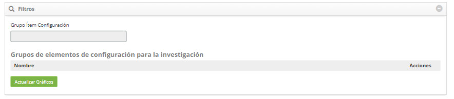

    **Figura 6 - Filtros de grupo de IC**

    !!! warning "ATENCIÓN"
    
        Se pueden agregar varios grupos, como desee, para la verificación.
        
3. Después del filtro definido, haga clic en el botón *Actualizar gráficos*. En este caso, se mostrará la información del grupo o 
grupos de IC en gráficos, como se muestra en la figura siguiente:

    

    **Figura 7 - Gráficos de disponibilidad por grupo de IC**

    - **Disponibilidad para el Período**: presenta la disponibilidad por día de cada grupo de ICs, dentro del período informado.
    - **Disponibilidad Total**: presenta la disponibilidad total de cada grupo de ICs, dentro del período informado.
    - **Ocurrencia de tiempo de inactividad**: presenta las ocurrencias de indisponibilidad de cada grupo de ICs, dentro del 
    período informado.
    - Para descargar la tabla de disponibilidad total y/o las instancias de indisponibilidad, simplemente haga clic en el botón 
    Guardar tabla correspondiente.
    - Para descargar la imagen o PDF de los gráficos, basta con hacer clic en el icono   del 
    gráfico correspondiente.

Verificación de la disponibilidad de grupo de disponibilidad
----------------------------------------------------------------

1. En la pantalla de **Gerenciamiento de disponibilidad** haga clic en *Grupo de disponibilidad*. Hecho esto, se mostrará el 
filtro de grupo de disponibilidad, como se muestra en la figura siguiente:

    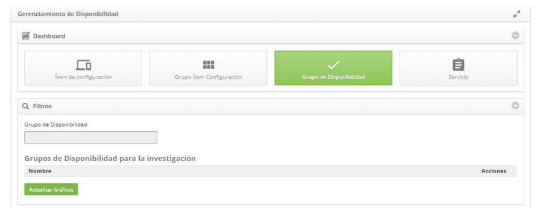

    **Figura 8 - Gestión de disponibilidad - Grupo de disponibilidad**

2. Haga clic en el campo *Grupo de disponibilidad*, aparecerá la pantalla de investigación de grupo de disponibilidad. Realice la 
investigación y seleccione el grupo de disponibilidad deseado. Después de eso, el grupo de disponibilidad será agregado en la 
pantalla como ejemplo ilustrado en la figura abajo:

    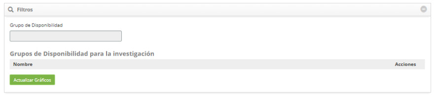

    **Figura 9 - Filtros de grupo de disponibilidad**

    !!! warning "ATENCIÓN"
    
        Se pueden agregar varios grupos, como desee, para la verificación.
       
3. Después del filtro definido, haga clic en el botón *Actualizar gráficos*. En este caso, se mostrará la información del grupo o 
grupos de disponibilidad en gráficos, como se muestra en la figura siguiente:

    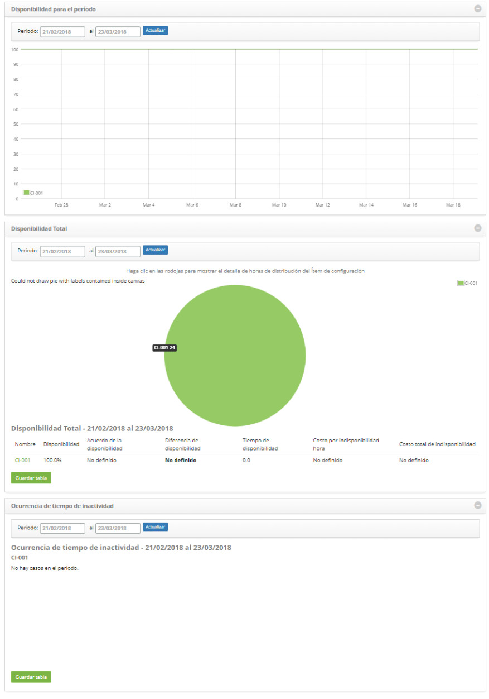

    **Figura 10 - Gráficos de disponibilidad por grupo de disponibilidad**

    - **Disponibilidad para el Período**: presenta la disponibilidad por día de cada grupo de disponibilidad, dentro del período 
    informado;
    - **Disponibilidad Total**: presenta la disponibilidad total de cada grupo de disponibilidad, dentro del período informado;
    - **Ocurrencias de tiempo de inactividad**: presenta las ocurrencias de indisponibilidad de cada grupo de disponibilidad, 
    dentro del período informado;
    - Para descargar la tabla de disponibilidad total y/o las instancias de indisponibilidad, simplemente haga clic en el botón 
    *Guardar tabla* correspondiente;
    - Para descargar la imagen o PDF de los gráficos, basta con hacer clic en el icono  del 
    gráfico correspondiente.

Verificación de la disponibilidad de servicio
----------------------------------------------

1. En la pantalla de **Gerenciamiento de disponibilidad**, haga clic en *Servicio*. Hecho esto, se mostrará el filtro de 
servicio, como se muestra en la figura siguiente:

    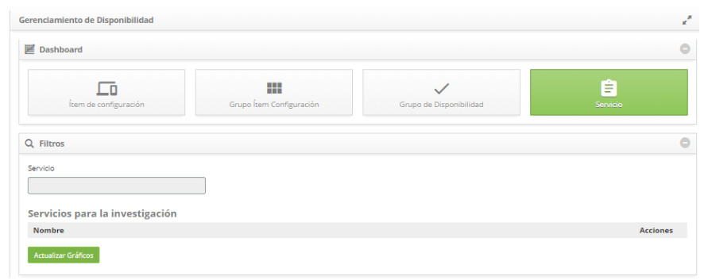

    **Figura 11 - Gestión de disponibilidad - Servicio**

2. Haga clic en el campo **Servicio**, aparecerá la pantalla de investigación de servicios. Realice la investigación y seleccione 
el servicio deseado. Después de eso, el servicio será agregado en la pantalla como ejemplo ilustrado en la figura abajo:

    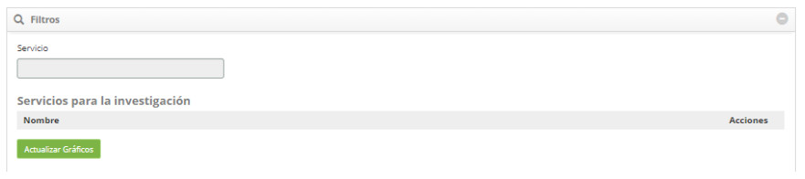
    
    **Figura 12 - Filtros de servicio**

    !!! warning "ATENCIÓN"
    
        Se pueden agregar varios servicios, como desee, para la verificación.
       
3. Después del filtro definido, haga clic en el botón *Actualizar gráficos*. Hecho esto, se mostrará la información del (s) 
Servicio (s) en gráficos, como ejemplo ilustrado en la figura abajo:

    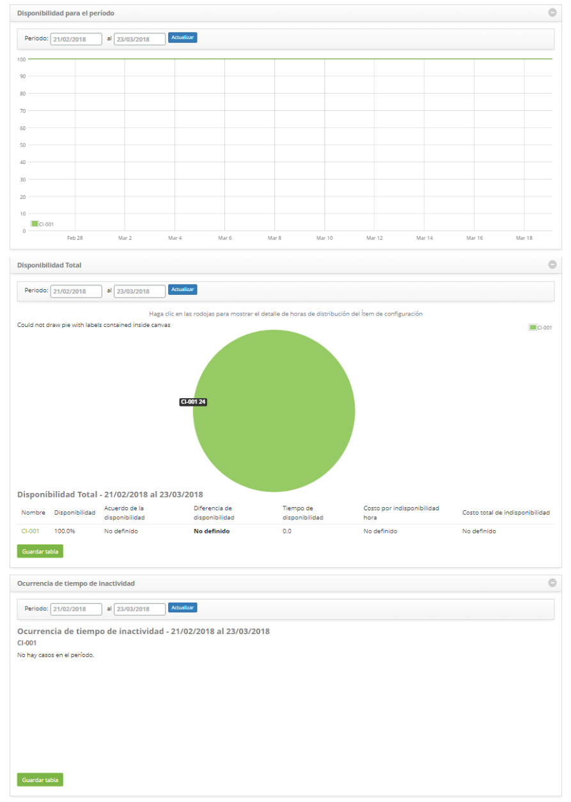

    **Figura 13 - Gráficos de disponibilidad por servicio**

    - **Disponibilidad para el Período**: presenta la disponibilidad por día de cada servicio, dentro del período informado;
    - **Disponibilidad Total**: presenta la disponibilidad total de cada servicio, dentro del período informado;
    - **Ocurrencias de tiempo de inactividad**: presenta las ocurrencias de indisponibilidad de cada servicio, dentro del período 
    informado;
    - Para descargar la tabla de disponibilidad total y/o ocurrencias de indisponibilidad, basta con hacer clic en el botón 
    *Guardar tabla* correspondiente;
    - Para descargar la imagen o PDF de los gráficos, basta con hacer clic en el icono  del gráfico 
    correspondiente.

!!! tip "About"

    <b>Product/Version:</b> CITSmart | 7.00 &nbsp;&nbsp;
    <b>Updated:</b>09/18/2019 – Larissa Lourenço
