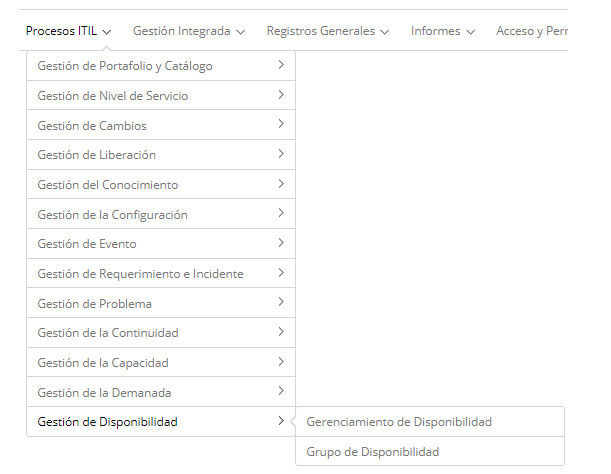

title: Módulo Gestión de Disponibilidad
Description: La gestión de disponibilidad es el proceso responsable de asegurar que los servicios de TI 
# Módulo Gestión de Disponibilidad

Objetivos del módulo
-----------------------

La gestión de disponibilidad es el proceso responsable de asegurar que los servicios de TI estén disponibles en conformidad con 
las necesidades del negocio, actuales y futuras, de una manera más rentable. Esta gestión se encarga de asegurar que la 
infraestructura, los procesos, las herramientas, los roles, etc. de TI sean adecuados para cumplir con los objetivos de 
disponibilidad acordados.

El objetivo principal de la Gestión de Disponibilidad es proporcionar un cierto nivel de disponibilidad de servicios de TI, 
permitiendo que el cliente alcanzar sus objetivos con la mejor relación costo-beneficio.

Esta funcionalidad tiene como objetivo verificar la disponibilidad de los ICs, la disponibilidad del Grupo ICs, la Disponibilidad 
del Grupo Disponibilidad y la Disponibilidad del Servicio de Negocio.

Donde están sus funcionalidades
---------------------------------

1. Para acceder a la funcionalidad, haga clic en el menú principal **Procesos ITIL > Gestión de Disponibilidad**.

**Figura 1 - Menú del módulo de gestión de disponibilidad**

Principal funcionalidad (en destaque)
----------------------------------------

En la sección Véase también es posible acceder a la (s) funcionalidad (es) principal (es) de este módulo, para obtener un 
conocimiento más detallado.

Veja também
-------------

- [Gerenciamento de disponibilidade](/pt-br/citsmart-platform-7/processes/availability/availability-management.html)

!!! tip "About"

    <b>Product/Version:</b> CITSmart | 7.00 &nbsp;&nbsp;
    <b>Updated:</b>07/10/2019 – Larissa Lourenço
