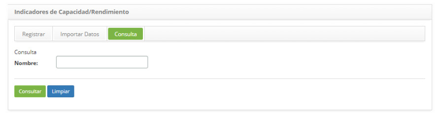
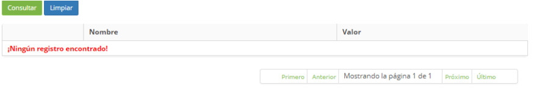
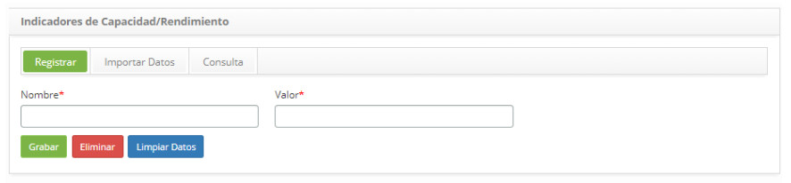

title: Registro y consulta de indicadores de capacidad
Description: Esta funcionalidad tiene el objetivo de registrar los indicadores de capacidad/rendimiento
# Registro y consulta de indicadores de capacidad

Esta funcionalidad tiene el objetivo de registrar los indicadores de capacidad/rendimiento que estarán vinculados a los Servicios 
ya los Ítems de Configuración (IC).

Como acceder
--------------

1. Acceda a la funcionalidad de Indicadores de Capacidad/Performance a través de la navegación en el menú principal **Procesos 
ITIL > Gestión de Capacidad > Indicadores de Capacidad/Rendimiento**.

Condiciones previas
----------------

1. No se aplica.

Filtros
----------

1. El siguiente filtro permite al usuario restringir la participación de ítems en el listado default de la funcionalidad, 
facilitando la localización de los ítems deseados:

    - Nombre.

    

    **Figura 1 - Pantalla de consulta de indicadores de capacidad/rendimiento**

2. Realice la consulta del indicador de capacidad/rendimiento;

    - Introduzca el nombre del indicador de capacidad/rendimiento que desea buscar y haga clic en el botón *Consultar*. Después 
    de eso, se mostrará el registro del indicador según el nombre informado.

    - Si desea listar todos los registros de indicador de capacidad/rendimiento, simplemente haga clic directamente en el botón 
    *Consultar*.

Listado de ítems
------------------

1. El(Los) siguiente (s) campo (s) de registro está (n) disponible (s) para facilitar al usuario la identificación de los 
elementos deseados en el listado default de la funcionalidad: **Nombre** y **valor**.

    

    **Figura 2 - Pantalla de lista de indicadores de capacidad/rendimiento**

2. Después de la consulta, seleccione el registro deseado. Hecho esto, será dirigido a la pantalla de registro exhibiendo el 
contenido referente al registro seleccionado;

3. Para cambiar los datos del registro de indicador de capacidad/rendimiento, basta con modificar la información deseada y hacer 
clic en el botón *Grabar*.

Completar los campos de registro
-------------------------------------

1. Se mostrará la pantalla de **registro de indicadores de capacidad/rendimiento**, como se muestra en la figura siguiente:

    

     **Figura 3 - Pantalla de registro de indicadores de capacidad/rendimiento**

2. Complete los campos según las instrucciones a continuación:

    - **Nombre**: introduzca el nombre del indicador de capacidad/rendimiento;
    - **Valor**: informe el valor del indicador de capacidad/rendimiento.

3. Después de los datos informados, haga clic en el botón *Grabar* para efectuar el registro, donde la fecha, hora y usuario 
serán grabados automáticamente para una futura auditoría.

!!! tip "About"

    <b>Product/Version:</b> CITSmart | 7.00 &nbsp;&nbsp;
    <b>Updated:</b>09/18/2019 – Larissa Lourenço

