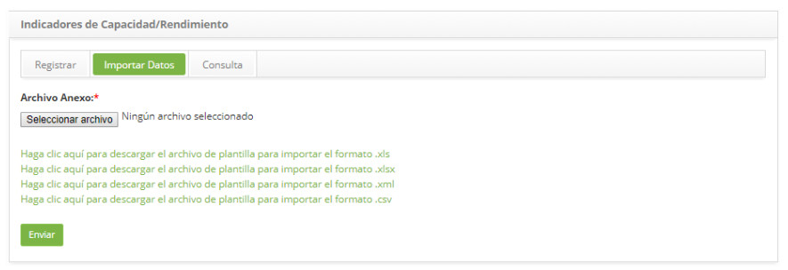

title: Importación de datos de indicadores de capacidad
Description: Importación de datos de indicadores de capacidad
# Importación de datos de indicadores de capacidade

Cómo acceder
----------------

1. Acceda a la funcionalidad de Indicadores de Capacidad/Rendimento a través de la navegación en el menú principal 
**Procesos ITIL > Gestión de Capacidad > Indicadores de Capacidad/Rendimiento**.

Realizando importación de datos de indicadores de capacidad/rendimiento
--------------------------------------------------------------------------

1. Se mostrará la pantalla de Indicadores de Capacidad/Rendimiento.

2. Haga clic en la ficha **Importar datos**, aparecerá la pantalla de importación de datos, como se muestra en la figura 
siguiente:

    

    **Figura 1 - Pantalla de importación de datos**

3. Adjunte el archivo para importar los datos:

4. Observe que en la pantalla se muestran las plantillas de archivos para orientar en la forma y el orden que los datos deben 
estar en el archivo;

5. Por lo tanto, antes de seleccionar el archivo, compruebe que el mismo está de acuerdo con el modelo, teniendo en cuenta el 
formato (.xls, .xlsx, .xml o .csv);

6. spués de la verificación, haga clic en el botón Seleccionar archivo, seleccione el archivo y haga clic en el botón *Enviar* 
para efectuar la importación;

7. Hecho esto, los datos se importarán con éxito.

!!! tip "About"

    <b>Product/Version:</b> CITSmart | 7.00 &nbsp;&nbsp;
    <b>Updated:</b>09/18/2019 – Larissa Lourenço

