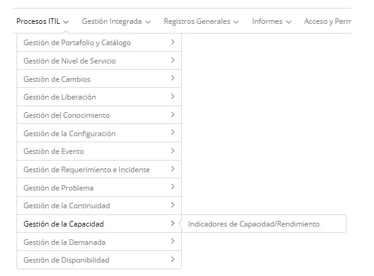

title: Módulo Gestión de la Capacidad
Description: La Gestión de la Capacidad es el proceso encargado de asegurar que se cubren los requisitos de capacidad  
# Módulo Gestión de la Capacidad

Objetivo del módulo
--------------------

La Gestión de la Capacidad es el proceso encargado de asegurar que se cubren los requisitos de capacidad y el rendimiento de la 
infraestructura de TI del acuerdo de servicio. Esta gestión toma en cuenta todos los recursos necesarios para llevar a cabo los 
servicios de TI, planes y requisitos de negocio a corto, mediano y largo plazo.

El objetivo de la Gestión de la Capacidad es garantizar que las capacidades del servicio de TI y la infraestructura de TI sean 
capaces de cumplir con los requisitos de capacidad y rendimiento acordados de manera oportuna y rentable.

La Gestión de la Capacidad tiene tres subprocesos, en los que se puede considerar la capacida

- **Gestión de la Capacidad de Negocio**: Asegura que las necesidades de negocio futuras sean consideradas, planificadas y 
satisfechas de manera oportuna. Esto se puede hacer mediante análisis de tendencias, pronósticos y modelado. El foco está en las 
necesidades comerciales actuales y futuras;o;

- **Gestión de la Capacidad de los Servicios**: gestiona el rendimiento de los servicios de TI en funcionamiento. Es su responsabilidad garantizar, controlar e informar los niveles de rendimiento definidos en nivel de servicio SLA y requisitos de nivel de servicio SLR. Su enfoque está en la tecnología responsable por mantener la actual provisión de servicios;

- **Gestión de la Capacidad de Recursos**: supervisa e informa los niveles de rendimiento individuales de los recursos de 
infraestructura de TI (componentes). Se enfoca en la tecnología responsable de mantener toda la provisión del servicio

En este módulo se definirán los indicadores de capacidad (rendimiento / desempeño), que estarán vinculados a los Servicios y 
ítems de configuración.

Donde están sus funcionalidades
---------------------------------

Acceder al menú principal de **Procesos ITIL > Gestión de la Capacidad**.

**Figura 1 - Menú del módulo de gestión de capacidad**

Principal funcionalidad (en destaque)
----------------------------------------

En la sección *Véase también* es posible acceder a la (s) funcionalidad (es) principal (es) de este módulo, para obtener un 
conocimiento más detallado.

Véase también
--------------

- [Registro y consulta de indicadores de capacidad](/es-es/citsmart-platform-7/processes/capacity/capacity-indicators.html);
- [Importación de datos de indicadores de capacidad](/es-es/citsmart-platform-7/processes/capacity/data-import-capacity.html).

!!! tip "About"

    <b>Product/Version:</b> CITSmart | 7.00 &nbsp;&nbsp;
    <b>Updated:</b>09/18/2019 – Larissa Lourenço

