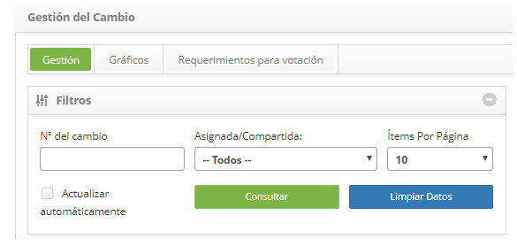
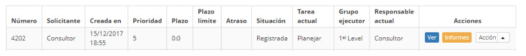
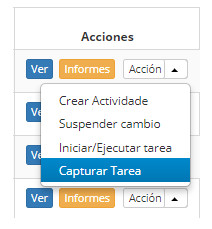

title: Captura de solicitud de cambios
Description: Esta funcionalidad se refiere al acto de asignar una determinada tarea al propio usuario
# Captura de solicitud de cambios

Esta funcionalidad se refiere al acto de asignar una determinada tarea al propio usuario, convirtiéndose en el responsable actual 
de la solicitud de cambio.

Cómo acceder
-------------

1. Acceda a la funcionalidad de captura de solicitud de cambio a través de la navegación en el menú principal 
**Procesos ITIL > Gestión de Cambios > Gestión del Cambio**.

Condiciones previas
----------------

1. No se aplica.

Filtros
----------

1. Los siguientes filtros posibilitan al usuario restringir la participación de ítems en el listado default de la funcionalidad, 
facilitando la localización de los ítems deseados:

    - Número del cambio;
    - Asignada/Compartida;
    - Ítens por página.
    
    
    
    **Figura 1 - Pantalla de filtros**
    
Listado de itens
------------------

1. El(Los) siguiente (s) campo (s) de registro está (n) disponible (s) para facilitar al usuario la identificación de los 
elementos deseados en el listado default de la funcionalidad: **Número, Solicitante, Creada en, Prioridade, Plazo, Plazo limite, 
Atraso, Situación, Tarea actual, Grupo Ejecutor** y **Responsable actual**.

2. Hay botones de acción disponibles para el usuario en relación con cada elemento de la lista, que son: *Ver* y *Informes*.

**Figura 2 - Pantalla de listado de tareas**

Completar los campos de registro
-------------------------------------

1. No se aplica.

Capturando tareas
------------------

1. En la ficha Gestión, busque la solicitud de cambio que desea capturar, haga clic en el botón *Acción* y seleccione la opción 
*Capturar tarea* como se muestra en la siguiente imagen:

    
    
    **Figura 3 - Capturar tarea**
    
2. Aparecerá un mensaje de confirmación de la captura de la tarea. Haga clic en *Aceptar* para realizar la operación;

3. Se presentará el responsable actual por la atención de la solicitud de cambio en la lista de requisiciones.

!!! tip "About"

    <b>Product/Version:</b> CITSmart | 7.00 &nbsp;&nbsp;
    <b>Updated:</b>09/18/2019 – Larissa Lourenço
