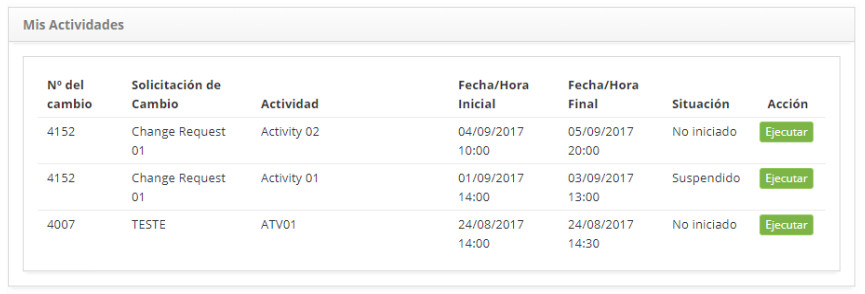
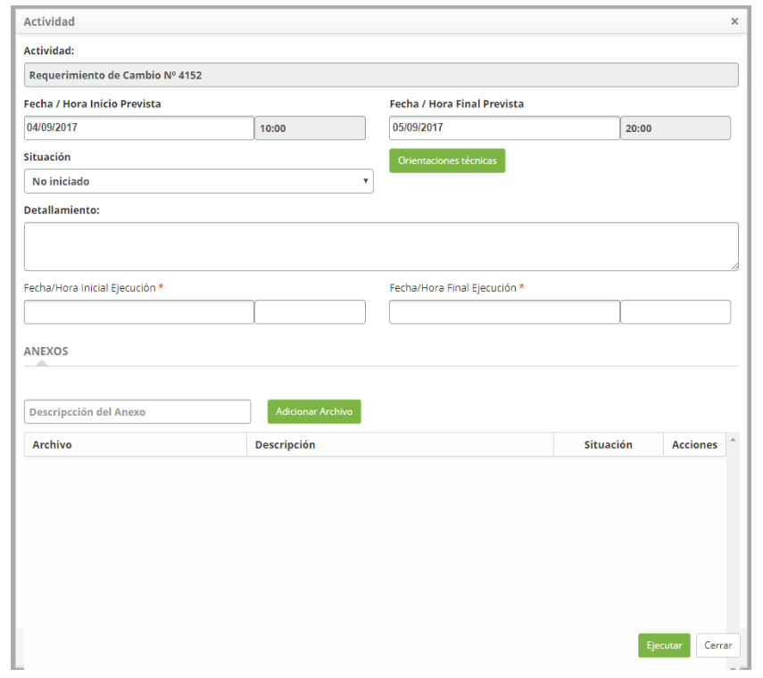

title: Gestión de actividades de cambios
Description: Esta funcionalidad tiene el objetivo de administrar sus actividades relacionadas con las solicitudes de cambio.
# Gestión de actividades de cambios

Esta funcionalidad tiene el objetivo de administrar sus actividades relacionadas con las solicitudes de cambio.

Como acceder
---------------

1. Accede a la funcionalidad de mis actividades a través de la navegación en el menú principal 
**Procesos ITIL > Gestión de Cambios > Mis Actividades**.

Condiciones previas
----------------------

1. Tener actividades asignadas a su usuario.

Filtros
--------

1. No se aplica.

Listado de ítems
------------------

1. El(Los) siguiente (s) campo (s) de registro está (n) disponible (s) para facilitar al usuario la identificación de los 
elementos deseados en el listado default de la funcionalidad: **Número del Cambio, Solicitación de Cambio, Actividad, Fecha/Hora 
Inicial, Fecha/Hora Final** y **Situación**.

2. Hay un botón de acción disponible para el usuario en relación con cada elemento de la lista, es él: *Ejecutar*.

3. Se mostrará la pantalla **Mis Actividades**, como se muestra en la figura siguiente:

**Figura 1 - Mis actividades**

Completar los campos de registro
------------------------------------

1. Para registrar información de la ejecución de la actividad, basta con hacer clic en el botón *Ejecutar* y aparecerá la pantalla, 
como se muestra a continuación:

    
    
    **Figura 2 - Registro de ejecución de actividad**
    
    - **Situación**: seleccione la situación de la actividad, para facilitar la gestión del cambio;
    
2. Haga clic en el botón *Orientaciones técnicas* para ver lo que se ha informado de la descripción de la solicitud de cambio;

    - **Detallamiento**: informe los detalles sobre la ejecución de la actividad;
    - **Fecha/Hora Inicio Ejecución**: informe la fecha y el horario de inicio de la ejecución de la actividad;
    
3. Para adjuntar un archivo a la actividad, introduzca la descripción del archivo adjunto, haga clic en el botón *Adicionar 
archivo* y seleccione el archivo que desee;

4. Haga clic en el botón *Ejecutar* para guardar la información completada referente a la actividad.

!!! tip "About"

    <b>Product/Version:</b> CITSmart | 7.00 &nbsp;&nbsp;
    <b>Updated:</b>09/18/2019 – Larissa Lourenço
