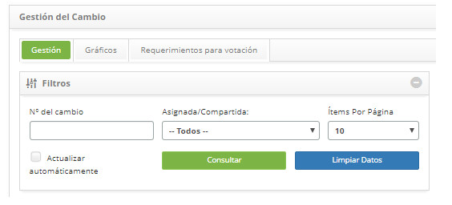
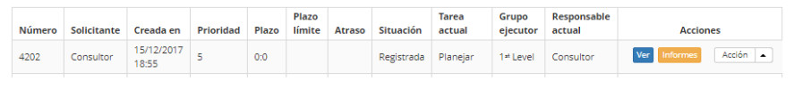
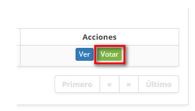
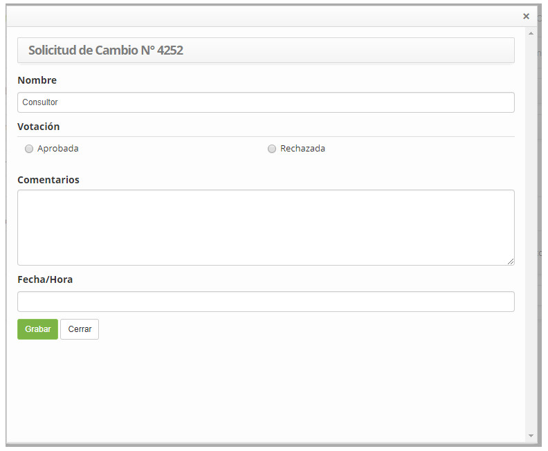
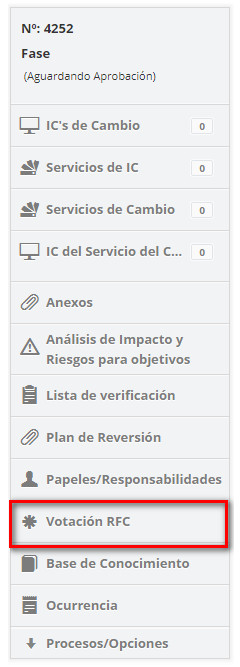
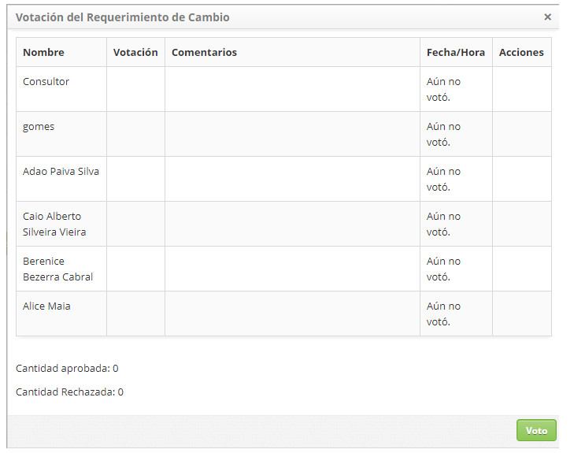

title: Aprobación de solicitud de cambio
Description: Esta funcionalidad permite realizar la aprobación de la solicitud de cambio.
# Aprobación de solicitud de cambio

Esta funcionalidad permite realizar la aprobación de la solicitud de cambio.

Cómo acceder
---------------

1. Acceda a la funcionalidad de aprobación de solicitud de cambio a través de la navegación en el menú principal 
**Procesos ITIL > Gestión de Cambios > Gestión del Cambio**.

Condiciones previas
----------------------

1. El grupo al que el usuario está registrado debe tener el valor igual a "SI" del CAC (ver conocimiento [Registro y consulta de grupo](/es-es/citsmart-platform-7/initial-settings/access-settings/user/group.html));

2. Para los tipos de flujo que no sean de emergencia o de padrón (Normal), los "permisos en los flujos de trabajo" del grupo al que el usuario está registrado deben estar todos habilitados (ver conocimiento del [Registro y consulta de grupo](/es-es/citsmart-platform-7/initial-settings/access-settings/user/group.html)).

Filtros
--------

1. Los siguientes filtros posibilitan al usuario restringir la participación de ítems en el listado default de la funcionalidad, 
facilitando la localización de los ítems deseados:

     - Número del cambio;
     - Asignada/Compartida;
     - Ítems por página

**Figura 1 - Pantalla de consulta de SDC**

Listado de ítems
-------------------

1. El(Los) siguiente (s) campo (s) de registro está (n) disponible (s) para facilitar al usuario la identificación de los 
elementos deseados en el listado default de la funcionalidad : **Número, Solicitante, Creada en, Prioridad, Plazo, Plazo límite, 
Atraso, Situación, Tarea Actual, Grupo Ejecutor** y **Responsable actual**.

2. Existen botones de acción disponibles para el usuario en relación con cada elemento de la lista, que son: *Ver* e *Informes*.

**Figura 2 - Pantalla de lista de SDC**

Completar los campos de registro
-------------------------------------

!!! info "IMPORTANTE"

    Sólo los miembros del CAC pueden realizar la aprobación de la SDC. Para aprobar una SDC debe observarse en la configuración 
    del parámetro "Votación SDC usando la regla de la mayoría absoluta (50% + 1) (Valores:" S "o" N "Default:" S "), donde el 
    valor "S" define la aprobación de la SDC cuando hay más del 50% de aprobación del CAC y el valor "N" define la aprobación de 
    la SDC cuando hay un 100% de aprobación del CAC.
    
1. Para votar busque la solicitud de cambio que desea aprobar, haga clic en el botón *Votar* de la misma, como se indica en la 
figura siguiente:

    

    **Figura 3 - Botón**

2. Se mostrará la pantalla para la votación de la solicitud de cambio, como se indica en la figura siguiente:

**Figura 4 - Aprobar la SDC**

- **Nombre**: se rellena automáticamente con el nombre del miembro del CAC que está votando de la SDC;
- **Votación**: seleccione su elección de votación para la SDC, aprobada o rechazada;
- **Comentarios**: si lo desea, haga un comentario sobre la votación de la solicitud de cambio;
- **Fecha/Hora**: se rellenará automáticamente cuando se realiza la consulta de la votación de la solicitud con la información de 
fecha y hora de la aprobación/rechazo de la misma;
- Haga clic en el botón *Grabar* para registrar la votación.

Vericación de la aprobación del comité asesor de cambios
-----------------------------------------------------------

1. Para proseguir con la aprobación, el responsable de la solicitud de cambio, que forma parte del grupo ejecutor, debe verificar 
la aprobación del Comité Asesor de Cambios.

    - En la pestaña **Gestión**, busque la solicitud de cambio, haga clic en el botón *Acción*, seleccione la opción 
    Iniciar/Ejecutar tarea y aparecerá la pantalla de solicitud de cambio con los campos rellenados, con el contenido referente a 
    la solicitud seleccionada;

    - Al lado derecho de la pantalla de solicitud de cambio, haga clic en la opción **Votación SDC**;

    

    **Figura 5 - Selección de votación SDC**

    - Se mostrará la pantalla de consulta de votación de la solicitud de cambio, como se muestra a continuación:

    

    **Figura 6 - Consulta de aprobación de la SDC**

    - Si ya ha obtenido la aprobación necesaria, haga clic en el botón *Grabar y Avanzar* el flujo para efectuar la operación, 
    donde la solicitud de cambio será aprobada y encaminada a la fase de planificación;

!!! note "NOTA"

    El sistema permite modificar el Comité Asesor de Cambios (CAC) en cualquier momento, siempre que no se haya iniciado la 
    votación de la Solicitud de Cambio (SDC). A partir del momento en que se inicia la votación de la Solicitud de Cambio aunque 
    se alteren los miembros del CAC, el sistema no altera los votantes de la Solicitud.
    
!!! tip "About"

    <b>Product/Version:</b> CITSmart | 7.00 &nbsp;&nbsp;
    <b>Updated:</b>09/18/2019 – Larissa Lourenço
