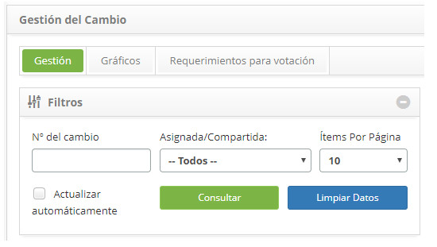
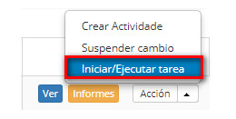

title: Cancelamiento de la solicitud de cambio
Description: Esta funcionalidad permite realizar la cancelación de la solicitud de cambio.
# Cancelamiento de la solicitud de cambio

Esta funcionalidad permite realizar la cancelación de la solicitud de cambio.

Cómo acceder
--------------

1. Acceda a la funcionalidad de cancelación de solicitud de cambio a través de la navegación en el menú principal 
**Procesos ITIL > Gestión de Cambios > Gestión del Cambio**.

Condiciones previas
----------------------

1. No se aplica.

Filtros
---------

1. Los siguientes filtros posibilitan al usuario restringir la participación de ítems en el listado default de la funcionalidad, 
facilitando la localización de los ítems deseados:

    - Número del cambio;
    - Asignada/Compartida;
    - Ítems por página.
    
    
    
    **Figura 1 - Pantalla de filtros**
    
Listado de ítems
--------------------

1. El(Los) siguiente (s) campo (s) de registro está (n) disponible (s) para facilitar al usuario la identificación de los 
elementos deseados en el listado default de la funcionalidad: **Número, Solicitante, Creada en, Prioridad, Plazo, Plazo límite, 
Situación, Tarea Actual, Grupo Ejecutor** y **Responsable actual**.

2. Hay botones de acción disponibles para el usuario en relación con cada elemento de la lista, que son: *Ver, Informes* y 
*Acción*.

**Figura 2 - Pantalla de Listado de Cambio**

Completar los campos de registro
-------------------------------------

1. No se aplica.

Cancelando registros de cambio
----------------------------------

1. En la ficha Gestión, busque la solicitud de cambio que desea cancelar, haga clic en el botón *Acción* y seleccione la opción 
Iniciar / Ejecutar tarea de la misma, como se indica en la siguiente imagen:

    
    
    **Figura 3 - Cancelar solicitud de cambio**
    
2. Se mostrará la pantalla de Registro de la Solicitud de Cambio con los campos rellenados, con el contenido referente a la 
solicitud seleccionada;

    - En el área de cierre, en el campo **Status**, marque la opción **Cancelada**;
    - En el campo **Cierre**, describa los detalles de la cancelación de la solicitud de cambio;
    - Después de registrar la información de cancelación de la solicitud de cambio, haga clic en el botón *Grabar y avanzar el 
    flujo* para efectuar la operación, donde la solicitud de cambio será cancelada con éxito;
    - Si desea grabar sólo la información registrada sobre la cancelación de la solicitud de cambio y mantener la tarea actual, 
    haga clic en el botón *Grabar y mantener la tarea actual*.
    - En ambos casos anteriores, al hacer clic en el botón *Grabar* la fecha, hora y usuario se guardarán automáticamente para 
    una futura auditoría.
    
!!! tip "About"

    <b>Product/Version:</b> CITSmart | 7.00 &nbsp;&nbsp;
    <b>Updated:</b>09/18/2019 – Larissa Lourenço
