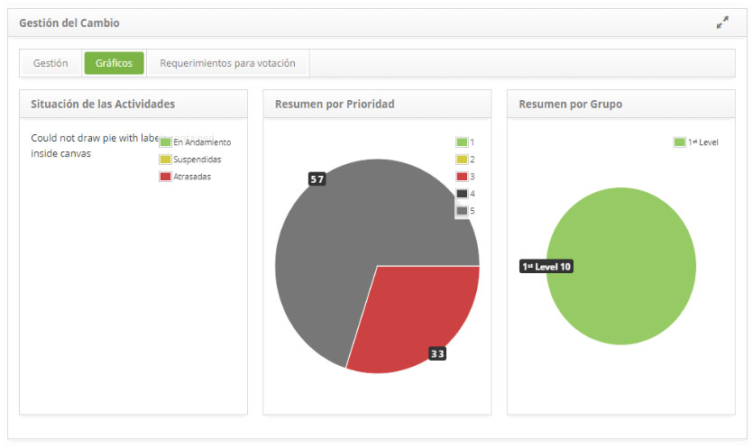

title: Gráficos de solicitud de cambios
Description: Esta característica le permite ver gráficos de orden de cambio.
# Gráficos de solicitud de cambios

Cómo acceder
-------------

1. Acceda a la funcionalidad de gráficos de solicitud de cambio a través de la navegación en el menú principal 
**Procesos ITIL > Gestión de Cambios > Gestión de Cambio**.

Visualizando gráficos
----------------------

1. Haga clic en la ficha Gráficos y se mostrará la información de las solicitudes por situación (en curso, suspendidas y atrasadas), 
por prioridad y por grupo ejecutor, siendo estas demostradas en gráficos como se muestra en la figura siguiente:

**Figura 1 - Pantalla de gráficos de cambios**

!!! tip "About"

    <b>Product/Version:</b> CITSmart | 7.00 &nbsp;&nbsp;
    <b>Updated:</b>09/19/2019 – Larissa Lourenço
