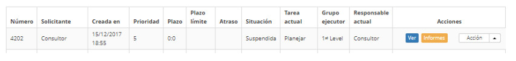

title: Visualización de solicitud de cambios
Description: Esta función permite ver la información de la solicitud de cambio.
# Visualización de solicitud de cambios

Esta función permite ver la información de la solicitud de cambio.

Cómo acceder
--------------

1. Acceda a la funcionalidad a través de la navegación en el menú principal **Procesos ITIL > Gestión de Cambios > Gestión del Cambio**.

Condiciones previas
---------------

1. No se aplica.

Filtros
---------

1. Los siguientes filtros posibilitan al usuario restringir la participación de ítems en el listado default de la funcionalidad, 
facilitando la localización de los ítems deseados:

    - Nº del cambio;

    - Asignada/Compartida;

    - Ítems Por Página.

**Figura 1 - Pantalla de filtros**

Listado de ítems
------------------

1. El(Los) siguiente (s) campo (s) de registro está (n) disponible (s) para facilitar al usuario la identificación de los 
elementos deseados en el listado default de la funcionalidad: **Número, Solicitante, Creada en, Prioridad, Plazo, Plazo límite, 
Atraso, Situación, Tarea actual, Grupo ejecutor** y **Responsable actual**.

2. Hay botones de acción disponibles para el usuario en relación con cada elemento de la lista, que son: *Ver, Informes* y 
*Acción*.

3. En la ficha Administración, busque la solicitud de cambio que desea ver y haga clic en el botón *Vista previa* de la misma:

    
    
    **Figura 2 - Botón ver**
    
4. Se abrirá la pantalla de Registro de la solicitud de cambio para la visualización;

    - Si desea generar PDF de la información de la solicitud de cambio, haga clic en el botón *Generar PDF*;

    - Si desea generar un informe de la información de la solicitud de cambio, haga clic en el botón *Informe de registro de 
    ejecución*.

Completar los campos de registro
------------------------------------

1. No se aplica.

!!! tip "About"

    <b>Product/Version:</b> CITSmart | 7.00 &nbsp;&nbsp;
    <b>Updated:</b>09/19/2019 – Larissa Lourenço

