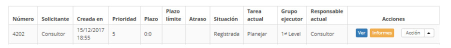
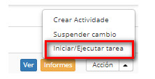

title: Evaluación y finalización de solicitud de cambios
Description: Esta funcionalidad permite realizar la evaluación de la solicitud de cambio y finalizar la misma.
# Evaluación y finalización de solicitud de cambios

Esta funcionalidad permite realizar la evaluación de la solicitud de cambio y finalizar la misma.

Cómo acceder
--------------

1. Acceda a la funcionalidad de evaluación y finalización de solicitud de cambio a través de la navegación en el menú principal 
**Procesos ITIL > Gestión de Cambios > Gestión del Cambio**.

Condiciones previas
--------------

1. No se aplica.

Filtros
---------

1. Los siguientes filtros posibilitan al usuario restringir la participación de ítems en el listado default de la funcionalidad, 
facilitando la localización de los ítems deseados:

    - Número de cambio;
    - Asignada/Compartida;
    - Ítems por página

**Figura 1 - Pantalla de consulta de cambio**

Listado de ítems
------------------

1. El siguiente campos de registro estan disponibles al usuario para facilitar la identificación de los ítems deseados en el 
listado default de la funcionalidad: **Número, Solicitante, Creada en, Prioridad, Plazo, Plazo límite, Atraso, Situación, Tarea 
actual, Grupo Ejecutor, Responsable actual**.

2. Existen botones de acción disponibles para el usuario con respecto a cada ítem de la lista, que son: *Ver* e *Informes*.

**Figura 2 - Pantalla de listado de cambio**

Completar los campos de registro
------------------------------------

1. No se aplica

Avaliando y finalizando requisitos de cambio
-----------------------------------------------

1. En la ficha Administración, busque la solicitud de cambio que se evaluará y finalizará, haga clic en el botón *Acción* y 
seleccione la opción *Iniciar/Ejecutar* tarea de la misma, como se indica en la siguiente imagen:

    

    **Figura 3 - Realizar evaluación de la solicitud de cambio**

2. Se mostrará la pantalla de **Solicitud de Cambio** con los campos rellenados, con el contenido referente a la solicitud 
seleccionada;
    
    - Compruebe que la solicitud de cambio ha sido atendida como se solicita;
    - Registre la información necesaria sobre la evaluación de la solicitud de cambio:
        - Haga clic en el botón *Agregar registro de ejecución*;
        - Describa la información sobre la ejecución de su actividad.
    - En el campo **Cierre**, informe el cierre de la solicitud de cambio, es decir, los detalles de la finalización de la 
    ejecución de la solicitud de cambio;
    -  Después del registro de las informaciones sobre la evaluación y finalización de la solicitud de cambio, haga clic en el 
    botón Grabar y avanzar el flujo para efectuar la operación, donde la solicitud de cambio y los problemas, incidentes e ítems 
    de configuración relacionados serán finalizados con éxito;
    - Si desea grabar sólo la información registrada sobre la evaluación y finalización de la solicitud de cambio y mantener la tarea actual, haga clic en el botón *Grabar y mantener la tarea actual*;
    - En ambos casos anteriores, al hacer clic en el botón *Grabar* la fecha, hora y usuario se almacenan automáticamente para 
    una futura auditoría.

!!! note "NOTA"

    Todos los "errores conocidos" relacionados con un problema al que se refiere al cambio que se está cerrando, se archivarán, 
    caso el Parámetro 232 (ERRO CONOCIDO - Archivar Error Conocido al concluir el Cambio? (S o N - Default: 'N')) esté definido 
    con el valor "S".
    
!!! tip "About"

    <b>Product/Version:</b> CITSmart | 7.00 &nbsp;&nbsp;
    <b>Updated:</b>09/19/2019 – Larissa Lourenço
