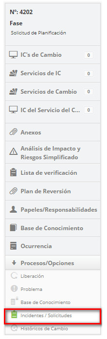

title: Ejecución de solicitud de cambios
Description: Esta funcionalidad permite realizar la ejecución de la solicitud de cambio.
# Ejecución de solicitud de cambios

Essa funcionalidade permite realizaEsta funcionalidad permite realizar la ejecución de la solicitud de cambio.

Cómo acceder
--------------

1. Acceda a la funcionalidad de ejecución de solicitud de cambio a través de la navegación en el menú principal 
**Procesos ITIL > Gestión de Cambio > Gestión de Cambio**.

Condiciones previas
---------------

1. Tener registro por lo menos una solicitud de cambio (ver conocimiento [Registro de solicitud de cambio](/es-es/citsmart-platform-7/processes/change/register-change.html)).

Filtros
--------

1. Los siguientes filtros posibilitan al usuario restringir la participación de ítems en el listado default de la funcionalidad, 
facilitando la localización de los ítems deseados:

    - Número del cambio;
    
    - Asignada/Compartida;
    
    - Ítems por página.
    
    
    
    **Figura 1 - Pantalla de filtros**
    
Listado de ítems
-------------------

1. El(Los) siguiente (s) campo (s) de registro está (n) disponible (s) para facilitar al usuario la identificación de los 
elementos deseados en el listado default de la funcionalidad: **Número, Solicitante, Creada en, Prioridad, Plazo, Plazo límite, Atraso, Situación, Tarea actual, Grupo Ejecutor** y **Responsable actual**.

2. Hay botones de acción disponibles para el usuario en relación con cada elemento de la lista, que son: *Ver, Informes* y 
*Acción*.

**Figura 2 - Pantalla de lista de cambio**

Completar los campos de registro
------------------------------------

1. No se aplica.

Ejecutando solicitudes de cambio
---------------------------------

1. En la ficha Gestión, busque la solicitud de cambio que desea registrar la información de su ejecución, haga clic en el botón 
*Acción* y seleccione la opción *Iniciar/Ejecutar* tarea de la misma, como se indica en la siguiente imagen:

    
    
    **Figura 3 - Registrar la ejecución de la solicitud de cambio**
    
2. Se mostrará la pantalla de **solicitud de cambio** con los campos a ser completados con el contenido correspondiente a la 
solicitud seleccionada;

    - Registre la información necesaria sobre la ejecución de la solicitud de cambio:
    
        - Haga clic en el botón *Agregar registro de ejecución*;
        - Describa la información sobre la ejecución de su actividad.
        
Vinculación del problema al cambio
-------------------------------------

1. Informe el problema (s) referente al cambio:

    - Al lado derecho de la pantalla de solicitud de cambio, haga clic en la opción **Problema**;
    
    
    
    **Figura 4 - Selección de problemas**
    
    - Haga clic en el icono  para vincular un problema;
    - Aparecerá una ventana de consulta de problemas. Realice la consulta y seleccione el problema. Hecho esto, se relacionará el 
    problema al cambio;
    
    
    
    **Figura 5 - Relacionamento de problema à mudança**
    
    - Si desea ver el registro de problemas relacionados con el cambio, simplemente haga clic en el icono 
     del mismo;
    - Si desea eliminar un problema relacionado con el cambio, simplemente haga clic en el icono 
     del mismo.
    
Vinculación de las solicitudes/incidentes al cambio
-------------------------------------------------------

1. Informe las solicitudes de servicio/incidentes referentes al cambio:

    - Al lado derecho de la pantalla de solicitud de cambio, haga clic en la opción Solicitudes/Incidentes;
    
    
    
    **Figura 6 - Selección de solicitudes/incidentes**
    
    - Haga clic en el icono   para vincular el Solicitud de Servicio/Incidente;
    - Se mostrará una ventana para la consulta de Solicitud de Servicio/Incidente, realice la consulta y seleccione el 
    solicitud/incidente;
    - Se relacionará el solicitud/incidente al cambio;
    
    
    
    **Figura 7 - Relación de solicitud/incidente al cambio**
    
    - Si desea crear un nuevo incidente referente al cambio, simplemente haga clic en el icono ;
    - Si desea eliminar una solicitud/incidente que se ha relacionado, simplemente haga clic en el icono
    .
    
Vinculación de la liberación al cambio
--------------------------------------------

1. Informe la liberación referente al cambio:

    - Al lado derecho de la pantalla de solicitud de cambio, haga clic en la opción **Liberación**;
    
    
    
    **Figura 8 - Selección de liberación**
    
    - Haga clic en el icono  para vincular la liberación;
    - Aparecerá una ventana de consulta de liberación. Realice la consulta y seleccione la liberación. Hecho esto, se relaciona 
    la liberación al cambio;
    
    
    
    **Figura 9 - Relación de liberación al cambio**
    
    - Si desea eliminar una liberación que se ha relacionado, simplemente haga clic en el icono 
    . 
    
Vinculando conocimiento al cambio
---------------------------------------

1. Informe el conocimiento referente al cambio:

    - Al lado derecho de la pantalla de solicitud de cambio, haga clic en la opción **Base de conocimiento**;
    
    
    
    **Figura 10 - Selección de base de conocimiento**
    
    - Haga clic en el botón *Agregar conocimientos* para agregar el conocimiento;
    - Se mostrará una ventana de consulta de conocimientos. Realice la consulta y seleccione el conocimiento. Hecho esto, se 
    relacionará el conocimiento al cambio;
    - Si desea crear un nuevo conocimiento referente al cambio, basta con hacer clic en el botón *Registro de Conocimiento*;
    
    
    
    **Figura 11 - Relación de conocimiento al cambio**
    
    - Si desea eliminar un conocimiento que se ha relacionado, simplemente haga clic en el icono Relación de conocimiento al cambio .
    
Vinculando papeles/responsabilidades al cambio
-----------------------------------------------

1. Informe los roles/responsabilidades, es decir, las personas involucradas en la ejecución de la solicitud de cambio:

    - Al lado derecho de la pantalla de solicitud de cambio, haga clic en la opción **Papeles/Responsabilidades**;
    
    
    
    **Figura 12 - Selección de papeles/responsabilidades**
    
    - Se mostrará una ventana para realizar la investigación de las personas involucradas en la ejecución de la solicitud de 
    cambio;
    
    !!! note "NOTA"
    
        Los responsables del IC vinculados a la solicitud de cambio ya se presentarán automáticamente.
        
    - Realice la consulta y seleccione el empleado implicado en la ejecución de la solicitud de cambio;
    - Informe el papel del empleado en la ejecución de cambio;
    - Seleccione la responsabilidad y haga clic en *Agregar* para realizar la operación;
    
    
    
    **Figura 13 - Relación de papeles/responsabilidades al cambio**
    
    - Si desea excluir la información sobre la persona involucrada en la ejecución de la solicitud de cambio que se ha agregado, 
    basta con hacer clic en el icono  de la misma. Con excepción de los responsables que 
    fueron traídos automáticamente del vínculo con el IC.
    
Vinculación de la ocurrencia del cambio
--------------------------------------------

1. Si desea insertar una instancia a la solicitud de cambio, proceda de la siguiente manera:

    - Al lado derecho de la pantalla de solicitud de cambio, haga clic en la opción **Ocurrencia**;
    
    
    
    **Figura 14 - Selección de ocurrencia**
    
    - Se mostrará la pantalla de **Ocurrencias** conteniendo dos fichas, una para visualización de la relación de las ocurrencias 
    registradas y otra para registro de ocurrencia;
    - Haga clic en la pestaña **Registro de Ocurrencia**, aparecerá pantalla de registro como se muestra en la figura siguiente:
    
    
    
    **Figura 15 - Registro de ocurrencia**
    
    - Complete los campos de acuerdo a la siguiente orientación:
        - **Categoría**: seleccione la categoría de la instancia. Si no se encuentra la categoría, es posible realizar un 
        registro rápido haciendo clic en el icono ;
        - **Origen**: seleccione el origen de la instancia. Si no se encuentra el origen, es posible realizar un registro rápido 
        haciendo clic en el icono;
        - **Tiempo Gasto (min)**: informe el tiempo gastado (en minutos);
        - **Registrado por**: informe por quién se registra la ocurrencia;
        - **Descripción**: informe la descripción de la ocurrencia;
        - **Ocurrencias**: describa los detalles de la ocurrencia;
        - **Información de contacto**: describa la información de contacto;
        - Después de informar todos los datos de la instancia, haga clic en el botón *Grabar* para realizar la operación, donde 
        la fecha, hora y usuario se almacenan automáticamente para una futura auditoría.
    - Después del registro de las informaciones sobre la ejecución de la solicitud de cambio, haga clic en el botón *Grabar y 
    avanzar* el flujo para efectuar la operación, donde la liberación será encaminada a la fase de evaluación;
    - Si desea grabar sólo la información registrada de la ejecución de la solicitud de cambio y mantener la tarea actual, haga 
    clic en el botón *Grabar y mantener la tarea actual*;
    - En ambos casos anteriores, al hacer clic en el botón *Grabar* la fecha, hora y usuario se almacenan automáticamente para 
    una futura auditoría.
    
!!! tip "About"

    <b>Product/Version:</b> CITSmart | 7.00 &nbsp;&nbsp;
    <b>Updated:</b>09/19/2019 – Larissa Lourenço
