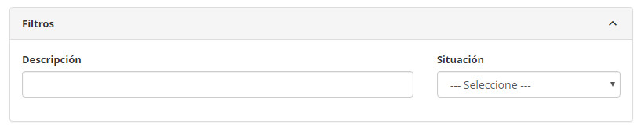
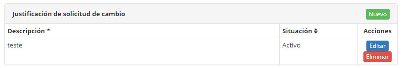
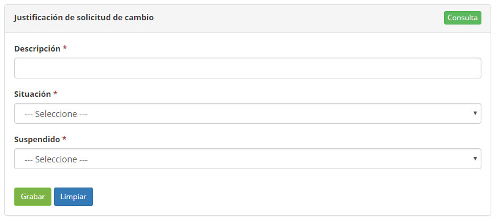

title: Registro y consulta de justificación de solicitud de cambio
Description: Esta funcionalidad tiene por objeto registrar la justificación de solicitud de cambio
# Registro y consulta de justificación de solicitud de cambio

Esta funcionalidad tiene por objeto registrar la justificación de solicitud de cambio que se utilizará en otras rutinas del 
sistema.

Cómo acceder
---------------

1. Acceda a la funcionalidad de búsqueda de liberación mediante la navegación en el menú principal 
**Procesos ITIL > Gestión de Cambios > Justificación Solicitud Cambio**.

Condiciones previas
---------------------

1. No se aplica.

Filtros
---------

1. Los siguientes filtros permiten al usuario restringir la participación de ítems en el listado default de la funcionalidad, 
facilitando la localización de los ítems deseados, como se muestra en la figura siguiente:

    - Descripción;
    - Situación.
    
    
    
    **Figura 1 - Pantalla de búsqueda de justificación de solicitud de cambio**
    
2. En la pantalla de registro de justificación de solicitud de cambio, haga clic en el botón *Consulta*. Se mostrará la pantalla 
de justificación de solicitud de cambio, como se muestra en la figura siguiente. En esta pantalla, se muestran las 
justificaciones de solicitud de cambio registradas para la visualización.

Listado de ítems
-------------------

1. El(Los) siguiente (s) campo (s) de registro está (n) disponible (s) para facilitar al usuario la identificación de los 
elementos deseados en el listado default de la funcionalidad: **Descripción** y **Situación**.

2. Hay botones de acción disponibles para el usuario en relación con cada elemento de la lista, que son: *Editar* y *Eliminar*.

    
    
    **Figura 2 - Pantalla de ítems**
    
3. Para realizar la investigación de una justificación de solicitud de cambio, informe la descripción y/o situación de la misma. 
Después de eso, se mostrará el registro según los datos informados;

4. Para cambiar los datos del registro de justificación de solicitud de cambio, haga clic en el botón *Editar*. Hecho esto, será 
dirigido a la pantalla de registro mostrando el contenido referente al registro seleccionado.

Completar los campos de registro
-------------------------------------

1. Haga clic en el botón *Nuevo*. Hecho esto, se presentará la pantalla de registro de justificación de solicitud de cambio, como 
se muestra en la figura siguiente:

    
    
    **Figura 3 - Pantalla de registro de justificación de solicitud de cambio**
    
2. Rellene los campos según las instrucciones a continuación:

    - **Descripción**: informe la descripción de la justificación de la solicitud de cambio;
    - **Suspensión**: informe si la justificación será para suspensión de la solicitud de cambio, seleccionando una de las 
    opciones (No o Sí);
    - **Situación**: seleccione la situación de la justificación de solicitud de cambio.
    
3. Haga clic en el botón *Grabar* para realizar el registro, donde la fecha, hora y usuario se guardarán automáticamente para una 
futura auditoría.

!!! tip "About"

    <b>Product/Version:</b> CITSmart | 7.00 &nbsp;&nbsp;
    <b>Updated:</b>09/19/2019 – Larissa Lourenço

