title: Planeamiento de solicitud de cambios
Description: Esta funcionalidad permite realizar la planificación de ejecución de la solicitud de cambio.
# Planeamiento de solicitud de cambios

Esta funcionalidad permite realizar la planificación de ejecución de la solicitud de cambio.

Condiciones previas
-----------------------

1. Se ha registrado una solicitud de cambio (ver conocimiento [Registro de solicitud de cambio](/es-es/citsmart-platform-7/processes/change/register-change.html)).

Planificación de requisitos de cambio
-------------------------------------------

!!! note "NOTA"

    Sólo se planifican las solicitudes de cambio de tipo "normal".
    
1. Acceda a la funcionalidad de planificación de solicitud de cambio a través de la navegación en el menú principal 
**Procesos ITIL > Gestión de Cambios > Gestión del Cambio**.

2. En la ficha Administración, busque la solicitud de cambio que desea registrar la planificación, haga clic en el botón Acción 
de la misma y luego en *Crear actividad* como se indica en la figura siguiente:

    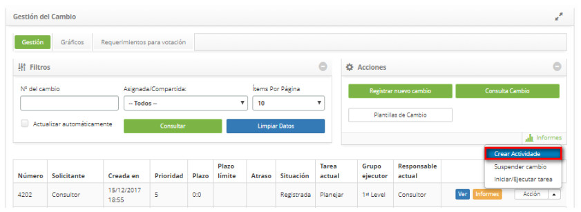
    
    **Figura 1 - Planear la ejecución de la solicitud de cambio**
    
3. Se mostrará la siguiente pantalla:

    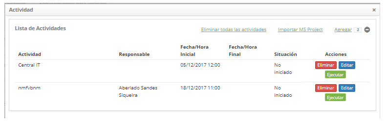
    
    **Figura 2 - Lista de actividades**
    
    - Para eliminar una actividad de la lista de actividades, simplemente haga clic en el botón *Eliminar*;
    - Para editar la información de la actividad, basta con hacer clic en el botón *Editar*;
    - Para realizar una actividad, basta con hacer clic en el botón *Ejecutar*, aparecerá la siguiente pantalla:
    
    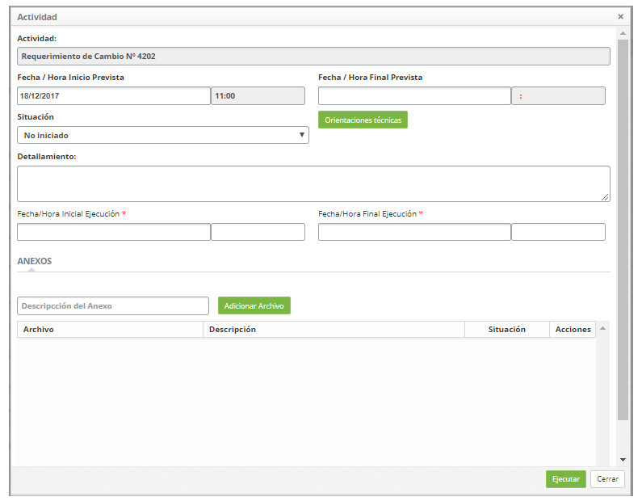
    
    **Figura 3 - Pantalla de ejecución de actividad**
    
    !!! info "IMPORTANTE"
    
        El responsable de la actividad debe rellenar la información de ejecución de la actividad.
        
    - **Situación**: seleccione la situación de la actividad, para facilitar la gestión del cambio;
    - Haga clic en el botón Orientaciones técnicas para ver lo que se ha informado de la descripción de la solicitud de cambio;
    - **Detallamiento**: informe los detalles sobre la ejecución de la actividad;
    - **Fecha/Hora Inicial Ejecución**: informe la fecha y el horario de inicio de la ejecución de la actividad;
    - **Fecha/Hora Final Ejecución**: informe la fecha y el horario de finalización de la ejecución de la actividad;
    - Para adjuntar un archivo a la actividad, introduzca la descripción del archivo adjunto, haga clic en el botón 
    *Agregar archivo* y seleccione el archivo que desee;
    - Haga clic en el botón *Ejecutar* para guardar la información rellenada referente a la actividad.
    
4. Para eliminar todas las actividades de la lista de actividades, basta con hacer clic en el botón *Eliminar todas las 
actividades*;  

5. Para importar actividades desde un archivo default de MS Project, simplemente haga clic en el botón *Importar MS Project* 
(acceder a la sección *Importación de Cronogramas MS-Project para Actividades de cambio* en este conocimiento);

6. Para registrar las actividades manualmente, haga clic en *Agregar*, aparecerá la pantalla para registrar la actividad: 

    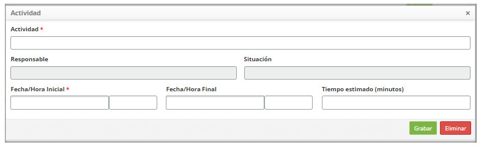
    
    **Figura 4 - Añadir la actividad**
    
    - **Actividad**: informe el nombre de la actividad;

    - **Responsable**: informe al responsable de la actividad;

    - **Situación**: este campo será rellenado de acuerdo con la marcha de la actividad;

    - **Fecha/Hora Inicial**: informe la fecha y hora planificadas para iniciar la ejecución de la actividad;

    - **Fecha/Hora Final**: informe la fecha y hora planificada para el fin de la ejecución de la actividad;

    - **Tiempo estimado (minutos)**: informe el plazo plan para la ejecución de la actividad, en minutos.

Importación de conogramas MS-Project para actividades de cambio
-------------------------------------------------------------------

1. En la "Lista de Actividades" es posible registrar las actividades manualmente o utilizando la aplicación Microsoft Project;

    - Para importar actividades registradas en la aplicación de Microsoft Project, haga clic en *Importar MS Project*;
        - Se mostrará la pantalla para importar el archivo de MS Project:
        
    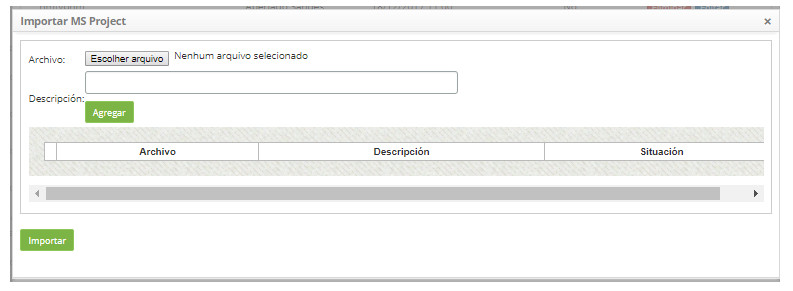
    
    **Figura 5 - Importar MS Project**
    
    - Haga clic en el botón *Elegir el archivo*. Se mostrará una ventana, donde podrá seleccionar el archivo deseado;
    - Seleccione el archivo;
    - Introduzca la descripción del archivo y haga clic en el botón *Agregar*;
    - Después de agregar el archivo, haga clic en el botón *Importar* y confirme la ejecución de la importación.

Anexando plan de reversa (back-out)
----------------------------------------

1. En la pantalla de lista de Gestión de Cambios → Botón Acción → Iniciar/Ejecutar tarea;

    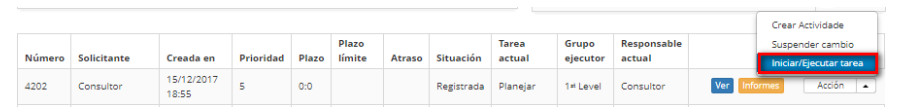
    
    **Figura 6 - Pantalla de gestión de cambios**
    
2. Informe el plan de reversa del cambio, haciendo clic en el lado derecho de la pantalla de solicitud de cambio, en la opción 
**Plan de Reversión**;

    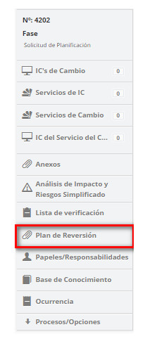
    
    **Figura 7 - Selección de plan de reversión**
    
3. Se mostrará la pantalla de datos adjuntos de plan de reversión, como se presenta en la figura siguiente:

    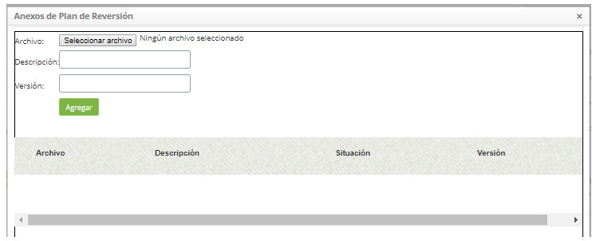
    
    **Figura 8 - Pantalla de datos adjuntos de plan de reversión**
    
    - Haga clic en el botón *Seleccionar archivo*. Se mostrará una ventana, donde podrá seleccionar el archivo (back-out);
    - Seleccione el archivo, introduzca la descripción y la versión del archivo. Haga clic en el botón *Agregar*.
    
Lista de proyectos
----------------------

1. En la pantalla de lista de **Gestión del Cambio > Botón Acciones > Iniciar/Ejecutar tarea**;

2. En la ficha "Planificación", haga clic en el icono ;

3. Haga clic en *Agregar*:

    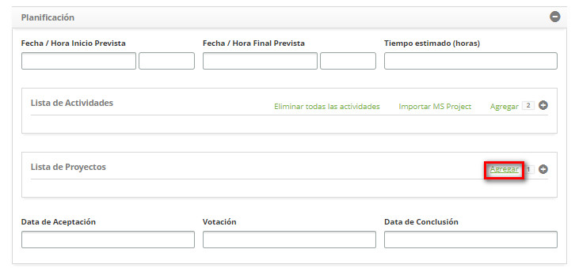
    
    **Figura 9 - Agregar proyecto a la solicitud de cambio**
    
    - Informe el (los) Proyecto (s) vinculado (s) a la solicitud de cambio;
    - Se mostrará la ventana para registrar y buscar proyecto;
    - En la pantalla **Proyecto**, en la pestaña **Registro**, se muestra la respectiva pantalla de registro, como se muestra a 
    continuación:
    
    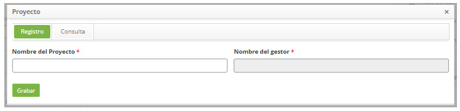
    
    **Figura 10 - Vincular proyecto**
    
    - **Nombre del Proyecto**: informe el nombre del proyecto;
    - **Nombre del Gestor**: informe el nombre del gestor;
    - Haga clic en el botón *Grabar* para realizar el registro y el mismo aparecerá en la "Lista de Proyectos".
    
4. En la pantalla Proyecto, haga clic en la pestaña Consulta, aparecerá la pantalla de consulta como se muestra en la figura 
siguiente:

    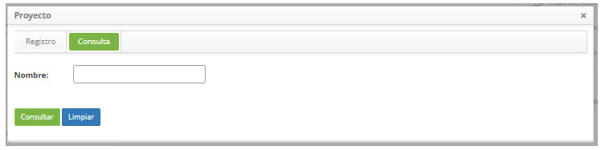
    
    **Figura 11 - Buscar proyecto**
    
    - Introduzca el nombre del proyecto que desea buscar y haga clic en el botón *Consultar*. Después de eso, se mostrará el 
    registro del proyecto según el nombre informado;
    - Si desea listar todos los registros de proyecto, simplemente haga clic directamente en el botón *Consultar*;
    - Seleccione el proyecto que desee y el mismo será presentado en la "Lista de Proyectos";
    - El botón *Limpiar* cuando se activa, limpia la búsqueda, preparando el entorno para una nueva búsqueda;
    
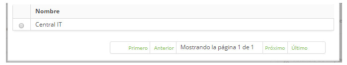

**Figura 12 - Lista de proyectos**

Planeando el análisis de impacto y riesgo por alvos
--------------------------------------------------------

Condiciones previas
-----------------------

1. Depende del tipo registrado en tipo de cambio (ver conocimiento [Registro y consulta del tipo de cambios](/es-es/citsmart-platform-7/processes/change/change-type.html));

2. Informe el "análisis de impacto y riesgo" implicado en el cambio, que puede ser "por objetivo" o "simplificado".

Análisis de Impacto y Riesgo por objetivos
--------------------------------------

1. En la pantalla de lista de **Gestión del Cambios > botón Acciones > Iniciar/Ejecutar tarea**;

    - Al lado derecho de la pantalla de solicitud de cambio, haga clic en la opción "Análisis de Impacto y Riesgo para 
    objetivos":
    
    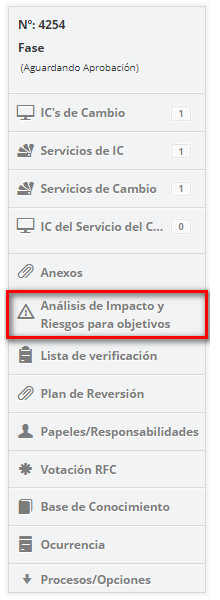
    
    **Figura 13 - Selección de análisis de impacto y riesgo por objetivos**
    
    - En la pestaña **Objetivos**, introduzca los objetivos del cambio que se considerarán para el análisis de impacto y la 
    evaluación de riesgos. Los objetivos pueden ser Item de Configuración, Servicio y Función Vital.
    
    !!! info "IMPORTANTE"
    
        Para añadir un objetivo del tipo Función Vital, es necesario vincular un servicio del cambio que posea proceso de negocio 
        con el tipo función vital.
        
    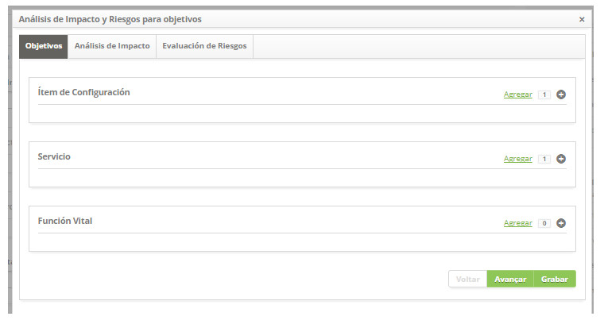
    
    **Figura 14 - Objetivos**
    
    - Haga clic en Agregar;
    - Se mostrará la ventana de búsqueda del objetivo (s);
    - Seleccione el (los) objetivo (s) deseado (s) y haga clic en el botón *Avanzar*;
    - Si desea adjuntar un archivo al objetivo, haga clic en el icono , busque y agregue el 
    archivo;
    - Para guardar la información rellenada y continuar, haga clic en *Grabar*.
    
    !!! warning "ATENCIÓN"
    
        Es obligatorio informar al menos a un objetivo para proseguir el análisis de impacto y la evaluación de riesgos, 
        recordando que el objetivo objetivo del tipo "función vital" se presentará de acuerdo con el (los) servicio (s) el cambio 
        que se vinculó a la solicitud de cambio.
        
    - En la pestaña Análisis de Impacto, haga el análisis de impacto para los blancos del cambio;
    
    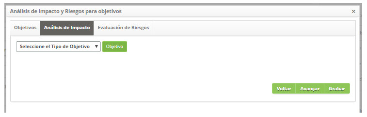
    
    **Figura 15 - Análisis de impacto**
    
    - Seleccione el tipo de Objetivo blanco y haga clic en el botón *Objetivo* para buscar los objetivos según el tipo de destino 
    elegido;
    - Se mostrará solamente el (los) objetivo (s) que fueron informados por adelantado en la pestaña "Objetivos";
    - Seleccione el objetivo deseado para rellenar el análisis de impacto del mismo, como se indica en la siguiente imagen:
    
    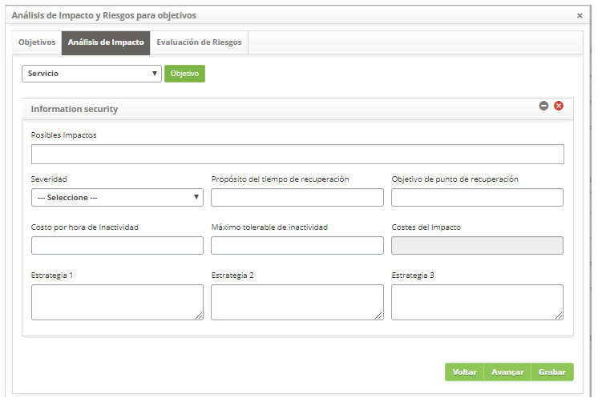
    
    **Figura 16 - Selección de blancos**
    
    - **Posibles Impactos**: informe los posibles impactos del blanco para el cambio;
    - **Severidad**: informe la gravedad del blanco para el cambio;
    - **Propósito del tiempo de recuperación**: informe el tiempo esperado para la recuperación del objetivo durante el cambio;
    - **Objetivo de punto de recuperación**: informe el tiempo que comenzará la recuperación del blanco durante el cambio;
    - **Costo por hora de inactividad**: defina el costo por hora cuando haya indisponibilidad de ese blanco; de esa función 
    vital;
    - **Máximo tolerable de inactividad**: informe el tiempo máximo que el blanco puede quedar inactivo;
    - **Costes del impacto**: defina el costo por impacto cuando hay indisponibilidad de ese objetivo, de esa función vital;
    - **Estrategia 1**: describir la primera estrategia para la continuidad del servicio;
    - **Estrategia 2**: describa la segunda estrategia para la continuidad del servicio;
    - **Estrategia 3**: describa la tercera estrategia para la continuidad del servicio;
        
    - En la pestaña **Evaluación de Riesgos**, haga la evaluación de riesgos para los objetivos del cambio;
    
    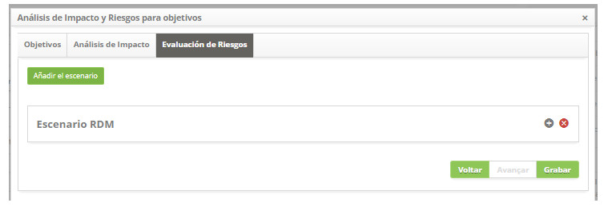
    
    **Figura 17 - Evaluación de riesgos**
    
    - Haga clic en el botón *Añadir el escenario* para rellenar información de escenarios de riesgo;
    
    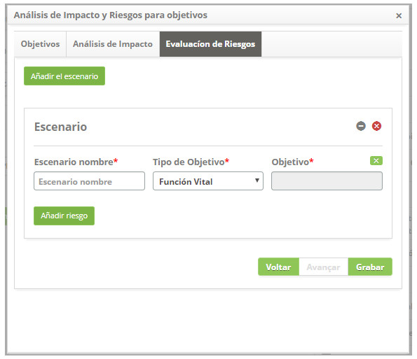
    
    **Figura 18 - Añadir escenario**
    
    - **Escenario Nombre**: informe el nombre del escenario;
    - **Tipo de objetivo**: seleccione el tipo de blanco;
    - **Objetivo**: seleccione el objetivo. Si desea borrar el dato informado en el campo, haga clic en el icono
    ;
    - Agregue los riesgos a la evaluación:
        - Haga clic en el botón *Añadir riesgo* y aparecerá la pantalla de registro y / o búsqueda de riesgos, como se muestra en 
        la figura siguiente:
            
    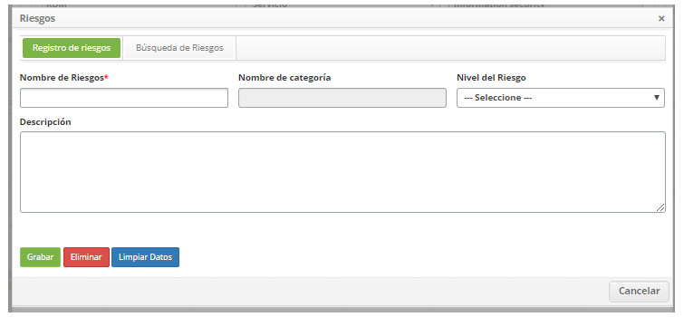
    
    **Figura 19 - Pantalla de registro e investigación de riesgo**
    
     - Realice la búsqueda y seleccione el riesgo deseado. Después de eso, se añadirá el riesgo en la pantalla, como ejemplo 
     ilustrado en la figura abajo:
            
    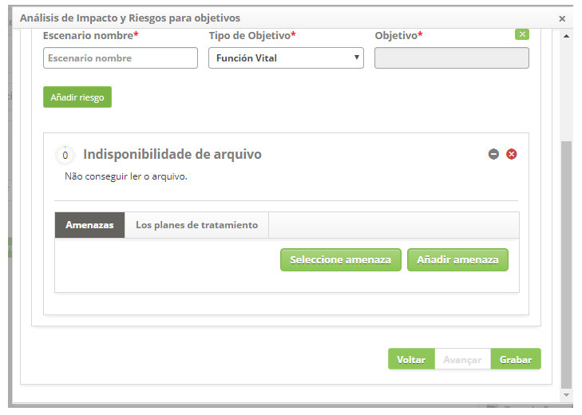
    
    **Figura 20 - Amenazas**
    
    - Haga clic en el botón *Seleccionar amenaza* para agregar la amenaza de riesgo. Se presentará el campo para informar de la 
    amenaza. Después de seleccionar la amenaza, haga clic en el icono para expandir la pantalla e informar la probabilidad, el 
    impacto de la amenaza y la justificación sobre el riesgo;
        
    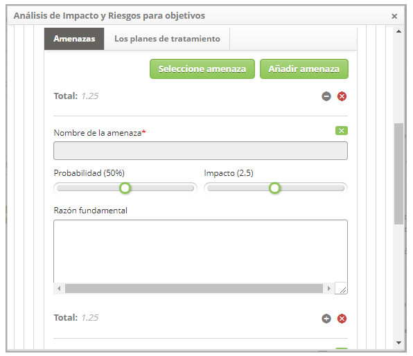
    
    **Figura 21 - amenazas**
    
    - Después de informar a la (s) amenaza (s), haga clic en la ficha Los planes de Tratamiento. Se presentará la pantalla de 
    plan de tratamiento como se muestra en la figura siguiente:
        
    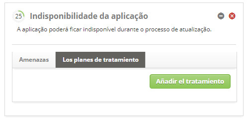
    
    **Figura 22 - Planos de tratamiento**
    
    - Haga clic en el botón Añadir el tratamiento para registrar el trata de la amenaza. Se mostrará el campo para informar la 
    descripción del plan de trata. Después de informar el nombre del plan haga clic en el icono
     para expandir la pantalla e informar la probabilidad y el impacto de la trata 
    sobre la amenaza;
        
    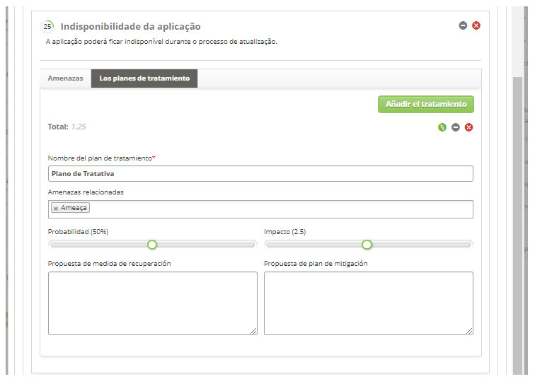
    
    **Figura 23 - Planos de tratamiento**
    
    - **Nombre del plan de tratamiento**: informe en el nombre del plan de trata de las amenazas;
    - **Amenazas relacionadas**: informe las amenazas relacionadas con el riesgo;
    - **Probabilidad**: informe la probabilidad de tratar las amenazas;
    - **Impacto**: informe el impacto de la trata sobre las amenazas;
    - **Propuesta de medida de recuperación**: describa la propuesta de la medida de recuperación;
    - **Propuesta de plan de mitigación**: describa la propuesta del plan de mitigación;
        
    !!! note "NOTA"
    
        Es posible, después del registro de los datos del plan de trata, verificar el gráfico de evaluación de riesgos (ver 
        conocimiento [Ejecución de solicitud de cambios][1]), en la sección de Seguimiento del desarrollo de los riesgos.
        
    - Después de la definición de amenazas y planes de trata, la evaluación de riesgos estará completa, a continuación, haga clic 
    en el botón *Grabar* para registrar, donde la fecha, hora y usuario se guardarán automáticamente para una futura auditoría.
    
Análisis de Impacto y Riesgo Simplificado
----------------------------------------

- Al lado derecho de la pantalla de solicitud de cambio, haga clic en la opción **Análisis de Impacto y Riesgo Simplificado**;
    
    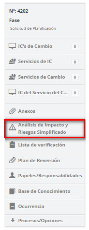
    
    **Figura 24 - Análisis de impacto y riesgo simplificado**
    
- Haga clic en el icono  para relacionar los riesgos con la solicitud de cambio;
    - Aparecerá una ventana de búsqueda de riesgos. Realice la búsqueda y seleccione el riesgo de cambio. Hecho esto, el riesgo 
    será relacionado con la solicitud de cambio;
        
    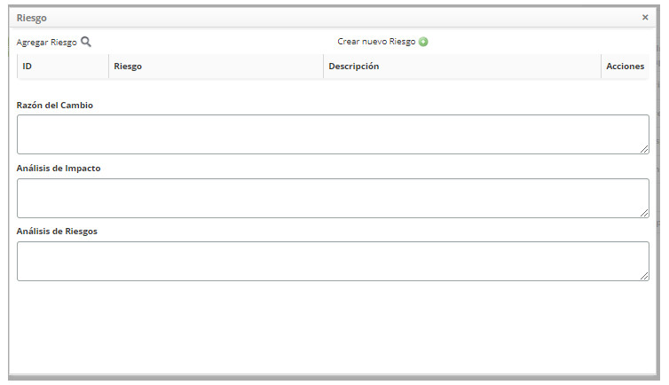
    
    **Figura 25 - Registro de los riesgos implicados en el cambio**
    
- Si desea registrar un nuevo riesgo desde esta pantalla, haga clic en el icono ;
    
    - **Razón del Cambio**: describa cuál es la razón del cambio;
    - **Análisis de Impacto**: describa los impactos que el cambio tendrá;
    - **Análisis de Riesgos**: describa el análisis de los riesgos involucrados en el cambio.  
    
[1][/pt-br/citsmart-platform-7/processes/change/change-execution.html]
        
!!! tip "About"

    <b>Product/Version:</b> CITSmart | 7.00 &nbsp;&nbsp;
    <b>Updated:</b>09/19/2019 – Larissa Lourenço
    
 
