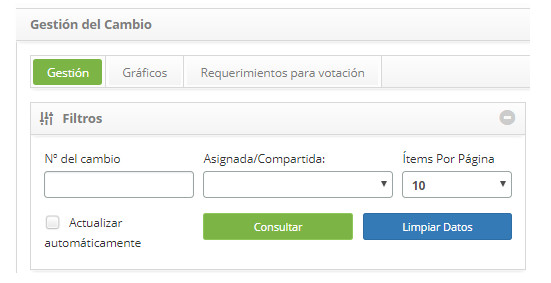
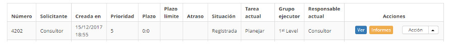
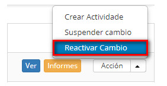

title: Reactivación de solicitud de cambios
Description: Esta característica permite reactivar la solicitud de cambio que se ha suspendido.
# Reactivación de solicitud de cambios

Esta característica permite reactivar la solicitud de cambio que se ha suspendido.

Cómo acceder
--------------

1. Acceda a la funcionalidad de reactivación de solicitud de cambio a través de la navegación en el menú principal 
**Procesos ITIL > Gestión de Cambios > Gestión del Cambio**.

Condiciones previas
------------------------

1. Tener registro por lo menos una solicitud de cambio (ver conocimiento [Registro de solicitud de cambio](/es-es/citsmart-platform-7/processes/change/register-change.html)).

Filtros
---------

1. Los siguientes filtros posibilitan al usuario restringir la participación de ítems en el listado default de la funcionalidad, 
facilitando la localización de los ítems deseados:

    - Número del Cambio;

    - Asignada/Compartida;

    - Ítems por página.

    

    **Figura 1 - Pantalla de consulta de cambio**

Listado de ítems
------------------

1. El(Los) siguiente (s) campo (s) de registro está (n) disponible (s) para facilitar al usuario la identificación de los 
elementos deseados en el listado default de la funcionalidad: **Número, Solicitante, Creada en, Prioridad, Plazo, Plazo límite, 
Atraso, Situación, Tarea actual, Grupo Ejecutor** y **Responsable actual**.

2. Existen botones de acción disponibles para el usuario en relación con cada elemento de la lista, que son: *Ver* e *Informes*.

**Figura 2 - Pantalla de lista de cambio**

Completar los campos de registro
-------------------------------------

1. No se aplica.

Reactivación de la solicitud de cambio
-----------------------------------------

1. En la ficha Gestión, busque la solicitud de cambio que está suspendida y desea reactivar, haga clic en el botón *Acción* y 
seleccione la opción *Reactivar Cambio*, como se indica en la siguiente imagen:

    
    
    **Figura 3 - Botón Reactivar cambio**
    
    - Aparecerá un mensaje para confirmar la reactivación.
    - Haga clic en *OK* para realizar la operación.
    - La situación de la solicitud se actualizará en la lista de solicitudes de cambio.
    
!!! tip "About"

    <b>Product/Version:</b> CITSmart | 7.00 &nbsp;&nbsp;
    <b>Updated:</b>09/19/2019 – Larissa Lourenço
