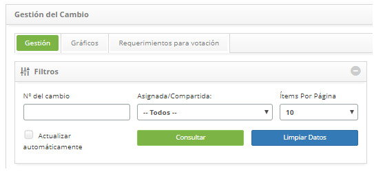
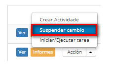
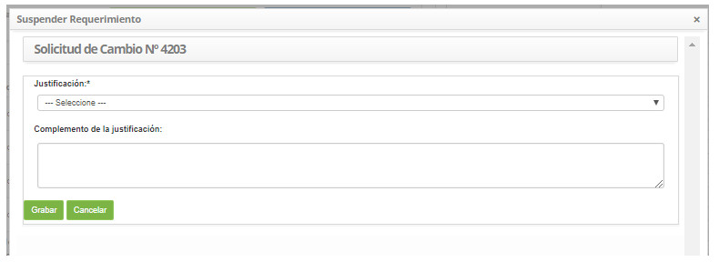
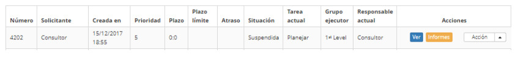

title: Suspensión de solicitud de cambios
Description: Esta característica permite suspender la solicitud de cambio.
# Suspensión de solicitud de cambios

Esta característica permite suspender la solicitud de cambio.

Cómo acceder
--------------

1. Acceda a la funcionalidad de suspensión de solicitud de cambio a través de la navegación en el menú principal 
**Procesos ITIL > Gestión de Cambios > Gestión de Cambios**. En la ficha Gerenciamiento, busque la solicitud de cambio que desea 
suspender, haga clic en el botón *Acción* y seleccione la opción *Suspender cambio*.

Condiciones previas
----------------------

1. Tener la justificación de solicitud de cambio catastrada (ver conocimiento [Registro y consulta de justificación de solicitud de cambio](/es-es/citsmart-platform-7/processes/change/change-justification.html))

Filtros
----------

1. Los siguientes filtros posibilitan al usuario restringir la participación de ítems en el listado default de la funcionalidad, 
facilitando la localización de los ítems deseados:

    - Número del cambio;

    - Asignada/Compartida;

    - Ítems por página.

    

    **Figura 1 - Pantalla de consulta de cambio**

Listado de ítens
-------------------

1. El(Los) siguiente (s) campo (s) de registro está (n) disponible (s) para facilitar al usuario la identificación de los 
elementos deseados en el listado default de la funcionalidad: **Número, Solicitante, Creada en, Prioridad, Plazo, Plazo límite, 
Atraso, Situación, Tarea Actual, Grupo Ejecutor** y **Responsable actual**.

2. Hay botones de acción disponibles para el usuario en relación con cada elemento de la lista, que son: *Ver*, *Informes* y *Acción*.

**Figura 2 - Pantalla de lista de cambio**

Completar los campos de registro
------------------------------------

1. No se aplica.

Suspendiendo requisitos de cambio
---------------------------------------

1. En la ficha **Gestión**, busque la solicitud de cambio que desea suspender, haga clic en el botón *Acción* y seleccione la 
opción *Suspender cambio*, como se indica en la siguiente imagen:

    
    
    **Figura 3 - Botón de suspensión**
    
2. Se mostrará una ventana para el registro de la justificación de suspensión de la solicitud de cambio:

    
    
    **Figura 4 - Registro de suspensión de solicitud de cambio**
    
    - **Justificación**: seleccione la Justificación de la suspensión de la solicitud de cambio;
    - **Complemento de la justificación**: informe el complemento de la justificación de suspensión de la solicitud de cambio;
    - Después de informar los datos, haga clic en el botón *Grabar* y aparecerá un mensaje para confirmar la suspensión, haga 
    clic en Aceptar para efectuar la operación, donde la fecha, hora y usuario se guardarán automáticamente para una futura 
    auditoría;
    - El botón *Cancelar*, al hacer clic, cancela la operación y vuelve a la pantalla de Gestión de cambios.
    
3. Después de la suspensión de la solicitud de cambio, la misma será actualizada en la lista de requisiciones de cambio, 
cambiando la situación a **Suspendida**, como se indica en la siguiente imagen:

**Figura 5 - Solicitud de cambio suspendido**

!!! tip "About"

    <b>Product/Version:</b> CITSmart | 7.00 &nbsp;&nbsp;
    <b>Updated:</b>09/19/2019 – Larissa Lourenço
