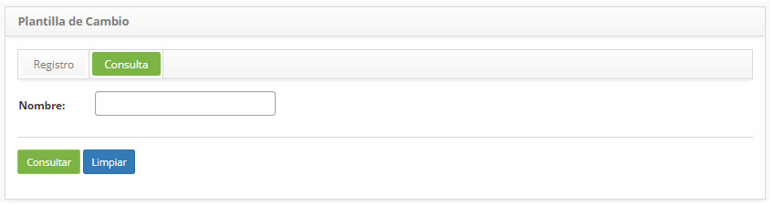
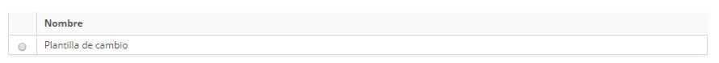
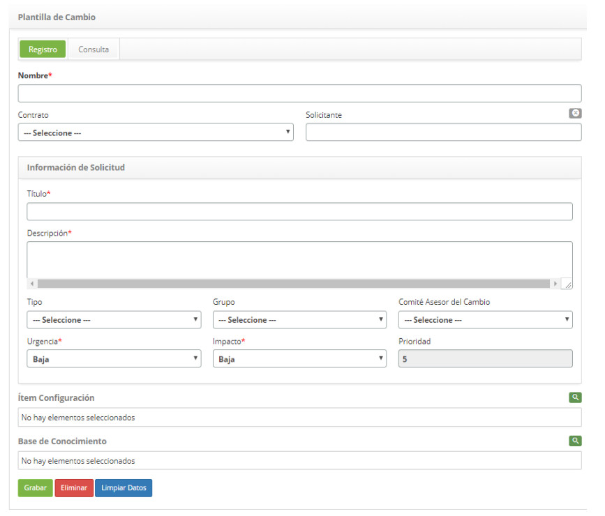

title: Registro y consulta de plantilla de cambios
Description: Esta funcionalidad tiene por objetivo registrar una plantilla
# Registro y consulta de plantilla de cambios

Esta funcionalidad tiene por objetivo registrar una plantilla para facilitar la apertura de una nueva solicitud de cambio.

Cómo acceder
---------------

1. Acceda a la funcionalidad de plantilla de cambio a través de la navegación en el menú principal 
**Procesos ITIL > Gestión de Cambios > Plantilla de Cambio**.

Condiciones previas
--------------------

1. No se aplica.

Filtros
---------

1. El siguiente filtro permite al usuario restringir la participación de elementos en el listado default de la funcionalidad, 
facilitando la localización de los elementos deseados:

    - Nombre.
    
    
    
    **Figura 1 - Pantalla de búsqueda de plantilla de cambio**
    
2. Realiza la búsqueda de plantilla de cambio;

    - Introduzca el nombre de la plantilla de cambio que desea buscar y haga clic en el botón *Consultar*. Después de eso, se 
    mostrará el registro de la plantilla de cambio según el nombre informado;
    
    - Si desea listar todos los registros de riesgo, simplemente haga clic directamente en el botón *Consultar*;
    
Listado de ítems
-------------------

1. El(Los) siguiente (s) campo (s) de registro está (n) disponible (s) para facilitar al usuario la identificación de los 
elementos deseados en el listado default de la funcionalidad: **Nombre**.

2. En la pantalla de plantilla de cambio, haga clic en la pestaña **Consulta**. Se mostrará la pantalla de búsqueda como se 
muestra en la figura siguiente:

    
    
    **Figura 2 - Listado de plantilla de cambio**
    
3. Después de la búsqueda, seleccione el registro deseado. Hecho esto, será dirigido a la pantalla de registro exhibiendo el 
contenido referente al registro seleccionado;

4. Para cambiar los datos del registro de plantilla de cambio, basta con modificar la información de los campos deseados y hacer 
clic en el botón *Grabar* para que se grabe el cambio realizado en el registro, donde la fecha, hora y usuario serán grabados 
automáticamente para una futura auditoría.

Completar los campos de registro
--------------------------------------

1. Se mostrará la pantalla de registro de plantilla de cambio, como se muestra en la figura siguiente:

    
    
    **Figura 3 - Pantalla de registro de plantilla de cambio**
    
2. Rellene los campos según las instrucciones a continuación:

    - **Nombre**: introduzca el nombre de la plantilla de cambio;
    
    - **Contrato**: seleccione el contrato para el cual se realizará la solicitud de cambio;
    
    - **Solicitante**: informe el nombre del solicitante, es decir, el nombre de la persona que está solicitando la apertura de 
    solicitud de cambio;
    
    - **Título**: informe el título de la solicitud de cambio;
    
    - **Descripción**: informe la descripción de la solicitud de cambio. La descripción debe ser objetiva, incluyendo toda la 
    información necesaria para la atención de la solicitud;
    
    - **Tipo**: seleccione el tipo de cambio;
    
        - **Cambio default**: es un cambio que es previamente pre-aprobado por la Gestión del Cambio y ya tiene procedimientos 
        aceptados y establecidos;
        
        - **Cambio normal**: es un cambio que sigue un flujo normal de evaluación, aprobación y autorización;
        
        - **Cambio de emergencia**: es un cambio en un servicio que pretende reparar de forma inesperada un error en el servicio 
        de TI.
        
    - **Grupo**: seleccione el grupo ejecutor, el cual será responsable por el atendimiento de la solicitud de cambio. En caso de 
    no ser informado el grupo, el mismo será establecido conforme definido en el registro de Tipo de Cambio de acuerdo con el 
    flujo;
    
    - **Comité Asesor del Cambio**: seleccione el Comité Consultivo de Cambio, grupo responsable de evaluar, ejecutar análisis de 
    riesgo y garantizar la participación de todas las áreas relacionadas con los cambios, aprobando o no su ejecución;
    
    - **Urgencia**: seleccione la urgencia del cambio;
    
    - **Impacto**: seleccione el impacto del cambio;
    
    - **Prioridad**: la prioridad será establecida por el sistema, tras informar de la urgencia e impacto;
    
    - **Ítem Configuración**: seleccione el (los) ítem (s) de configuración referente a la solicitud;
    
    - **Base de Conocimiento**: seleccione el (los) conocimiento (s) referente a la solicitud;
    
    - Haga clic en el botón *Grabar* para realizar el registro, donde la fecha, hora y usuario se guardarán automáticamente para 
    una futura auditoría.
    
!!! tip "About"

    <b>Product/Version:</b> CITSmart | 7.00 &nbsp;&nbsp;
    <b>Updated:</b>09/19/2019 – Larissa Lourenço
      
    
    
