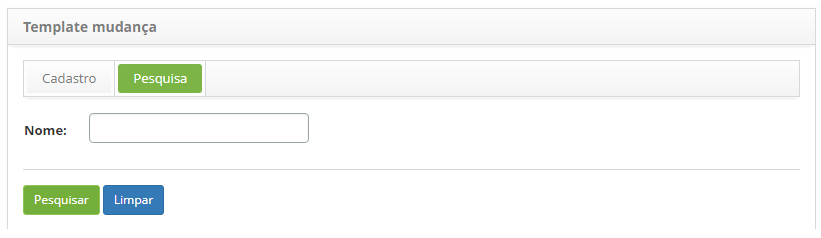
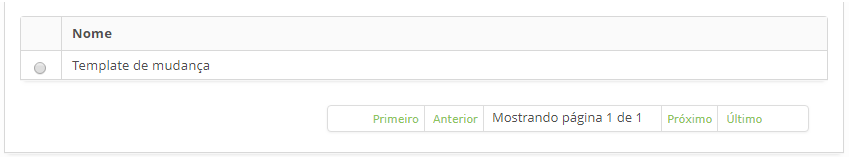
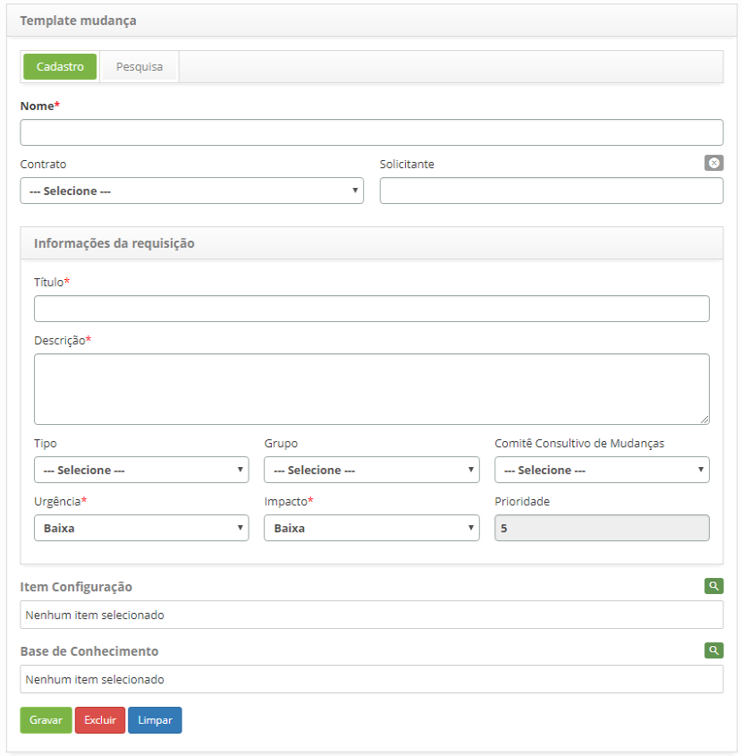

title: Cadastro e pesquisa de template de mudança
Description: Esta funcionalidade tem por objetivo cadastrar um template para facilitar a abertura de uma nova requisição de mudança.
# Cadastro e pesquisa de template de mudança

Esta funcionalidade tem por objetivo cadastrar um template para facilitar a abertura de uma nova requisição de mudança.

Como acessar
---------------

1. Acesse a funcionalidade de template de mudança através da navegação no menu principal 
**Processos ITIL > Gerência de Mudança > Template de Mudança**.

Pré-condições
---------------

1. Não se aplica.

Filtros
---------

1. O seguinte filtro possibilita ao usuário restringir a participação de itens na listagem padrão da 
funcionalidade, facilitando a localização dos itens desejados:

    - Nome
    
    
    
    **Figura 1 - Tela de pesquisa de template de mudança**
    
2. Realize a pesquisa de template de mudança;

    - Informe o nome do template de mudança que deseja pesquisar e clique no botão "Pesquisar". Após isso,
    será exibido o registro do template de mudança conforme o nome informado;
    
    - Caso deseje listar todos os registros de risco, basta clicar diretamente no botão "Pesquisar".
    
Listagem de itens
-------------------

1. O seguinte campo cadastral está disponível ao usuário para facilitar a identificação dos itens
desejados na listagem padrão da funcionalidade: **Nome**.

2. Na tela de **Template mudança**, clique na aba **Pesquisa**.

    
    
    **Figura 2 - Listagem de template de mudança**
    
3. Após a pesquisa, selecione o registro desejado. Feito isso, será direcionado para a tela de cadastro
exibindo o conteúdo referente ao registro selecionado;

4. Para alterar os dados do registro de template de mudança, basta modificar as informações dos campos 
desejados e clicar no botão "Gravar" para que seja gravada a alteração realizada no registro, onde a data,
hora e usuário serão gravados automaticamente para uma futura auditoria.

Preenchimento dos campos cadastrais
--------------------------------------

1. Será apresentada a tela de cadastro de template de mudança, conforme ilustrada na figura abaixo:

    
    
    **Figura 3 - Tela de cadastro de template de mudança**
    
2. Preencha os campos conforme orientações abaixo:

    - **Nome**: informe o nome do template de mudança;
    
    - **Contrato**: selecione o contrato para qual será feita a requisição de mudança;
    
    - **Solicitante**: informe o nome do solicitante, ou seja, o nome da pessoa que está solicitando a
    abertura de requisição de mudança;
    
    - **Título**: informe o título da requisição de mudança;
    
    - **Descrição**: informe a descrição da requisição de mudança. A descrição deve ser objetiva, incluindo toda 
    informação necessária para o atendimento da requisição;
    
    - **Tipo**: selecione o tipo de mudança;
    
        - **Mudança padrão**: é uma mudança que é previamente pré-aprovada pelo Gerenciamento de Mudança e já possui
        procedimentos aceitos e estabelecidos;
        
        - **Mudança normal**: é uma mudança que segue um fluxo normal de avaliação, aprovação e autorização;
        
        - **Mudança emergencial**: é uma mudança em um serviço que pretende reparar emergencialmente um erro no serviço de TI.
        
    - **Grupo**: selecione o grupo executor, o qual será responsável pelo atendimento da requisição de mudança. Caso não seja 
    informado o grupo, o mesmo será estabelecido conforme definido no cadastro de Tipo de Mudança de acordo com o fluxo;
    
    - **Comitê Consultivo de Mudança**: selecione o Comitê Consultivo de Mudanças, grupo responsável por avaliar, executar 
    análise de risco e garantir o envolvimento de todas as áreas relacionadas às mudanças, aprovando ou não sua execução;
    
    - **Urgência**: selecione a urgência da mudança;
    
    - **Impacto**: selecione o impacto da mudança;
    
    - **Prioridade**: a prioridade será estabelecida pelo sistema, após informar a urgência e impacto;
    
    - **Item Configuração**: selecione o(s) item(s) de configuração referente a requisição;
    
    - **Base de Conhecimento**: selecione o(s) conhecimento(s) referente a requisição;
    
    - Clique no botão "Gravar" para efetuar o registro, onde a data, hora e usuário serão gravados
    automaticamente para uma futura auditoria.
    
!!! tip "About"

    <b>Product/Version:</b> CITSmart | 7.00 &nbsp;&nbsp;
    <b>Updated:</b>07/11/2019 – Larissa Lourenço
      
    
    
