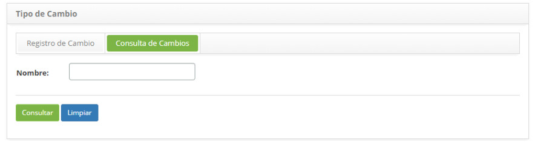
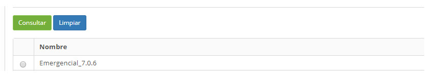
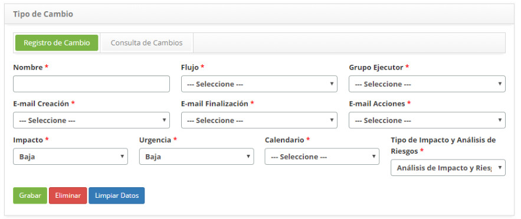

title: Registro y consulta del tipo de cambios
Description: Esta funcionalidad tiene por objeto registrar el tipo de cambio
# Registro y consulta del tipo de cambios

Esta funcionalidad tiene por objeto registrar el tipo de cambio que se utilizará para definir toda la configuración del flujo de 
trabajo que la solicitud seguirá.

Cómo acceder
--------------

1. Acceda a la funcionalidad de tipo de cambio a través de la navegación en el menú principal 
**Procesos ITIL > Gestión de Cambios > Tipo de Cambio**.

Condiciones previas
-----------------------

1. Tener el flujo referente a la gestión de cambio registrado (ver conocimiento [Mantenimiento del flujo de trabajo](/es-es/citsmart-platform-7/workflow/workflow-management.html))

2. Configurar las plantillas de correo electrónico (ver conocimiento [Registro y consulta de la configuración del modelo de e-mail](/es-es/citsmart-platform-7/plataform-administration/email-settings/configure-email-template.html))

3. Tener el grupo ejecutor registrado (ver conocimiento [Registro y consulta de grupo](/es-es/citsmart-platform-7/initial-settings/access-settings/user/group.html))

4. Han registrado calendario (ver conocimiento [Registro y consulta de calendario](/es-es/citsmart-platform-7/plataform-administration/time/create-calendar.html))

Filtros
---------

1. El siguiente filtro permite al usuario restringir la participación de elementos en el listado default de la funcionalidad, 
facilitando la localización de los elementos deseados:

    - Nombre.
    
    
    
    **Figura 1 - Pantalla de consulta de tipo de cambio**
    
2. Realice la consulta de tipo de cambio. Introduzca el nombre del tipo de cambio que desea consultar y haga clic en el botón 
*Consultar*. Después de eso, se mostrará el registro del tipo de cambio según el nombre informado;

    - Si desea listar todos los registros de tipo de cambio, basta con hacer clic directamente en el botón *Consultar*;
    
Listado de ítems
-------------------

1. El(Los) siguiente (s) campo (s) de registro está (n) disponible (s) para facilitar al usuario la identificación de los 
elementos deseados en el listado default de la funcionalidad: **Nombre**.

    
    
    **Figura 2 - Listado de tipo de cambio**
    
2. Después de la consulta, seleccione el registro deseado. Hecho esto, será dirigido a la pantalla de registro exhibiendo el 
contenido referente al registro seleccionado;

3. Para cambiar los datos del registro de tipo de cambio, basta con modificar la información de los campos deseados y hacer clic 
en el botón *Grabar* para que se grabe el cambio realizado en el registro, donde la fecha, hora y usuario serán grabados 
automáticamente para una futura auditoría.

Completar los campos de registro
-------------------------------------

1. Se mostrará la pantalla de registro de **Tipo de Cambio**, como se muestra en la figura siguiente:

    
    
    **Figura 3 - Pantalla de registro de tipo de cambio**
    
2. Rellene los campos según las instrucciones a continuación:

    - **Nombre**: introduzca el nombre del tipo de cambio;
    
    - **Flujo**: seleccione el flujo para que el mismo sea asociado al tipo de cambio que está siendo registrado;
    
    - **Grupo Ejecutor**: informe al grupo ejecutor, el cual será el grupo default del tipo de cambio, responsable por la 
    ejecución de la solicitud de cambio;
    
    - **E-mail Creación**: seleccione el modelo de e-mail de registro de solicitud de cambio que servirá para notificar al 
    solicitante que la solicitud de cambio ha sido registrada;
    
    - **E-mail Finalización**: seleccione el modelo de e-mail de finalización de la solicitud de cambio que servirá para 
    notificar al solicitante que la solicitud de cambio ha finalizado;
    
    - **E-mail Acciones**: seleccione el modelo de e-mail de progreso de la solicitud de cambio que servirá para notificar al 
    solicitante sobre el progreso de la solicitud de cambio;
    
    - **Impacto**: informe el impacto del tipo de cambio;
    
    - **Urgencia**: informe la urgencia del tipo de cambio;
    
    - **Calendario**: informe el calendario del tipo de cambio;
    
    - **Tipo de Impacto y Análisis de Riesgos**: seleccione el tipo de análisis de impacto y riesgo, simplificado o por blancos;
    
    - Haga clic en el botón *Grabar* para registrar, donde la fecha, la hora y el usuario se guardarán automáticamente para una 
    futura auditoría;
    
!!! tip "About"

    <b>Product/Version:</b> CITSmart | 7.00 &nbsp;&nbsp;
    <b>Updated:</b>09/19/2019 – Larissa Lourenço
