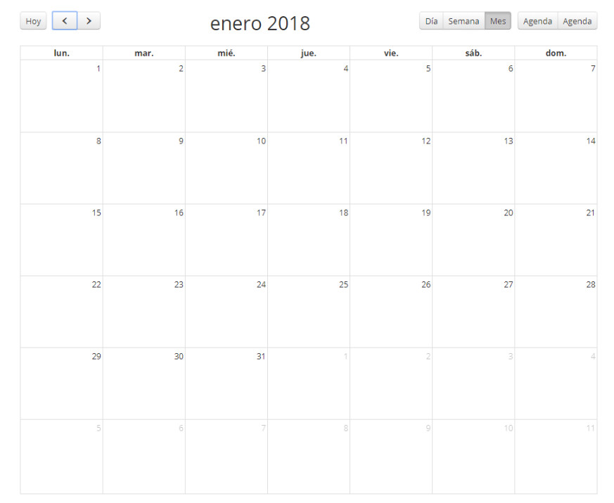

title: Ventana de Cambios
Description: Gerenciar los períodos en que la organización pasa por un momento de mantenimiento
# Ventana de Cambios

Gerenciar los períodos en que la organización pasa por un momento de mantenimiento o apagón y así ayudar en la planificación de 
un cambio.

Cómo acceder
-------------

1. Acceda a la funcionalidad de ventana de cambio a través de la navegación en el menú principal 
**Procesos ITIL > Gestión de Cambios > Ventanas para el Cambios**.

Condiciones previas
---------------

1. No se aplica.

Filtros
---------

1. No se aplica.

Listado de ítems
-------------------

1. No se aplica.

Completar los campos de registro
-------------------------------------

1. Se mostrará la pantalla de ventana de cambio en formato de calendario, donde podrán visualizarse períodos de mantenimiento y 
blackout, como se muestra en la figura siguiente:

    
    
    **Figura 1 - Calendario de ventana de cambio**
    
2. Para registrar una nueva ventana de cambio, haga clic en la fecha que desea que aparezca la pantalla para registro de ventana 
de cambio, como se muestra a continuación:

    
    
    **Figura 2 - Ventana de cambio**
    
    - **Ventana para el Cambio**: informe la descripción para identificar la ventana de cambio;
    - **Tipo**: seleccione el tipo de ventana de cambio:
        - **Mantenimiento**: establece períodos de tiempo en que los cambios en el IC ocurrirá;
        - **Desactivación**: establecen períodos de tiempo en que los cambios en el IC no deben ocurrir.
    - **Global**: este campo se debe marcar para una ventana de mantenimiento que no puede tener IC asociados;
    
    !!! info "IMPORTANTE"
    
        Este campo sólo se debe marcar para la ventana de cambio del tipo "Mantenimiento".
        
    - **Fecha/Hora Inicial**: introduzca la fecha y la hora de inicio de interrupción para ejecutar la ventana de cambio;
    - **Fecha/Hora Final**: informe la fecha y la hora final de interrupción para la ejecución de la ventana de cambio;
    - **Detalles**: informe los detalles de la ventana de cambio, por ejemplo, causa raíz, propósito, etc.
    - **Repetición**: si existe, informe la recurrencia de esa ventana de cambio, así podrá reprogramar automáticamente la 
    ventana de cambio con las siguientes recurrencias:
        - **Diária**: informe la fecha límite para la recurrencia diaria;
        - **Semanal**:  informe la fecha límite para la repetición semanal y seleccione los días de la semana que desee, además 
        del día de la semana que está siendo registrada la ventana de cambio;
        - **Mensual**: informe la fecha límite para la recurrencia mensual;
        - **Anualmente: informe la fecha límite para la recurrencia anual.
        
!!! tip "About"

    <b>Product/Version:</b> CITSmart | 7.00 &nbsp;&nbsp;
    <b>Updated:</b>09/19/2019 – Larissa Lourenço
       
