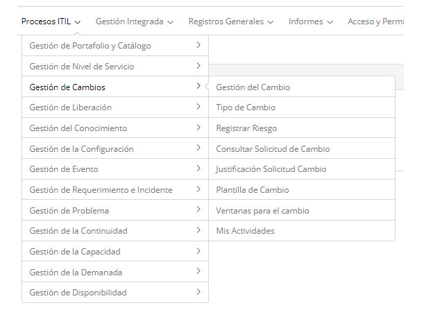

title: Módulo Gestión de Cambios
Description: La gestión de cambios es el proceso responsable de evaluar, coordinar y decidir sobre la realización de cambios 
# Módulo Gestión de Cambios

Objetivo del módulo
--------------------

La gestión de cambios es el proceso responsable de evaluar, coordinar y decidir sobre la realización de cambios propuestos a los 
items de configuración (IC).

Según ITIL, el objetivo principal del proceso es garantizar que los cambios se realicen de forma controlada, que sean evaluados, 
priorizados, planificados, probados, implementados y documentados.

Los cambios se pueden clasificar de la siguiente manera: Cambio default, Cambio normal y Cambio de emergencia.

- **Cambio default**: preautorizado de bajo riesgo, ocurre con frecuencia. Se inicia con un desencadenante definido que sigue un 
procedimiento o instrucción de trabajo para llevar a cabo las actividades, bien conocidas, tienen un presupuesto predeterminado. 
Ejemplo: instalar un paquete de aplicaciones de escritorio default.

- **Cambio Normal**: cualquier cambio de servicio que no sea de emergencia o default. Sigue las políticas, los plazos y los 
procedimientos definidos por la organización.

- **Cambio de Emergencia**: cambio que debe lograrse lo antes posible. Por ejemplo: cambo que resuelve un incidente grave o 
corregir un problema de seguridad. El proceso de administración de cambios generalmente tiene un procedimiento específico para 
manejar los cambios de emergencia.

Donde están sus funcionalidades
---------------------------------

Acceder al menú principal de **Procesos ITIL > Gestión de Cambio**.

**Figura 1 - Menú del Módulo de Gestión de Cambios**

Principal funcionalidad (en destaque)
---------------------------------------

En la sección *Véase también* es posible acceder a la (s) funcionalidad (es) principal (es) de este módulo, para obtener un conocimiento más detallado.

!!! note "NOTA"

    Dependiendo de su permiso de acceso, puede realizar una serie de acciones en las solicitudes de cambio existentes, como: ver 
    la información de solicitud de cambio, programar actividades para la solicitud de cambio, suspender la solicitud de cambio, 
    reactivar la solicitud de cambio que se ha suspendido para el servicio , captura la solicitud de cambio para la ejecución, 
    ejecuta la solicitud de cambio, etc.
    
Véase también
------------

- [Registro de Solicitud de Cambio](/es-es/citsmart-platform-7/processes/change/register-change.html).

!!! tip "About"

    <b>Product/Version:</b> CITSmart | 7.00 &nbsp;&nbsp;
    <b>Updated:</b>09/20/2019 – Larissa Lourenço
