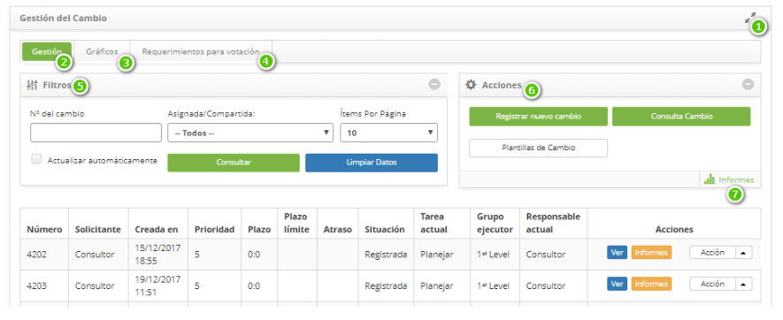
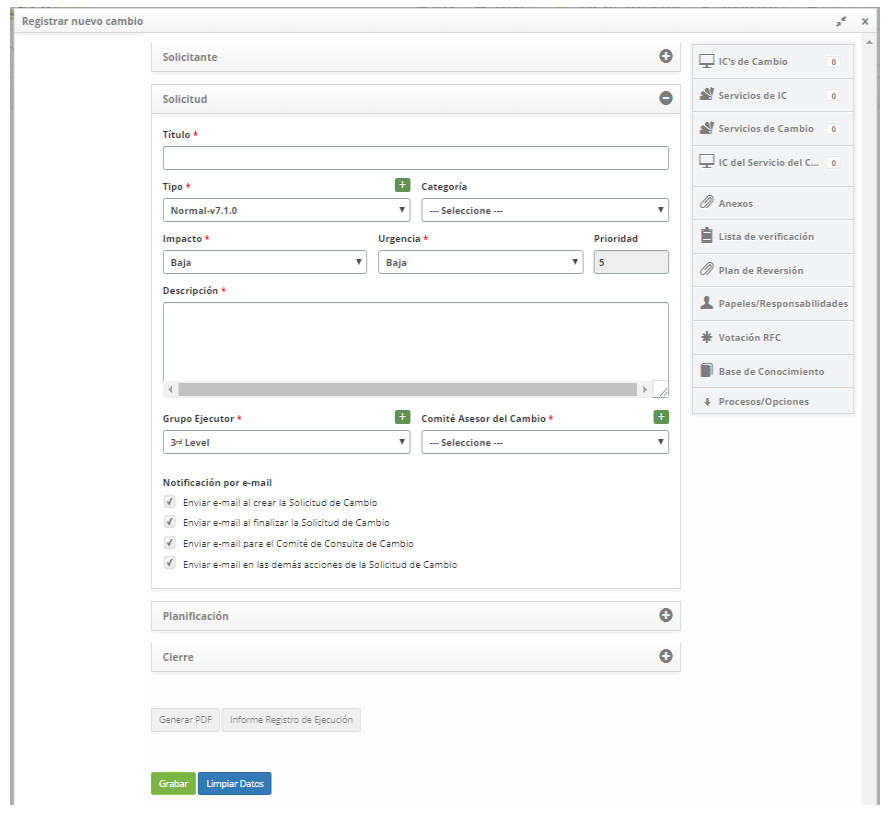
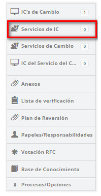
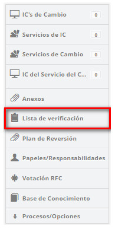

title: Registro de solicitud de cambio
Description: Esta funcionalidad tiene por objeto registrar la solicitud de cambio.
# Registro de solicitud de cambio

Esta funcionalidad tiene por objeto registrar la solicitud de cambio.

Cómo acceder
--------------------

1. Acceda a la funcionalidad de registro de solicitud de cambio a través de la navegación en el menú principal 
**Procesos ITIL > Gestión de Cambios > Gestión del Cambio**. En la guia de **Gestión**, haga clic en el botón *Registrar nuevo 
cambio*.

Condiciones previas
-------------------------

1. Tener el contrato registrado (ver conocimiento [Registro y consulta de contrato](/es-es/citsmart-platform-7/additional-features/contract-management/use/register-contract.html))

2. Tener la unidad registrada (ver conocimiento [Registro y consulta de unidad](/es-es/citsmart-platform-7/plataform-administration/region-and-language/register-unit.html))

3. Tener solicitante registrado (ver conocimiento [Registro y consulta de colaborador](/es-es/citsmart-platform-7/initial-settings/access-settings/user/employee.html))

4. Tener el "Comité Consultivo de Cambios" registrado (ver conocimiento [Registro y consulta de grupo](/es-es/citsmart-platform-7/initial-settings/access-settings/user/group.html))

5. Tener el tipo de cambio catastrado, el cual deberá tener el vínculo con el flujo referente a la solicitud de cambio (ver 
conocimiento [Registro y consulta del tipo de cambios](/es-es/citsmart-platform-7/processes/change/change-type.html))

6. Configurar los parámetros (ver conocimiento [Reglas de parametrización - cambios](/es-es/citsmart-platform-7/plataform-administration/parameters-list/parametrization-change.html)):

    - Parámetro 47;
    - Parámetro 279;
    - Parámetro 280.
   
7. Tener el grupo vinculado al contrato, asociando a los Solicitantes (colaboradores) ya registrados a este grupo. En caso de que 
sea necesario crear un nuevo colaborador, es necesario incluirlo al Grupo de Solicitante en el cual esté relacionado con el 
contrato (ver conocimiento [¿Cómo relacionar el grupo al contrato?](/es-es/citsmart-platform-7/processes/tickets/relate-group.html));

8. Tener la unidad vinculada al contrato (ver conocimiento [¿Cómo relacionar la unidad al contrato?](/es-es/citsmart-platform-7/processes/tickets/relate-unit.html))

9. Tener el cambio registrado;

10. Tener el cuestionario registrado (ver conocimiento Registro y consulta de cuestionarios](es-es/plataform-administration/questionnaires/questionnaires-management/register-questionnaire.html))

Filtros
----------

1. No se aplica.

Listado de ítems
-------------------

1. No se aplica.

Completar campos de registro
------------------------------------

1. Para tener una mejor visión de las opciones de funcionalidad, sigue la imagen:

    

    **Figura 1 - Pantalla de gestión de cambios**

      : amplía la pantalla de **Gestión del Cambio**;

     **Gestión**: muestra los registros de solicitudes de cambio para atención y gestión;

     **Gráficos**: presenta los gráficos de información de las solicitudes de cambio por situación (en curso, suspendidas y atrasadas), por prioridad y por grupo;

     **Solicitudes de votación**: se presentan los registros de solicitudes de cambio para su aprobación;

     **Filtros**: presenta los filtros para la consulta de solicitudes de cambio;

     **Acciones**: permite registrar nuevas solicitud de cambio y realizar una consulta rápida de solicitud de 
    cambio;

     **Informes**: presenta los informes dinámicos referentes a la gestión del cambio.

2. Después de acceder a la funcionalidad, se mostrará su pantalla de registro nuevo cambio, que contiene una serie de pasos a 
seguir para realizar el registro:

    - Registre la información del solicitante, como se indica a continuación:
    
    
    
    **Figura 2 - Pantalla de registro de nuevo cambio**
    
    - **Contrato**: informe el contrato referente a la solicitud de cambio;
    - **Solicitante**: informe al solicitante, es decir, a la persona que está solicitando el cambio;
        - Haga clic en el campo solicitante. Después de eso, se mostrará una pantalla para consulta de solicitante, realice la 
        consulta y seleccione el solicitante;
        - Si no encuentra el registro del solicitante, es posible realizar un registro rápido haciendo clic en el icono
        .
    - **Nombre del contacto**: informe el nombre del contacto;
    - **E-mail**: informe el e-mail del solicitante para contacto;
    - **Teléfono**: informe código de área (DDD) y el número de teléfono del solicitante, para contacto;
    - **Extensión**: informe el número del interno del solicitante para contacto;
    - **Unidad**: seleccione la unidad del solicitante;
    - **Localidad Física**: informe la ubicación física del solicitante;
    - **Observación**: describa las observaciones sobre el contacto, si es necesario.
    
    - Registre la información de la solicitud, como se indica a continuación:
    
    
    
    **Figura 3 - Pantalla de registro de nuevo cambio**
    
    - **Título**: informe el título de la solicitud de cambio;
    - **Tipo**: informe el tipo de cambio que se está solicitando;
        - **Cambio default**: es un cambio que es previamente pre-aprobado por la Gestión de Cambio y ya tiene procedimientos 
        aceptados y establecidos;
        - **Cambio normal**: es un cambio que sigue un flujo normal de evaluación, aprobación y autorización;
        - **Cambio de emergencia**: es un cambio en un servicio que pretende reparar de forma inesperada un error en el servicio 
        de TI.
       
    !!! note "NOTA"
       
        El cambio default y el cambio de emergencia no requieren información de la categoría y el comité consultivo de cambio, ya 
        que no participan en la votación de la solicitud de cambio.
           
    - Si el tipo de solicitud de cambio informado es "Normal", introduzca la categoría.
    - **Impacto**: informe el impacto del cambio;
    - **Urgencia**: informe la urgencia del cambio;
    - **Prioridad**: la prioridad será establecida por el sistema, después de informar el impacto y urgencia;
    - **Descripción**: informe la descripción del cambio que se está solicitando. La descripción debe ser objetiva, incluyendo 
    toda la información necesaria para la realización del cambio;
    - **Grupo Ejecutor**: informe al grupo ejecutor, el cual será responsable por la atención de la solicitud de cambio. En caso 
    de no ser informado el grupo, el mismo será establecido conforme definido en el registro de Tipo de Cambio de acuerdo con el 
    flujo;
    - **Comité Asesor del Cambios**: informe al Comité Consultivo de Cambios, grupo responsable de evaluar, ejecutar análisis de 
    riesgo y garantizar la participación de todas las áreas relacionadas con los cambios, aprobando o no su ejecución;
   
3. Haga clic en el botón *Grabar* para registrar la solicitud de cambio, donde la fecha, hora y usuario se guardarán automáticamente para una futura auditoría;

4. Se mostrará un mensaje confirmando el éxito del registro de la solicitud de cambio.

**Figura 4 - Confirmación del registro de la solicitud de cambio**

Vinculación de los IC's del cambio
------------------------------------

1. Introduzca los ítems de configuración (IC) referentes al cambio:

    - Al lado derecho de la pantalla de solicitud de cambio, haga clic en **IC's del Cambio**;
    
    
    
    **Figura 5 - Selección de IC's del cambio**
    
    - Se mostrará la pantalla de adición de ítem de configuración. Haga clic en el icono  para 
    agregar los ítems de configuración.
    - Aparecerá la ventana de consulta de ítems de configuración. Realice la consulta, seleccione el ítem de configuración 
    referente al cambio;
    - Aparecerá el mensaje "¿Desea vincular IC?", Haga clic en OK;
    - Aparecerá el mensaje "¿Desea informarle qué cambiará?". Si desea realizar algún cambio en el IC, haga clic en el botón Sí y 
    se dirigirá a la pantalla que contiene información general, características y ítems relacionados con el IC seleccionado. 
    Realice los cambios necesarios y haga clic en *Grabar*. Si no desea realizar ningún cambio en el IC seleccionado, haga clic 
    en el botón No;
    - Aparecerá el mensaje de que el ítem de configuración se ha guardado correctamente, haga clic en *Aceptar* para realizar la 
    operación. Hecho esto, se relacionará el ítem de configuración a la solicitud de cambio;

    
    
    **Figura 6 - Relación de ítem de Configuración a la Solicitud de Cambio**
    
    - Para editar la información del ítem de configuración, haga clic en el icono  del mismo;
    - Para ver la información del ítem de configuración, basta con hacer clic en el icono 
    del mismo;
    - Si desea remover un ítem de configuración que se ha relacionado con la solicitud de cambio, simplemente haga clic en el 
    icono  del mismo.
    
    !!! note "NOTA"
    
        Los ítems de configuración relacionados con el cambio se relacionarán automáticamente y se presentarán en el análisis de 
        impacto y riesgo por objetivos.
        
Vinculación de servicios del IC
-----------------------------------

1. Si hay servicios relacionados con el (los) IC (s) elegido (s) en la solicitud de cambio, para consultarlo, proceda de la 
siguiente manera:
    
    - A la derecha de la pantalla de solicitud de cambio, haga clic en **Servicios de IC**;
    
    
    
    **Figura 7 - Selección de servicios del IC**
    
    - Se mostrará la pantalla de consulta de servicios del IC, como se muestra en la figura siguiente:
    
    
    
    **Figura 8 - Relación de servicios con el ítem de configuración**
    
    - Haga clic en el botón  , si desea vincular ese servicio a la solicitud de cambio;
    - Haga clic en el botón *Cerrar* para volver a la pantalla del Registro de solicitud de cambio;
    
Vinculación de los servicios del cambio
-------------------------------

1. Introduzca el (los) servicio (s) referente al cambio:

    - Al lado derecho de la pantalla de solicitud de cambio, haga clic en la opción **Servicios de Cambio**;
   
    
   
    **Figura 9 - Selección de servicio**
   
    - Haga clic en el icono  para agregar el servicio;
    
    - Aparecerá una ventana de consulta del servicio. Realice la consulta y seleccione el servicio. Hecho esto, el servicio 
    estará relacionado con el cambio;
   
   
   
   **Figura 10 - Relación de los servicios al cambio**
   
   - Si desea ver el diseño del mapa del servicio, basta con hacer clic en el icono ;
   - Si desea remover un servicio relacionado con el cambio, simplemente haga clic en el icono 
   .
   
!!! note "NOTA"

    Los servicios relacionados con el cambio serán automáticamente relacionados y presentados en el Análisis de Impacto y Riesgo 
    por objetivos.
    
Vinculando IC's del servicio del cambio
---------------------------------------

1. Si hay IC's relacionados con el (los) servicio (s) del cambio elegido (s) en la solicitud de cambio, para consultarlo, proceda 
de la siguiente manera:

    - Al lado derecho de la pantalla de solicitud de cambio, haga clic en **IC's de los Servicios de Cambio**;
 
    
 
    **Figura 11 - Selección de IC's de los servicios del cambio**
 
    - Se mostrará la pantalla de consulta de IC del Servicio del Cambio, como se muestra en la figura siguiente:
 
 
 
 **Figura 12 - IC's del servicio del cambio**
 
 - Haga clic en el botón , si desea vincular el IC al cambio;
 - Haga clic en el botón *Cerrar* para volver a la pantalla del Registro de solicitud de cambio.
 
Vinculando anexos
------------------

1. Si desea adjuntar un archivo en la solicitud de cambio, proceda de la siguiente manera:

    - Al lado derecho de la pantalla de solicitud de cambio, haga clic en **Anexos**;
  
    
  
    **Figura 13 - Selección de archivos adjuntos**
  
    - Se mostrará la pantalla adjunta de archivos, como se muestra a continuación:
  
  
  
  **Figura 14 - Pantalla de archivos adjuntos**
  
  - Haga clic en el botón *Elegir archivo*. Se mostrará una ventana, donde podrá seleccionar los archivos deseados;
  - Seleccione el archivo;
  - Introduzca la descripción del archivo y haga clic en el botón *Agregar*;
  - Después de agregar el archivo, haga clic en el botón *Cerrar* para volver a la pantalla del Registro de solicitud de cambio;
 
Vinculando checklist
---------------------

1. Si desea añadir un Checklist al cambio, proceda de la siguiente manera:

     - Al lado derecho de la pantalla de solicitud de cambio, haga clic en **Lista de Verificación**;
  
    
  
     **Figura 15 - Selección de checklist**
  
    - Se mostrará la pantalla de checklist, como se muestra a continuación:
  
  
  
  **Figura 16 - Pantalla de checklist**
  
  - Seleccione un cuestionario vinculado al cambio registrado. Responde los campos en él contenidos. Hecho esto, el checklist 
  será vinculado al cambio.
  
Vinculando base de conocimiento
---------------------------------

1. Si desea consultar la Base de Conocimientos, proceda de la siguiente manera:

    - Al lado derecho de la pantalla de solicitud de cambio, haga clic en **Base de conocimientos**;
 
    
 
    **Figura 17 - Selección de base de conocimiento**
 
    - Se mostrará la pantalla del portal de conocimiento, como se muestra en la figura siguiente:
  
  
  
  **Figura 18 - Pantalla de consulta a la base de conocimiento**
  
  - Realice la consulta del conocimiento deseado;
  - Después de la consulta, cierre la ventana para volver a la pantalla del Registro de solicitud de cambio.
  
!!! tip "About"

    <b>Product/Version:</b> CITSmart | 7.00 &nbsp;&nbsp;
    <b>Updated:</b>09/19/2019 – Larissa Lourenço
