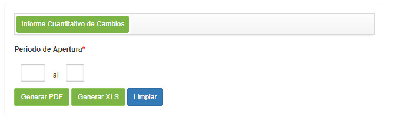

title:  Generación de informes - Gestión de Cambios
Description: Este informe tiene el objetivo de presentar la cantidad de solicitud de cambio. 
# Generación de informes - Gestión de Cambios

Generando informe de cuantitativo de cambio
-----------------------------------------------

Este informe tiene el objetivo de presentar la cantidad de solicitud de cambio.

*Cómo acceder*

1. Acceder a la funcionalidad de Informe Cuantitativo de Cambio a través de la navegación en el menú principal
**Informes > Gestión de Cambios > Cuantitativo de Cambio**.

*Condiciones previas*

1. No se aplica.

*Filtros*

1. Los siguientes filtros posibilitan al usuario restringir la participación de ítems en el listado default de la funcionalidad, 
facilitando la localización de los ítems deseados:

    - **Período de apertura**: informe el período deseado.
    
2. Se mostrará la pantalla de **Generación de Informe Cuantitativo de Cambio**, como se muestra en la figura siguiente:

    
    
    **Figura 1 - Pantalla de generación del informe cuantitativo de cambios**
    
3. Defina los filtros según su necesidad;

4. Haga clic en el botón *Generar PDF* para generar el informe cuantitativo de cambios en formato PDF;

5. Haga clic en el botón *Generar XSL* para generar el informe cuantitativo de cambios en formato de Excel.

*Listado de ítems*

1. No se aplica.

*Completar los campos de registro*

1. No se aplica.

!!! tip "About"

    <b>Product/Version:</b> CITSmart | 7.00 &nbsp;&nbsp;
    <b>Updated:</b>09/20/2019 - Larissa Lourenço
