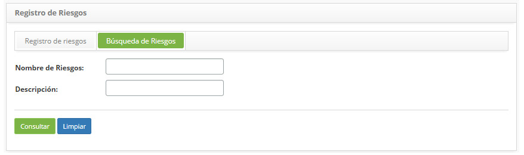
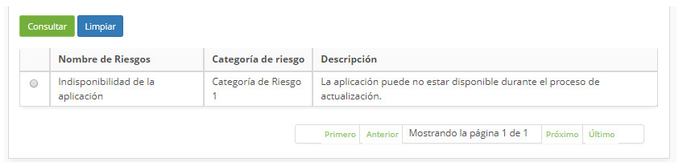
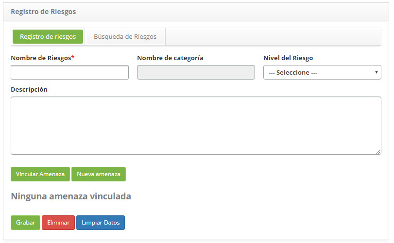
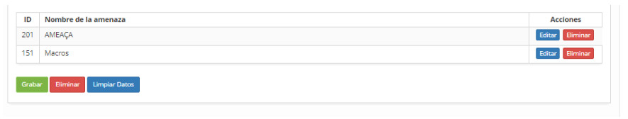

title: Registro y consulta de riesgo de cambios
Description: Esta funcionalidad tiene como objetivo registrar los riesgos involucrados en el cambio
# Registro y consulta de riesgo de cambios

Esta funcionalidad tiene como objetivo registrar los riesgos involucrados en el cambio que se utilizar en otras rutinas del 
sistema.

Cómo aceder
--------------

1. Acceda a la funcionalidad de riesgo a través de la navegación en el menú principal 
**Procesos ITIL > Gestión de Cambios > Registrar Riesgo**.

Condiciones previas
-------------------------

1. Tener la categoría de riesgo registrada (ver conocimiento [Registro y consulta de categoría de riesgo](/es-es/citsmart-platform-7/processes/continuity/risk-category.html));

2. Tener la amenaza catastrada (ver conocimiento [Registro y consulta de amenazas](/es-es/citsmart-platform-7/processes/continuity/threat-registration.html)).

Filtros
---------

1. Los siguientes filtros permiten al usuario restringir la participación de ítems en el listado detalhe de la funcionalidad, 
facilitando la localización de los ítems deseados, como se muestra en la figura siguiente:

    - Nombre del riesgo

    - Descripción

2. En la pantalla de Riesgo, haga clic en la pestaña **Búsqueda de Riesgos**. Se mostrará la pantalla de búsqueda como se muestra 
en la figura siguiente:

    
    
    **Figura 1 - Pantalla de búsqueda de riesgo**
    
3. Realice la búsqueda de riesgo:

    - Introduzca el nombre y/o descripción del riesgo que desea buscar y haga clic en el botón *Consultar*. Después de eso, se 
    mostrará el registro del riesgo según el nombre informado;
    
    - Si desea listar todos los registros de riesgo, simplemente haga clic directamente en el botón *Consultar*;
    
Listado de ítems
------------------

1. El(Los) siguiente (s) campo (s) de registro está (n) disponible (s) para facilitar al usuario la identificación de los 
elementos deseados en el listado default de la funcionalidad: **Nombre de Riesgo, Categoría de Riesgo** y **Descripción**.

    
    
    **Figura 2 - Pantalla de ítems**
    
2. Después de la búsqueda, seleccione el registro deseado. Hecho esto, será dirigido a la pantalla de registro exhibiendo el 
contenido referente al registro seleccionado;

3. Para cambiar los datos del registro de riesgos, basta con modificar la información de los campos deseados y hacer clic en el 
botón *Grabar* para que se grabe el cambio realizado en el registro, donde la fecha, hora y usuario serán grabados 
automáticamente para una futura auditoría.

Completar los campos de registro
-------------------------------------

1. Se mostrará la pantalla de **Registro de Riesgos**, como se muestra en la figura siguiente:

    
    
    **Figura 3 - Pantalla de registro de riesgo**
    
2. Rellene los campos según las instrucciones a continuación:

    - **Nombre de Riesgos**: informe el nombre del Riesgo
    
    - **Nombre de la categoría**: seleccione la categoría de riesgo;
    
    - **Nivel de riesgo**: seleccione el nivel de riesgo;
    
    - **Descripción**: informe la descripción del riesgo;
    
Vnculando amenazas al riesgo
-----------------------------

1. Vincule amenaza con el riesgo:

    - Haga clic en el botón *Vincular Amenaza*. Hecho esto, aparecerá la pantalla de búsqueda de amenaza. Realice la búsqueda, 
    seleccione la (s) amenaza (s) deseada (s) y haga clic en el botón *Enviar* para realizar la operación. Si no encuentra el 
    registro de la amenaza y existe la necesidad de registrar una amenaza para obligar al riesgo, puede registrarla desde esa 
    pantalla, simplemente haga clic en el botón *Nueva Amenaza*;
    
    - Después del vínculo de la (s) amenaza (s) al riesgo, la (s) misma (s) será (s) mostrada (s) en la pantalla de registro de 
    riesgo, como ejemplo ilustrado en la figura abajo:
    
    
    
    **Figura 4 - Amenazas vinculadas al riesgo**
    
    - Para eliminar el vínculo de la amenaza con el riesgo, simplemente haga clic en el botón *Eliminar* de la misma.
    
2. ADespués de los datos informados, haga clic en el botón *Grabar* para efectuar el registro, donde la fecha, hora y usuario se 
guardarán automáticamente para una futura auditoría.

!!! tip "About"

    <b>Product/Version:</b> CITSmart | 7.00 &nbsp;&nbsp;
    <b>Updated:</b>09/19/2019 – Larissa Lourenço
