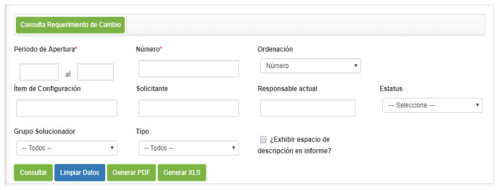
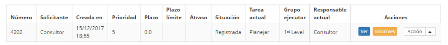

title: Consulta de solicitud de cambios
Description: Realizar la consulta de las solicitudes de cambio de acuerdo con filtros definidos por el usuario.
# Consulta de solicitud de cambios

Realizar la consulta de las solicitudes de cambio de acuerdo con filtros definidos por el usuario.

Cómo acceder
--------------

1. Acceda a la funcionalidad de búsqueda de solicitud de cambio a través de la navegación en el menú principal 
**Procesos ITIL > Gestión de Cambios > Consultar Solicitud de Cambio o Procesos ITIL > Gestión de Cambios > Gestión del Cambios** 
y haga clic en la opción **Consulta Cambio**.

Condiciones previas
---------------

1. No se aplica.

Filtros
---------

1. Los siguientes filtros posibilitan al usuario restringir la participación de ítems en el listado default de la funcionalidad, 
facilitando la localización de los ítems deseados:

    - **Período de apertura**: informe el período deseado;
    - **Número**: informe el número de identificación de la solicitud de cambio;
    - **Ordenación**: seleccione la ordenación;
    - **Ítem de Configuración**: informe el ítem de configuración referente a la solicitud de cambio que desea buscar;
    - **Solicitante**: informe al solicitante referente a la solicitud de cambio que desea investigar;
    - **Responsable actual**: informe al responsable referente a la solicitud de cambio que desea buscar;
    - **Status**: seleccione el estado de la solicitud de cambio que desea buscar;
    - **Grupo Solucionador**: seleccione el grupo solucionador referente a la solicitud de cambio que desea buscar;
    - **Tipo**: seleccione el tipo de cambio;
    - Si desea que la descripción de la solicitud de cambio aparezca en el informe, marque la opción **¿Exhibir espacio de 
    descripción en informe?**;
    
2. Se mostrará la pantalla de consulta de solicitud de cambio que contiene campos donde podrá definir los filtros necesarios para 
su búsqueda, como se muestra a continuación:

    
    
    **Figura 1 - Pantalla de consulta de solicitud de cambio**
    
3. Rellene los campos según las instrucciones a continuación:

    - Después de los filtros definidos, haga clic en el botón *Consultar* para realizar la operación;
    - Se enumeran los registros de solicitud de cambio, según los filtros elegidos, debajo de los botones *Consultar, Limpiar 
    Datos* y *Generar informe*.
    - Al lado de cada registro de solicitud de cambio de la lista, hay iconos que permiten realizar las siguientes acciones: 
    visualizar las informaciones y los anexos de la solicitud de cambio;
        - Para ver la información de la solicitud de cambio, haga clic en *Ver*;
            - Se mostrará la pantalla de registro de la determinada solicitud de cambio para la visualización.
        - Para ver los datos adjuntos de la solicitud de servicio, haga clic en el icono  ;
            - Se abrirá una ventana que muestra los datos adjuntos de la solicitud de cambio para la visualización.
    - Si es necesario, haga clic en el botón *Generar (PDF)* para generar el informe de solicitud de cambio en formato PDF.
    - Si es necesario, haga clic en el botón *Generar (XLS)* para generar el informe de solicitud de cambio en formato Excel.

Listado de ítems
------------------

1. El(Los) siguiente (s) campo (s) de registro está (n) disponible (s) para facilitar al usuario la identificación de los 
elementos deseados en el listado default de la funcionalidad: **Contrato, Número del cambio, Tipo, Status, Título, Descripción, 
Responsable actual, Solicitante, Categoría, Fecha/Hora Inicial, Conclusión, Grupo** y **Cierre**.

2. Existen botones de acción disponibles para el usuario en relación con cada uno de los elementos de la lista, que son: *Ver* y 
*Ver datos adjuntos*.

**Figura 2 - Pantalla de ítems**

Completar los campos de registro
------------------------------------

1. No se aplica.

!!! tip "About"

    <b>Product/Version:</b> CITSmart | 7.00 &nbsp;&nbsp;
    <b>Updated:</b>09/20/2019 – Larissa Lourenço
