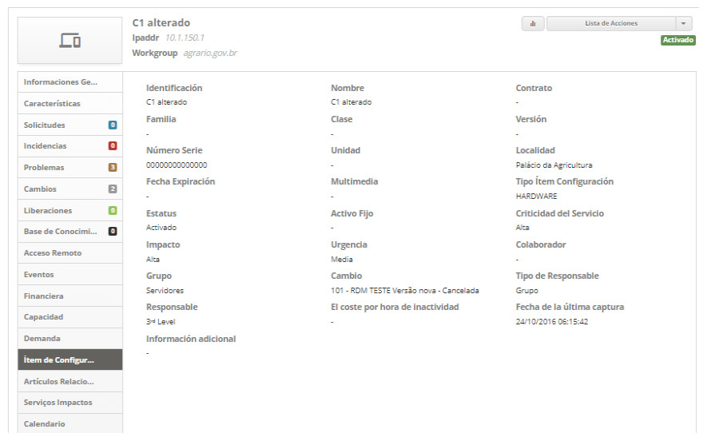
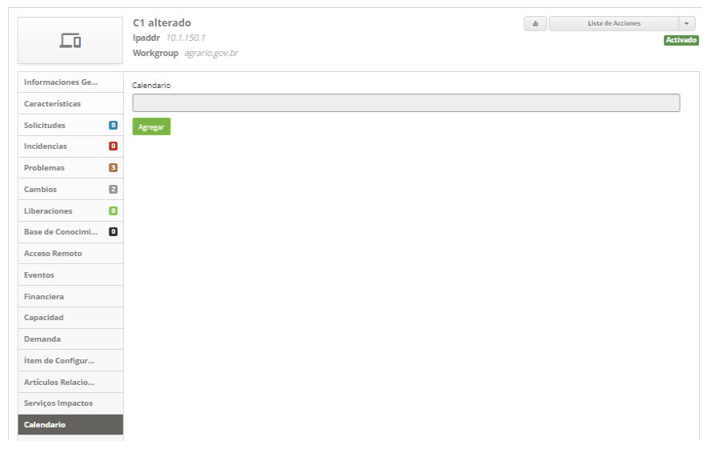

title: Gestión de ítems de configuración
Description: Esta funcionalidad permite identificar, registrar y administrar los ítems de configuración presentes en la 
# Gestión de ítems de configuración

Esta funcionalidad permite identificar, registrar y administrar los ítems de configuración presentes en la organización.

Condiciones previas
----------------------

1. Registrar el Acuerdo de Nivel de Servicio (General) del tipo "Disponibilidad" (ver conocimiento [Registro y consulta de acuerdo de nivel de servicio general](/es-es/citsmart-platform-7/processes/service-level/register-sla.html));

2. Registro de la localidad (ver conocimiento [Registro y consulta de la localidad](/es-es/citsmart-platform-7/plataform-administration/region-and-language/register-locations.html));

3. Registro de colaborador (ver conocimiento [Registro y consulta de colaborador](/es-es/citsmart-platform-7/initial-settings/access-settings/user/employee.html));

4. Registrar grupo (ver conocimiento [Registro y consulta de grupo](/es-es/citsmart-platform-7/initial-settings/access-settings/user/group.html));

5. Registro de contrato (ver conocimiento [Registro y consulta de contrato](/es-es/citsmart-platform-7/additional-features/contract-management/use/register-contract.html));

6. Registrar el tipo de ítem de configuración (ver conocimiento [Registro y consulta de tipo de ítem de configuración](/es-es/citsmart-platform-7/processes/configuration/IC-type.html));

7. Registrar al menos un ítem de configuración principal si necesita crear otro ítem de configuración relacionado (Consulte la 
sección "Registrando ítem de configuración relacionado a un ítem de configuración)

Cómo acceder
--------------

1. Acceda a la funcionalidad de Gestión de ítems de configuración mediante la navegación en el menú principal 
**Procesos ITIL > Gestión de la configuración > Gestión de la configuración.**.

Gestión de ítems de configuración
----------------------------------------

1. Se mostrará la pantalla de **Gestión de Ítems de Configuración**, como se muestra en la figura siguiente:

    
    
    **Figura 1 - Pantalla de administración de ítems de configuración**
    
     : amplía la pantalla de administración de ítems de configuración;
    
     : permite ver el estado de ejecución del inventario;
    
     **Dashboard**: presenta los ítems de configuración relacionados con los procesos de Incidente, 
    Problema, Cambio y Liberación;
    
     **Informes**: presenta los informes dinámicos referentes a la gestión de la configuración y los 
    activos de servicio;
    
     **Filtros**: se presenta los demás filtros para la búsqueda de los ítems de configuración;
    
     **Acciones**: permite registrar nuevo ítem de configuración, crear, cambiar y eliminar grupo de ítems 
    de configuración, vincular calendario, acuerdo de nivel de servicio y costo por hora de inactividad al grupo de ítems de 
    configuración, y exportar CMDB;
    
     **Base de datos de gestión de la configuración**: repositorio utilizado para almacenar los registros 
    de ítems de configuración organizados en grupos.
    
2. En esta pantalla de **Gestión de ítems de configuración**, puede crear un nuevo grupo de IC, registrar un nuevo ítem de 
configuración, consultar los ítems de configuración (IC) existentes, y al seleccionar un ítem de configuración existente también 
puede editar su información, crear ítems relacionados, consultar los ítems relacionados y entre otras acciones. En los próximos 
temas se abordará cómo realizar estas acciones.

Creando un nuevo grupo de ítem de configuración
-----------------------------------------------

!!! abstract "SEPA MAS"

    Hay otra manera para registrar y buscar un grupo de ítems de configuración presentado en el conocimiento de Registro y 
    consulta de grupo de ítems de configuración.
    
1. En la pantalla de Administración de ítems de configuración, en Acciones, haga clic en el botón *Crear nuevo grupo*:

    
    
    **Figura 2 - Botón crear nuevo grupo**
    
2. Se mostrará la pantalla de registro de grupo de ítem de configuración, como se muestra en la figura siguiente:

    
    
    **Figura 3 - Registro de grupo de ítems de configuración**
    
    - **Nombre**: introduzca el nombre del nuevo grupo de IC;
    - **Grupo padre**: informe al grupo principal, es decir, grupo superior al cual el grupo que está siendo creado forma parte;
    - **Icono**: seleccione un icono para representar el nuevo grupo de IC;
    - **Color de fondo**: esta función permite definir el color de fondo del grupo IC. Para seleccionar un color, basta con 
    colocar el puntero en el color deseado y hacer clic;
    - **Color del Icono/Texto**: esta función permite definir el color del icono y del texto del grupo IC. Para seleccionar un 
    color, basta con posicionar el puntero en el color deseado y hacer clic;
    - Haga clic en el botón *Grabar* para realizar el registro. La figura abajo muestra los grupos de ICs después de creados:
    
    
    
    **Figura 4 - Grupos de ítems de configuración**
    
Cambio grupo de ítem de configuración
-----------------------------------------

1. Haga clic en el grupo deseado y en el área de **Acciones**, haga clic en el botón *Cambiar grupo*;

    
    
    **Figura 5 - Botón cambiar grupo**
    
2. Se mostrará la pantalla de registro del determinado grupo de IC;

3. Cambie los datos del grupo y haga clic en *Grabar* para realizar el cambio, donde la fecha, la hora y el usuario se guardarán 
automáticamente para una futura auditoría.

Eliminando el grupo de ítem de configuración
------------------------------------------------

!!! info "IMPORTANTE"

    Sólo se puede eliminar el grupo que no está relacionado (grupos y/o ítems de configuración).
    
1. Haga clic en el grupo deseado y en el área de **Acciones** haga clic en el botón *Eliminar grupo*;

    
    
    **Figura 6 - Botón eliminar grupo**
    
2. Se mostrará un mensaje para confirmar la eliminación del grupo;

3. Haga clic en *Confirmar* para realizar la operación;

4. Se realizará con éxito la eliminación del grupo de IC.

Vinculando el calendario al grupo de IC's
---------------------------------------------

1. En la pantalla de **Gestión de ítems de configuración**, seleccione el grupo que desea vincular el calendario. Hecho esto, en 
**Acciones**, haga clic en el botón *Vincular calendario*, como se indica en la figura siguiente:

    
    
    **Figura 7 - Botón de enlace de calendario**
    
2. Se mostrará la pantalla para el vínculo del calendario, como se muestra en la figura siguiente:

    
    
    **Figura 8 - Pantalla de vínculo de calendario**
    
3. Busque y seleccione el calendario que desea vincular y después de eso, haga clic en el botón Agregar para establecer el 
vínculo de calendario con el grupo de IC.

Vinculando acuerdo de nivel de servicio al grupo de IC's
--------------------------------------------------------

1. En la pantalla de **Gestión de ítems de configuración**, seleccione el **Grupo** que desea vincular el acuerdo de nivel de 
servicio. En Acciones, haga clic en el botón *Vincular Acuerdo de nivel del servicio*, como se indica en la figura siguiente:

    
    
    **Figura 9 - Botón vincular acuerdo de nivel de servicio**
    
2. Se mostrará la pantalla para vincular el acuerdo de nivel de servicio del tipo "disponibilidad", como se muestra en la figura 
siguiente:

    
    
    **Figura 10 - Pantalla de vínculo de ANS**
    
3. Busque y seleccione el acuerdo de nivel de servicio que desea vincular y después de eso, haga clic en el botón Agregar para 
establecer el vínculo del acuerdo de nivel de servicio con el grupo de IC.

Registrando costo por hora de indisponibilidad del grupo de IC's
------------------------------------------------------------------

1. En la pantalla de **Gestión de ítems de configuración**, seleccione el grupo que desee. En **Acciones**, haga clic en el botón *Costo por hora de inactividad*, como se indica en la figura siguiente:

    
    
    **Figura 11 - Botón de costo**
    
2. Se mostrará la pantalla de registro del costo por hora de inactividad, como se muestra en la figura siguiente:

    
    
    **Figura 12 - Registro de costos por hora de indisponibilidad**
    
3. Introduzca el valor de la hora de inactividad del grupo de IC. Después de eso, haga clic en el botón Agregar para registrarlo.

Registrando un nuevo ítem de configuración
------------------------------------------

1. En la pantalla de **Gestión de ítems de configuración**, en **Acciones**, haga clic en el botón *Crear nuevo ítem de 
configuración*;

    
    
    **Figura 13 - Botón Crear nuevo ítem de configuración**
    
2. Se muestra la pantalla **Registro de ítem de Configuración**, como se muestra en la figura siguiente:

    
    
    **Figura 14 - Pantalla de registro de ítems de configuración (IC)**
    
3. Complete los campos según las instrucciones a continuación:

    - **Identificación**: informe la identificación del nuevo ítem de configuración;
    - **Nombre**: introduzca el nombre del nuevo ítem de configuración;
    - **Contrato**: seleccione el contrato al que pertenece el ítem de configuración;
    - **Familia**: informe a la familia a la que pertenece el ítem de configuración;
    - **Clase**: introduzca el nombre de la clase del ítem de configuración;
    - **Versión**: informe la versión del ítem de configuración;
    - **Número serie**: introduzca el número de serie del ítem de configuración;
    - **Unidad**: informe a la unidad de negocio / departamento / asignación en que se asigna el ítem de configuración;
    - **Localidad**: introduzca el lugar donde se encuentra el ítem de configuración;
    - **Fecha Expiración**: introduzca la fecha de expiración de la licencia del ítem de configuración;
    - **Multimedia**: informe a los medios definitivos (donde las versiones definitivas y autorizadas de ICs de software se 
    almacenan de forma segura) del IC, si es necesario. Si desea borrar el dato informado en el campo, haga clic en el icono
    ;
    - **Tipo de ítem configuración**: introduzca el tipo de ítem de configuración;

    !!! abstract "SEPA MAS"
    
        Al ser informado el tipo de ítem de configuración, se exhibir las características relacionadas en la guía de 
        características, donde podrá ser registrado el valor para cada característica.
        
    - **Status**: seleccione el estado del ítem de configuración;
    - **Activo Fijo**: Si el IC es un activo fijo (activo de negocio tangible que tiene una vida útil de larga duración, por 
    ejemplo, un servidor o una licencia de software), informe la identificación del patrimonio del mismo;
    - **Criticidad del Servicio**: informe la importancia que el IC tiene para la organización;
    - **Impacto**: informe el impacto que causa la ausencia del funcionamiento del IC dentro del ambiente organizacional;
    - **Urgencia**: informe la urgencia del restablecimiento del IC dentro del ambiente organizacional;
    - **Colaborador**: informe al colaborador que utiliza o utilizará el ítem de configuración;
    - **Grupo**: informe al grupo de IC al cual el IC formará parte;
        - **Cambios**: relacione un cambio al IC, cuando sea necesario. Si desea borrar el dato informado en el campo, haga clic 
        en el icono ;
        - **Tipo de Responsable**: seleccione el tipo de responsable: usuario o grupo;
        - **Responsable**: informe al responsable del ítem de configuración, de acuerdo con el tipo de responsable. Si desea 
        borrar el dato informado en el campo, haga clic en el icono ;
        - **Ítem de Configuración Padre**: si el IC que está siendo registrado forma parte de otro IC, infórmelo. Si desea borrar 
        el dato informado en el campo, haga clic en el icono ;
        - **El coste por hora de inactividad**: informe el valor de la hora de indisponibilidad del IC;
        - **Información adicional**: describa las demás informaciones sobre el ítem de configuración, si es importante;
        
4. Después de informar todos los datos, haga clic en el botón *Grabar* para registrar el ítem de configuración, donde la fecha, 
hora y usuario se guardarán automáticamente para una futura auditoría.

Registrando garantía del ítem de configuración
----------------------------------------------

1. En la pantalla de **Registro de ítems de configuración**, haga clic en la ficha Garantías, como se muestra en la figura 
siguiente:

    
    
    *Figura 15 - Pantalla de registro de garantías**
    
2. Haga clic en el botón *Agregar*. Se mostrará la pantalla de consulta de Proveedor, busque y seleccione el mismo y se mostrarán 
los campos para ser completados, como se muestra en la figura siguiente:

    
    
    **Figura 16 - Pantalla de registro de garantías**
    
    - **Fecha inicio**: introduzca la fecha de inicio de la garantía;
    - **Fecha final**: informe la fecha final de la garantía;
    - Si desea eliminar la garantía, simplemente haga clic en el icono  de la misma.
    
3. Después de los datos informados, haga clic en el botón *Grabar*.

Consultando de los ítems de configuración
---------------------------------------------

1. En la pantalla de **Gestión de ítem de configuración**, se permite realizar consultas de IC en las siguientes formas:

    - **Por proceso**: permite visualizar los ítems de configuración relacionados con los procesos: Incidente, Problema, Cambio y 
    Liberación;
    - **Por grupo**: permite ver los ítems de configuración de un determinado grupo;
    - **Por filtros**: permite ver los ítems de configuración de acuerdo con el filtro informado.

Consultando IC's por procedimiento
--------------------------------------

1. En el área de **Dashboard** se presentan en cada proceso la cantidad de ICs relacionados, como ejemplo ilustrado en la figura 
abajo:

    
    
    **Figura 17 - Dashboard**
    
2. Haga clic en un proceso para comprobar los IC relacionados. Hecho esto, se presentarán los ICs, los cuales están relacionados 
con el determinado proceso. La figura siguiente ilustra un ejemplo:

    
    
    **Figura 18 - IC (ítem de configuración) relacionado con el proceso de incidente**
    
3. Se permite también verificar los IC relacionados con dos o más procesos, basta con seleccionar los procesos que desea y luego 
serán presentados los IC que están relacionados con los procesos. La figura siguiente ilustra un ejemplo:

!!! warning "ATENCIÓN"

    Se mostrará sólo los IC que se relacionan con los procesos seleccionados, por ejemplo: si ha seleccionado dos procesos y no 
    se muestra ningún IC, esto significa que no existe IC relacionado con los procesos.
    

**Figura 19 - IC relacionados con los procesos de incidentes y problemas**

Consultando IC's por grupo
----------------------------

1. En el área de **Base de Datos de Gestión de Configuración** se muestra de forma predeterminada tres grupos de IC: *Desarrollo, 
Homologación* y *Producción*. Estos grupos tienen como hijos otros grupos de ICs y/o ítems de configuración;

2. Haga clic en el grupo (s) deseado (s) para ver los IC. Serán presentados los IC del determinado grupo, según el ejemplo 
ilustrado en la figura siguiente;

3. Después de entrar en un grupo de IC y si desea volver al grupo anterior, es decir, el grupo superior, haga clic en la 
descripción del mismo que aparece en la barra de navegación, que se encuentra en la parte superior de la pantalla. El ejemplo 
ilustrado en la figura siguiente muestra la barra de navegación, donde permite navegar entre los grupos de IC.

**Figura 20 - Ítems de configuración por grupo**

Consultando IC's por filtros
-----------------------------

1. En el área **Filtros**, haga clic en el icono  de la misma para expandir el área. Se 
presentarán los filtros para realizar la consulta del IC de acuerdo con su necesidad, como se muestra en la figura siguiente:

    
    
    **Figura 21 - Filtros para consulta de IC**
    
    - **Estado**: informe el estado del IC para la consulta de los ICs referentes al estado;
    - **Criticidad**: informe a la criticidad para la consulta de los ICs referentes a la criticidad;
    - **Identificación**: informe la identificación del IC para la consulta de un IC específico;
    - **Buscar sólo en el grupo actual**: si desea ver sólo los IC del grupo actual, es decir, el grupo en el que está accediendo 
    en el momento, habilite el filtro;
    - **Mostrar ítems hijos**: si desea ver los IC hijos, habilite el filtro;
    
2. Después de los filtros definidos, haga clic en el botón *Filtrar* para realizar la operación. Se visualizan los IC según los 
filtros definidos.

3. La figura siguiente ilustra un ejemplo:

**Figura 22 - Ítem de configuración**

Cambio de los datos del ítem de configuración
--------------------------------------------
   
1. Realice la consulta del ítem de configuración que desee, tal como se describe en el apartado **Consulta de los ítems de 
configuración**. Haga clic en el *Ítem de configuración*, aparecerá la pantalla de información del determinado ítem de 
configuración, como se muestra en la siguiente figura:

    
    
    **Figura 23 - Pantalla de información de ítem de configuración**
    
2. Haga clic en el botón *Lista de acciones* y, a continuación, haga clic en *Editar*, como se indica en la figura siguiente:

    
    
    **Figura 24 - Selección de la acción "Editar""**
    
3. Se mostrará la pantalla de registro del ítem de configuración, como se muestra en la figura siguiente:

    
    
    **Figura 25 - Pantalla de registro de ítems de configuración**
    
4. Cambie los datos que desee y haga clic en el botón *Grabar* para que se grabe el cambio realizado en el registro IC, donde la 
fecha, hora y usuario se guardarán automáticamente para una futura auditoría.

!!! abstract "SEPA MAS"

    Los cambios de ítems de configuración se guardan en un historial. Cada vez que se modifica el ítem, se inserta una nueva 
    versión con los cambios.
    
Registrando ítem de configuración relacionado a un ítem de configuración
------------------------------------------------------------------------

1. Realice la consulta del ítem de configuración que desee, tal como se describe en el apartado **Consulta de los ítems de 
configuración**. Haga clic en el ítem de configuración. Se mostrará la pantalla de información del determinado ítem de 
configuración.

2. Haga clic en el botón *Lista de acciones* y, a continuación, haga clic en *Crear ítem de configuración relacionado*, como se 
indica en la siguiente figura:

    
    
    **Figura 26 - Selección de la acción "Crear ítem de configuración relacionado"**
    
3. Se mostrará la pantalla de registro de ítems de configuración para el registro de la información del IC relacionada. Registre 
la información de acuerdo con las instrucciones del ítem **Registrando un nuevo ítem de configuración**.

!!! warning "ATENCIÓN"

    Los campos "Identificación", "Nombre" y "Contrato" no estarán completados, ya que su contenido difiere del IC padre. Este 
    llenado automático se extiende a la opción "Características" (menú lateral a la izquierda).
    
Ejecutando script referente al ítem de configuración
-----------------------------------------------------

1. Realice la consulta del ítem de configuración que desee, tal como se describe en el apartado **Consulta de los ítems de 
configuración**. Haga clic en el *Ítem de configuración*. Se mostrará la pantalla de información del determinado ítem de 
configuración;

2. Haga clic en el botón *Lista de acciones* y, a continuación, haga clic en *Ejecutar* secuencia de comandos, como se muestra en 
la siguiente figura:

    
    
    **Figura 27 - Selección de la acción "Crear ítem de configuración relacionado"**
    
3. Se mostrará la pantalla de **Ejecución de scripts** de comandos como se muestra en la figura siguiente:

    
    
    **Figura 28 - Pantalla de ejecución de secuencias de comandos**
    
4. Describa las scripts de comandos que desea ejecutar y haga clic en el botón Ejecutar secuencia de comandos para realizar la 
operación.

Verificación de los procesos (solicitudes de servicio, incidentes, problemas, cambios, liberación y base de conocimiento) relacionados al IC
----------------------------------------------------------------------------------------------------------------------------

1. Realice la consulta del ítem de configuración que desee, tal como se describe en el apartado **Consulta de los ítems de 
configuración**. Haga clic en el *Ítem de configuración*. Se mostrará la pantalla de información del determinado ítem de 
configuración. En esta pantalla se presenta la cantidad de solicitudes, incidentes, problemas, cambios, liberaciones y 
conocimientos relacionados con el IC, como se muestra en la figura siguiente:

    
    
    **Figura 29 - Pantalla de información de ítem de configuración**
    
2. Para comprobar las solicitudes relacionadas con el IC, basta con hacer clic en la guía **Solicitudes**.

3. Para comprobar los incidentes relacionados con el IC, basta con hacer clic en la guía **Incidentes**.

4. Para comprobar los problemas relacionados con el IC, simplemente haga clic en la guía **Problemas**.

5. Para verificar las solicitudes de cambio relacionadas con el IC, basta con hacer clic en la guía **Cambios**.

6. Para comprobar las liberaciones relacionadas con el IC, basta con hacer clic en la guía **Liberaciones**.

7. Para comprobar o relacionar conocimientos con IC, simplemente haga clic en la guía **Base de Conocimientos**.

Verificando de las ocurrencias de eventos del IC
------------------------------------------

1. Realice la consulta del ítem de configuración que desee, tal como se describe en el apartado **Consulta de los ítems de 
configuración**. Haga clic en el ítem de configuración. Se mostrará la pantalla de información del determinado ítem de 
configuración;

2. Haga clic en la ficha **Eventos**, como se muestra en la siguiente figura:

    
    
    **Figura 30 - Guía de eventos**
    
3. Se mostrarán los filtros para consulta de eventos que se generaron para el IC, como se muestra en la figura siguiente:

    
    
    **Figura 31 - Consulta de ocurrencias de eventos del IC**
    
4. Defina los filtros de acuerdo con su necesidad y haga clic en el botón *Consulta*. Hecho esto, se muestran los eventos 
ocurridos.

Registrando el valor financiero del IC
--------------------------------------

1. Realice la consulta del ítem de configuración que desee, tal como se describe en el apartado **Consulta de los ítems de 
configuración**. Haga clic en el ítem de configuración. Se mostrará la pantalla de información del determinado ítem de 
configuración;

2. Haga clic en la ficha **Financiera**, como se indica en la figura siguiente:

    
    
    **Figura 32 - Guía financiera**
    
3. Se mostrarán los campos para rellenar la información del valor financiero del ítem de configuración, como se muestra en la 
figura siguiente:

    
    
    **Figura 33 - Pantalla de registro de valor financiero del IC**
    
    - **Fecha inicio**: informe la fecha de inicio del valor del IC;
    - **Fecha final**: informe la fecha final del valor del IC;
    - **Valor del ítem de configuración**: informe el valor del IC;
    
4. Después de los datos informados, haga clic en el botón *Grabar*. Será grabado y presentado en la pantalla el valor financiero 
del ítem de configuración.

5. Si desea cambiar los datos del valor financiero del IC, simplemente haga clic en el icono  
del mismo.

6. Si desea eliminar el valor financiero del IC, simplemente haga clic en el icono  del 
 mismo.

Verificación de indicadores de capacidad/rendimiento al IC
--------------------------------------------------------------

1. Realice la consulta del ítem de configuración que desee, tal como se describe en el apartado **Consulta de los ítems de 
configuración**. Haga clic en el *Ítem de configuración*. Se mostrará la pantalla de información del determinado ítem de 
configuración;

2. Haga clic en la guía de *Capacidad*, como se indica en la figura siguiente:

    
    
    **Figura 34 - Guía de capacidad**
    
3. Se mostrará la pantalla para el vínculo de indicadores de capacidad al ítem de configuración, como se muestra en la figura 
siguiente:

    
    
    **Figura 35 - Vínculo de indicadores de capacidad al IC**
    
4. Haga clic en el botón *Enlace indicadores de la Capacidad/Rendimiento*. Se mostrará la pantalla de consulta de indicadores de 
capacidad. Realice la consulta, seleccione los indicadores y haga clic en el botón *Agregar* para realizar la operación.

5. Si desea eliminar el vínculo de un indicador de capacidad con el IC, simplemente haga clic en el icono
 del mismo.

Vinculación de atributos de demanda al IC
---------------------------------------

1. Realice la consulta del ítem de configuración que desee, tal como se describe en el apartado **Consulta de los ítems de 
configuración**. Haga clic en el *Ítem de configuración*. Se mostrará la pantalla de información del determinado ítem de 
configuración;

2. Haga clic en la ficha Demanda, como se indica en la figura siguiente:

    
    
    **Figura 36 - Guia de demanda**
    
3. Se mostrará la pantalla para el vínculo de atributos de la demanda al ítem de configuración, como se muestra en la figura 
siguiente:

    
    
    **Figura 37 - Vínculo de atributos de la demanda al IC**
    
4. Haga clic en el botón *Enlace atributos de la demanda*. Hecho esto, se mostrará la pantalla de cosulta de atributos. Realice 
la búsqueda, seleccione los atributos y haga clic en el botón *Agregar* para realizar la operación.

5. Si desea excluir el vínculo de un atributo de demanda con el IC, simplemente haga clic en el icono
 del mismo.

Verificando ítem de configuración padre
--------------------------------------

1. Realice la consulta del ítem de configuración padre que desee, tal como se describe en el apartado **Consulta de los ítems de 
configuración**. Haga clic en el *Ítem de configuración*. Se mostrará la pantalla de información del determinado ítem de 
configuración;

2. Haga clic en la guía **Ítem de Configuración Padre**, como se muestra en la figura siguiente:

    
    
    **Figura 38 - Guía de ítem de configuración principal**
    
3. Se mostrará el ítem de configuración padre que está relacionado con el ítem de configuración.

    
    
    **Figura 39 - ítem de configuración principal**
    
Verificación de ítems de configuración relacionados a un tiempo de configuración
--------------------------------------------------------------------------

1. Realice la consulta del ítem de configuración que desee, tal como se describe en el apartado **Consulta de los ítems de 
configuración**. Haga clic en el *Ítem de configuración*. Se mostrará la pantalla de información del determinado ítem de 
configuración;

2. Haga clic en la guía **Artículos relacionados**, como se muestra en la figura siguiente:

    
    
    **Figura 40 - Guía de Artículos relacionados**
    
3. Se mostrarán los ítems de configuración que se relacionan con el ítem de configuración.

    
    
    **Figura 41 - ítems relacionados**
    
4. Para comprobar la información del IC relacionada, simplemente haga clic en *Ver*.

5. Uno de los tipos de relación entre IC es explicado en el conocimiento sobre el [Mapa de Servicio][1]". 

6. A continuación se muestra el ejemplo de 2 tipos de relación que los IC pueden tener:

**Figura 42 - Detalles de las dos secciones visibles en ítems relacionados (IC-hijos y relacionados por el mapa de servicio)**

Realizando análisis de impacto del ítem de configuración
-------------------------------------------------------

1. Realice la consulta del ítem de configuración que desee, tal como se describe en el apartado **Consulta de los ítems de 
configuración**. Haga clic en el *Ítem de configuración*. Se mostrará la pantalla de información del determinado ítem de 
configuración;

2. Haga clic en la guía **Servicios Impactados**, como se indica en la figura siguiente:

    
    
    **Figura 43 - Guía de servicios impactados**
    
3. Se mostrará una pantalla que muestra los servicios que utilizan el IC, como se muestra en la figura siguiente:

    
    
    **Figura 44 - Servicios afectados**
    
4. Si desea comprobar el diseño del mapa de activos del servicio, basta con hacer clic en el botón *Mapa* del servicio deseado.

Vinculación calendario al ítem de configuración
--------------------------------------------------

1. Realice la consulta del ítem de configuración que desee, tal como se describe en el apartado **Consulta de los ítems de 
configuración**. Haga clic en el *Ítem de configuración*. Se mostrará la pantalla de información del determinado ítem de 
configuración;

2. Haga clic en la ficha **Calendario**, como se muestra en la figura siguiente:

    
    
    **Figura 45 - Guía del calendario**
    
3. Se mostrará la pantalla para el vínculo del calendario, como se muestra en la figura siguiente:

    
    
    **Figura 46 - Pantalla de vínculo de calendario**
    
4. Introduzca el calendario que desea vincular y después de ello, haga clic en el botón *Agregar* para que el vínculo de 
calendario se haya ajustado al IC.

Vinculando acuerdo de nivel de servicio al ítem de configuración
---------------------------------------------------------------

1. Realice la consulta del ítem de configuración que desee, tal como se describe en el apartado **Consulta de los ítems de 
configuración**. Haga clic en el ítem de configuración. Se mostrará la pantalla de información del determinado ítem de 
configuración;

2. Clique na guia de **Acordo de Nível de Serviço**, conforme indicado na figura abaixo:

    
    
    **Figura 47 - Guia de acordo de nível de serviço**
    
3. Será apresentada a tela para vínculo do acordo de nível de serviço do tipo "disponibilidade", conforme ilustrada na 
figura abaixo:

    
    
    **Figura 48 - Tela de vínculo de ANS**
    
4. Informe o acordo de nível de serviço que deseja vincular e após isso, clique no botão "Adicionar" para efetuar o vínculo do 
acordo de nível de serviço ao IC.

Verificando garantias relacionadas a um item de configuração
---------------------------------------------------------------

1. Realize a consulta do Item de Configuração que deseja, conforme descrito no item **Consultando os Itens de Configuração**. 
Após a consulta, clique sobre o item de configuração. Será apresentada a tela de informações do determinado Item de Configuração; 

2. Clique na guia de **Garantias**, conforme indicado na figura abaixo:

    
    
    **Figura 49 - Guia de itens relacionados**
    
3. Serão apresentadas as Garantias que estão relacionados ao Item de Configuração.

    
**Figura 50 - Garantias**
    
Realizando auditoria de item de configuração
----------------------------------------------

1. Realize a consulta do Item de Configuração que deseja, conforme descrito no item **Consultando os Itens de Configuração**.
Após a consulta, clique sobre o item de configuração. Será apresentada a tela de informações do determinado Item de Configuração;

2. Clique na guia de **Auditoria**, conforme indicado na figura abaixo:

    
    
    **Figura 51 - Guia de Auditoria**
    
3. Será apresenta uma tela para informação do período que deseja verificar os dados do item de configuração para auditoria. 
A figura abaixo ilustra essa tela:

    
    
    **Figura 52 - Auditoria de item de configuração**
    
    - **Data de início**: informe a data inicial de referência de auditoria;
    - **Data fim**: informe a data final de referência de auditoria.
    
4. Após o período informado, clique no botão "Pesquisar". Feito isso, será exibido o histórico do Item de Configuração de acordo 
com o período informado, permitindo realizar a auditoria.

Verificando o histórico do item de configuração
-------------------------------------------------

1. Realize a consulta do Item de Configuração que deseja, conforme descrito no item **Consultando os Itens de Configuração**. 
Após a consulta, clique sobre o item de configuração. Será apresentada a tela de informações do determinado Item de Configuração;

2. Clique na guia de **Histórico**, conforme indicado na figura abaixo:

    
    
    **Figura 53 - Guia de histórico**
    
3. Será apresentada a tela de histórico do item de configuração, conforme ilustrada na figura abaixo:

    
    
    **Figura 54 - Histórico de item de configuração (IC)**
    
4. O item de configuração poderá ter um ou mais ponto de restauração *(baselines)* gerado. E para gerar um ponto de restauração, 
basta clicar no botão "Gerar Ponto de Restauração".

5. Para restaurar o Item de Configuração para uma determinada versão, ou seja, recuperar de volta a configuração conhecida do IC, 
basta clicar no botão "Restaurar".

6. Para restaurar o Item de Configuração para uma versão específica, ou seja, recuperar a configuração CI conhecida, basta clicar 
no botão "Restaurar".

Verificando o status de execução do inventário de IC
------------------------------------------------------

Essa funcionalidade permite visualizar o status atual da execução do inventário através da aplicação CITSmart Inventory.

1. Na tela de **Gerenciamento de Itens de Configuração**, clique no ícone . Feito isso, será 
apresentada a respectiva tela para verificação do status de execução do inventário, conforme ilustração abaixo:

    
    
    **Figura 55- Tela de status de execução do inventário**
    
2. Para realizar uma pesquisa específica, informe o filtro conforme sua necessidade:

    - Conexão CITSmart Inventory
    - Identificação do IC
    - IP
    - Status, podendo assumir os seguintes valores:
        - **Inventariada**: o sistema capturou as informações do IC com sucesso;
        - **Inacessível**: o sistema não conseguiu inventariar a máquina, a mesma pode estar sem rede por exemplo, e o agente 
        não conseguiu estabelecer uma conexão para capturar os dados;
        - **Ignorada**: na conexão de inventário, caso o usuário tenha optado por Ignorar Máquinas Inventariadas, o sistema
        passa um período sem inventariar a mesma e atribui esse Status;
        - **Em execução**: o inventário está em andamento no momento;
        - **Não Inventariada**: o sistema ainda não capturou as informações do IC.
        
3. Clique no botão "Filtrar". Após isso, será apresentada a tela com os dados do inventário conforme o filtro informado;

4. Caso deseje fazer um inventário de um item de configuração específico, clique no botão "Inventariar Agora".

Exportando CMDB
-----------------

1. Na tela de **Gerenciamento de Itens de Configuração**, selecione o Grupo de ICs que deseja exportar as informações. Feito isso, em **Ações**, clique no botão "Exportar CMDB", conforme indicado na figura abaixo:

    
    
    **Figura 56 - Botão exportar CMDB**
    
2. O sistema exportará as informações do banco de dados em formato XML, conforme figura abaixo:

**Figura 57 - Exportação XML**

Veja também
-------------

- Como faço o desenho de ativos que compõem o meu serviço?

!!! tip "About"

    <b>Product/Version:</b> CITSmart | 7.00 &nbsp;&nbsp;
    <b>Updated:</b>07/16/2019 – Larissa Lourenço

[1]:/pt-br/citsmart-platform-7/processes/portfolio-and-catalog/configure-service-attribute.html
