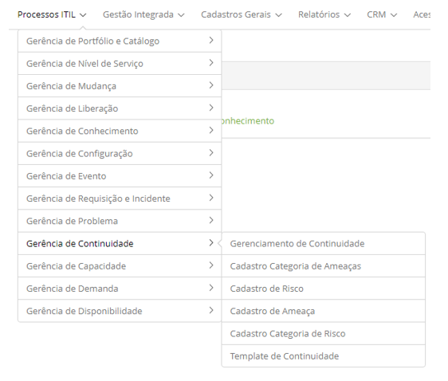

title: Módulo Gerenciamento de Continuidade
Description: O Gerenciamento de Continuidade foca em recuperar os serviços de TI e seus componentes diante de um evento de desastre.
# Módulo Gerenciamento de Continuidade

Objetivo do módulo
--------------------

O Gerenciamento de Continuidade foca em recuperar os serviços de TI e seus componentes diante de um evento de desastre.

O que pode ser um evento de desastre?

1. Incêndios;
2. Enchentes;
3. Terrorismo;
4. Apagões ou blackouts;
5. Queda de sistemas;
6. Vandalismo;
7. Tempestades.

A definição do que poderá ser um desastre varia nas organizações de acordo com o impacto ao negócio.

O propósito do Gerenciamento de Continuidade é apoiar o processo de continuidade do negócio, gerenciar os riscos
que podem afetar seriamente os serviços de TI e garantir a provisão desses serviços no mínimo acordo de nível de serviço.

Onde estão suas funcionalidades
--------------------------------

Acesse o menu principal **Processos ITIL > Gerência de Continuidade**.

**Figura 1 - Menu do Módulo Gerência de Continuidade**

Principal funcionalidade (em destaque)
----------------------------------------

Na seção "Veja também" é possível acessar a(s) funcionalidade(s) principal(is) deste módulo, desta forma se pode obter um 
conhecimento mais detalhado.

!!! abstract "SAIBA MAIS"

    Essa funcionalidade é responsável por iniciar o Gerenciamento de Continuidade do Negócio que dará base
    ao Gerenciamento de Continuidade agir em um momento de desastre. Por sua vez, o Gerenciamento de Continuidade de Serviço
    de TI se liga aos processos de Gerenciamento de Nível de Serviço, Gerenciamento de Disponibilidade, Gerenciamento de 
    Configuração, Gerenciamento de Capacidade e Gerenciamento de Mudança para garantir que as implementações de 
    recuperação ocorram de maneira satisfatória diante da necessidade de uso.
    
Veja também
-------------

- [Gerenciamento de Continuidade](/pt-br/citsmart-platform-7/processes/continuity/continuity-management.html)

!!! tip "About"

    <b>Product/Version:</b> CITSmart | 7.00 &nbsp;&nbsp;
    <b>Updated:</b>07/17/2019 – Larissa Lourenço

