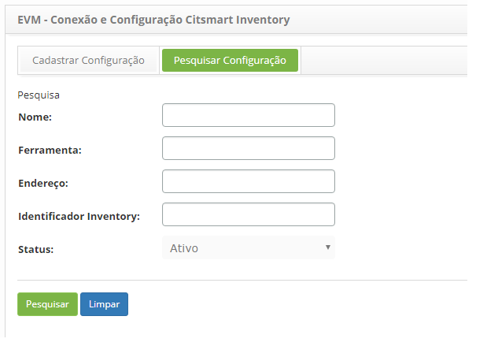
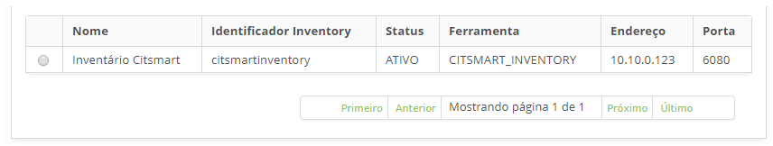
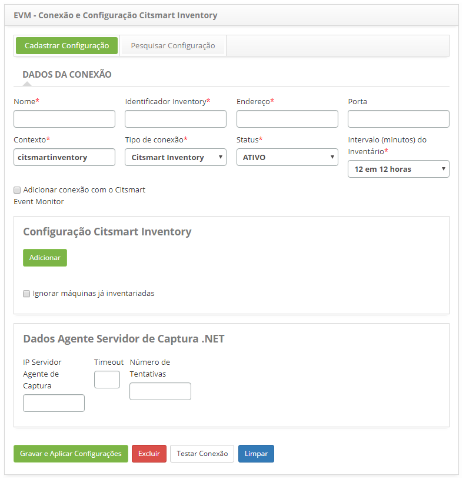
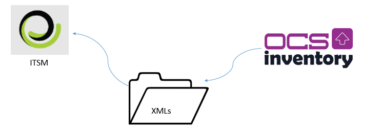
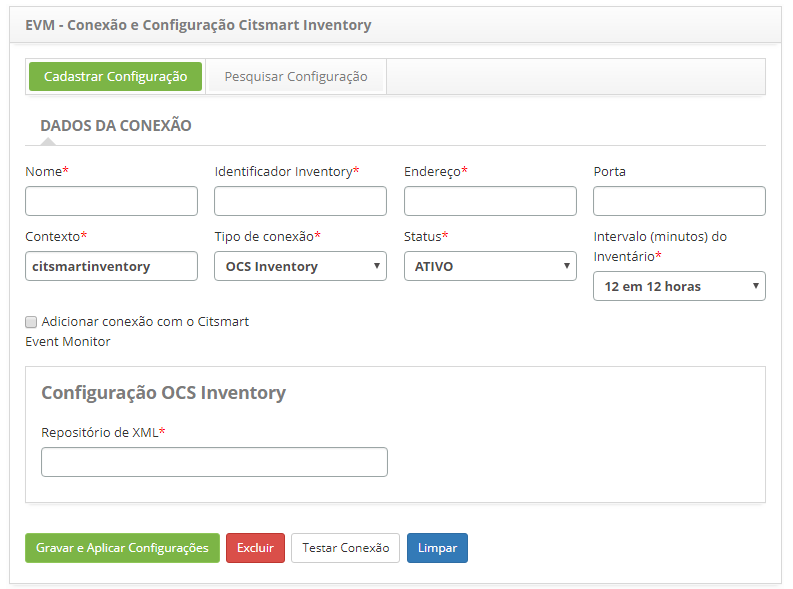

title: Configuração da conexão do Citsmart inventory
Description: Esta funcionalidade tem como objetivo cadastrar todas as propriedades referentes à conexão do CITSmart Inventory.
# Configuração da conexão do Citsmart inventory

Esta funcionalidade tem como objetivo cadastrar todas as propriedades referentes à conexão do CITSmart Inventory, de acordo com o IP 
e porta onde está instalado o Jboss do CITSmart Inventory.

Como acessar
---------------

1. Acesse a funcionalidade de conexão e configuração CITSmart inventory através da navegação no menu principal 
**Processos ITIL > Gerência de Evento > Conexões Inventory**.

Pré-condições
---------------

1. Não se aplica.

Filtros
----------

1. Os seguintes filtros possibilitam ao usuário restringir a participação de itens na listagem padrão da funcionalidade, facilitando 
a localização dos itens desejados:

    - Nome;
    - Ferramenta;
    - Endereço;
    - Identificador Inventory;
    - Status.
    
    
    
    **Figura 1 - Tela de pesquisa de conexão do CITSmart inventory**
    
2. Realize a pesquisa de conexão CITSmart Inventory;

    - Informe os filtros (nome da conexão, ferramenta de monitoração, endereço do servidor CITSmart Inventory, identificador do 
    Inventory e/ou status da conexão) conforme sua necessidade e clique no botão "Pesquisar". Após isso, será exibido o registro 
    da conexão CITSmart Inventory conforme os dados informados;
    
    - Caso deseje listar todos os registros, basta clicar diretamente no botão "Pesquisar".
    
Listagem de itens
--------------------

1. Os seguintes campos cadastrais estão disponíveis ao usuário para facilitar a identificação dos itens desejados na listagem 
padrão da funcionalidade: **Nome, Identificador Inventory, Status, Ferramenta, Endereço** e **Porta**.

2. Na tela de **EVM - Conexão e Configuração CITSmart Inventory**, clique na aba **Pesquisar Configuração**. Será apresentada a 
tela de pesquisa conforme ilustrada na figura abaixo:

    
    
    **Figura 2 - Tela de listagem de conexão do CITSmart inventory**
    
3. Após a pesquisa, selecione o registro desejado. Feito isso, será direcionado para a tela de cadastro exibindo o conteúdo 
referente ao registro selecionado e as informações do usuário que realizou o registro e data/hora da criação;

4. Para alterar os dados do registro de conexão CITSmart Inventory, basta modificar as informações dos campos desejados e clicar no botão "Gravar".
    
Preenchimento dos campos cadastrais
-------------------------------------

1. Será apresentada a tela de cadastro de conexão CITSmart Inventory, conforme ilustrada na figura abaixo:

    
    
    **Figura 3- Tela de cadastro de conexão do CITSmart inventory**
    
2. Nesta tela, os campos são autoexplicativos. Basta posicionar o mouse sobre o campo escolhido e será apresentada uma breve descrição. Portanto serão abordadas somente as informações principais para efetuar o registro da conexão;

    - Informe os **Dados da Conexão**.
    
    !!! warning "ATENÇÃO"
    
        Selecionando a opção "Ignorar máquinas já inventariada" (No caso de máquinas inventariadas é possível definir quantos  
        dias essa máquina ficará sem novo inventário e por isso seu Status será colocado como Ignorado até que se passe o total 
        de dias parametrizado) serão abertas duas caixas que se referem a Período e Formato do período, marcar a opção que melhor 
        se encaixe e gravar as configurações.
        
Premissas OCS Inventory
--------------------------

**Figura 4 - Integração CITSmart inventory - OCS inventory**

3. Se o tipo de conexão (ferramenta de inventário) escolhida for o OCS Inventory será apresentado o campo de configuração do 
mesmo para ser informado o repositório de XML, conforme ilustrado abaixo. Além disso, existem alguns **pré-requisitos** muito 
relevantes que devem ser observados:

    - Após instalar o OCS Inventory, ele não vem como padrão qualquer tipo de integração com outro sistema, para isso no menu 
    Inventory files precisa atribuir GENERATE_OCS_FILES = ON, OCS_FILES_FORMAT = XML e especificar o caminho onde irão ser 
    guardados os arquivos XML em OCS_FILES_PATH
    - O local especificado para a geração dos arquivos XML é algo muito estratégico:
        - Caso o servidor OCS seja o mesmo servidor do Inventory, trata-se do menor risco pois a pasta provavelmente estará 
        acessível para leitura
        - Caso o servidor OCS **NÃO** seja o mesmo servidor do Inventory, deve-se optar por uma dessas duas opções:
            - o OCS Inventory deve ter permissão para gravar no servidor do Inventory
            - o Inventory deve ter permissão (compartilhamento) no servidor OCS Inventory
            
    
    
    **Figura 5 - Tela de Cadastro de Conexão do CITSmart inventory**
    
4. Caso deseje relacionar o CITSmart Inventory com o CITSmart Event Monitor, marque a opção **Adicionar conexão com o CITSmart 
Event Monitor**.

5. Feito isso, escolha a conexão do CITSmart Event Monitor.

    !!! note "NOTA"
    
        Para relacionar o CITSmart Inventory com o CITSmart Event Monitor é necessário, primeiramente, efetuar a configuração da 
        conexão do CITSmart Event Monitor.
        
6. Após informar os dados da conexão, clique no botão **Testar Conexão** para testar conexão com CITSmart Inventory;

    - Informe os dados da **Configuração**;
        - O campo **Identificador Inventory** corresponde à propriedade *“idCitsmartInventory”* do arquivo de propriedades 
        *“inventory_config.properties”*.
        - Se desejar ignorar máquinas já inventariadas, selecione a opção e informe o período e o formato do período.
    - Informe os dados do Agente de Captura .Net.
        - O campo **IP Servidor Agente de Captura** refere-se ao IP do servidor onde está instalado o Agente de Captura das 
        informações das máquinas.
    - Informe os dados do Agente SNMP.
    
    !!! warning "ATENÇÃO"
    
        A aplicação de Inventário realiza a captura dos dados por meio da porta do Agente SNMP (161) e/ou pelo Agente de Captura 
        (porta 7103 desenvolvido pela CITSmart Corporation, em .Net). Inicialmente, o Inventory realiza um comando "ping" para 
        verificar se a máquina está ativa. Se conseguir realizar o comando, tenta acessar a porta SNMP do item de configuração. 
        Se o acesso à porta não for obtido com sucesso, o Inventory tenta realizar o acesso através do agente de captura.
        
7. Clique no botão "Gravar e Aplicar Configurações" para efetuar o registro, onde a data, hora e usuário serão gravados 
automaticamente para uma futura auditoria.

!!! tip "About"

    <b>Product/Version:</b> CITSmart | 7.00 &nbsp;&nbsp;
    <b>Updated:</b>07/18/2019 – Larissa Lourenço
