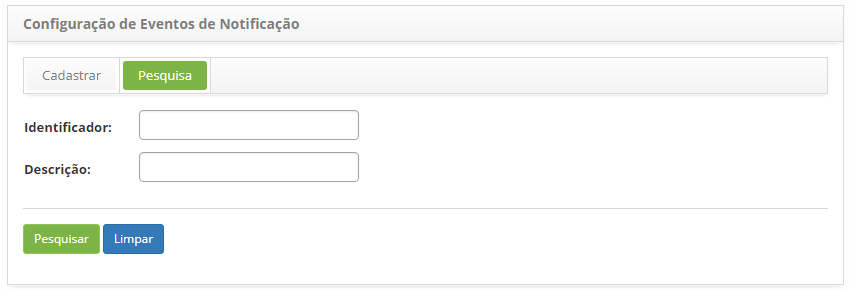
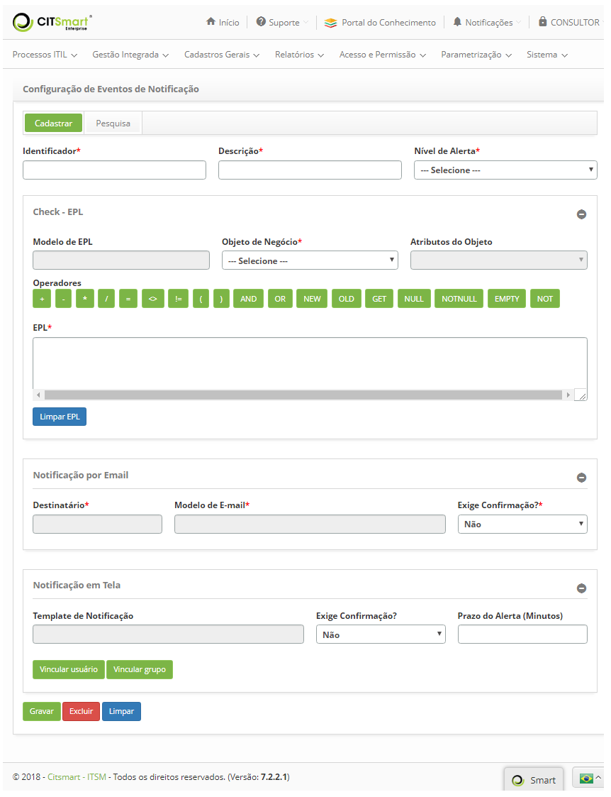

title: Cadastro e pesquisa de eventos de notificação
Description: Esta funcionalidade tem por objetivo estabelecer quais as regras que irão definir um evento de notificação.
# Cadastro e pesquisa de eventos de notificação

Esta funcionalidade tem por objetivo estabelecer quais as regras que irão definir um evento de notificação, ou seja, realizar a 
configuração referente à notificação que será disparada quando as condições da EPL forem satisfeitas.

!!! warning "ATENÇÃO"

    É necessário ter conhecimento da linguagem de processamento de eventos. Para mais informações consulte 
    o site: [espertech](http://www.espertech.com/esper)
    
Pré-condições
---------------

1. Cadastrar modelo de EPL (ver conhecimento [Cadastro e pesquisa de modelos de EPL](/pt-br/citsmart-platform-7/processes/event/epl-models.html));

2. Configurar destinatário (ver conhecimento [Configuração dos destinatários das notificações](/pt-br/citsmart-platform-7/processes/event/notifications-recipients.html));

3. Cadastrar modelo de e-mail (ver conhecimento [Cadastro e pesquisa de configuração de modelo de e-mail](/pt-br/citsmart-platform-7/plataform-administration/email-settings/configure-email-template.html));

4. Cadastrar template de notificação (ver conhecimento [Cadastro e pesquisa de template de notificação](/pt-br/citsmart-platform-7/additional-features/communication-and-notification/notification/configuration/notification-template.html)).

Como acessar
---------------

1. Acesse a funcionalidade de configuração de eventos de notificação através da navegação no menu principal 
**Processos ITIL > Gerência de Evento > Configuração de Eventos de Notificação**.

Filtros
---------

1. Os seguintes filtros possibilitam ao usuário restringir a participação de itens na listagem padrão da funcionalidade, 
facilitando a localização dos itens desejados:

    - Identificador;
    - Descrição.
    
2. Na tela de **Configuração de Eventos de Notificação**, clique na aba **Pesquisa**. Será apresentada a tela de pesquisa 
conforme ilustrada na figura abaixo:

    
    
    **Figura 1 - Tela de pesquisa de configuração de eventos de notificação**
    
3. Realize a pesquisa de configuração de eventos de notificação;

    - Informe o identificador e/ou a descrição da configuração de eventos de notificação e clique no botão "Pesquisar". Após isso,
    será exibido o registro conforme os dados informados;
    
    - Caso deseje listar todos os registros de configuração de eventos de notificação, basta clicar diretamente no botão 
    "Pesquisar".
    
Listagem de itens
-------------------

1. Os seguintes campos cadastrais estão disponíveis ao usuário para facilitar a identificação dos itens desejados na listagem 
padrão da funcionalidade: **Identificador** e **Descrição**.

    
    
    **Figura 2 - Tela de listagem de configuração de eventos de notificação**
    
2. Após a pesquisa, selecione o registro desejado. Feito isso, será direcionado para a tela de cadastro exibindo o conteúdo
referente ao registro selecionado;

3. Para alterar os dados do registro de configuração de eventos de notificação, basta modificar as informações dos campos 
desejados e clicar no botão "Gravar" para que seja gravada a alteração realizada no registro, onde a data, hora e usuário serão 
gravados automaticamente para uma futura auditoria.

Preenchimento dos campos cadastrais
-------------------------------------

1. Será apresentada a tela de cadastro de configuração de eventos de notificação, conforme ilustrada na figura abaixo:

    
    
    **Figura 3 - Tela de cadastro de configuração de eventos de notificação**
    
2. Informe os dados para cadastro de configuração de eventos de notificação:

    - **Identificador**: informe a identificação do evento de notificação. Essa identificação é uma palavra chave ou sigla para 
    diferenciar os eventos.
    - **Descrição**: informe a descrição que desejar para a configuração de eventos de notificação;
    - **Nível de Alerta**: selecione o nível de alerta;
    - **Informe os dados para Check - EPL**:
        - **Modelo de EPL**: informe o modelo de EPL que será utilizado. Ao clicar neste campo, será apresentada a tela "Modelo 
        de EPL", clique na guia "Pesquisar", realize a pesquisa e selecione o modelo de EPL. Caso queira criar um modelo de EPL, 
        clique na guia "Cadastrar";
        - **Objeto de Negócio**: selecione o objeto de negócio, o qual deverá ser analisado. No momento que é escolhido o objeto 
        de negócio, o sistema substitui a chave 'BusinessClass' para o nome completo da classe DTO, ou seja, o objeto de negócio
        selecionado;
        - **Atributos do Objeto**: selecione os atributos. Os atributos definem as características dos objetos de negócios e serão 
        apresentados conforme o objeto escolhido. No momento que é escolhido o atributo, o sistema substitui a chave 
        'AttributeClass' para o nome do atributo da classe DTO selecionado;
    - **Operadores**: são os itens que poderão ser usados para criação da EPL.
    - **EPL**: descreva o script EPL para identificação do evento.
        - Caso queira limpar os dados informados no campo, basta clicar no botão "Limpar EPL";
            - **Informe os dados para Notificação por E-mail**: quando o evento cair na regra da EPL, será enviado e-mail 
            de notificação para o destinatário escolhido;
    - **Destinatário**: informe o destinatário. Ao clicar neste campo, será apresentada a tela "Destinatário", realize a pesquisa 
    e selecione o destinatário.
    - **Modelo de E-mail**: informe o modelo de e-mail. Ao clicar neste campo, será apresentada a tela "Modelo de E-mail", 
    realize a pesquisa e selecione o modelo de e-mail.
    - **Exige Confirmação?**: selecione Sim ou Não para a necessidade de uma confirmação quando a notificação for recebida;
        - Se a opção marcada for **Não**, o sistema vai disparar um e-mail para o destinatário e registrar o evento de notificação
        como concluído.
        - Se a opção marcada for **Sim**, os campos com as informações de prazo de alerta em minutos, e prazo de confirmação em 
        minutos deverão ser preenchidos, assim como as informações para escalonamento:
            - **Destinatário de Escalonamento**: informe o destinatário de escalonamento. Ao clicar neste campo, será apresentada 
            a tela "Destinatário de Escalonamento", realize a pesquisa e selecione o destinatário de escalonamento;
            - **Modelo de E-mail Escalonamento**: informe o modelo de e-mail de escalonamento. Ao clicar neste campo, será 
            apresentada a tela "Modelo de E-mail Escalonamento", realize a pesquisa e selecione o modelo de e-mail de 
            escalonamento;
            - **Prazo de Escalonamento (Minutos)**: informe o prazo de escalonamento.
    - **Informe os dados para Notificação em Tela**: quando o evento cair na regra da EPL, será apresentada notificação na tela
    conforme configurado no template escolhido;
    - **Template de Notificação**: selecione o template de notificação desejado;
    - **Exige Confirmação?**: selecione Sim ou Não para a necessidade de uma confirmação quando a notificação for recebida;
    - **Prazo do Alerta (Minutos)**: informe o prazo de alerta da notificação em tela, em minutos;
    - **Vincular usuário**: vincule usuário(s) à notificação em tela;
        - Clique no botão "Vincular usuário". Após isso, será apresentada a tela de pesquisa de usuários;
        - Realize a pesquisa, selecione o usuário que deseja vincular à notificação em tela;
    - **Vincular grupo**: vincule grupo(s) à notificação em tela;
        - Clique no botão "Vincular grupo". Após isso, será apresentada a tela de pesquisa de grupos;
        - Realize a pesquisa, selecione o grupo que deseja vincular à notificação em tela;

3. Clique no botão "Gravar" para efetuar o registro, onde a data, hora e usuário serão gravados automaticamente para uma futura 
auditoria.

!!! note "NOTA"

    No momento da gravação, o sistema faz uma validação da sintaxe da EPL.
    
!!! tip "About"

    <b>Product/Version:</b> CITSmart | 7.00 &nbsp;&nbsp;
    <b>Updated:</b>07/18/2019 – Larissa Lourenço
