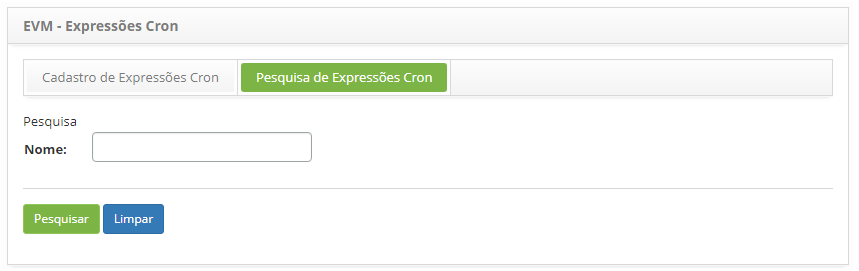
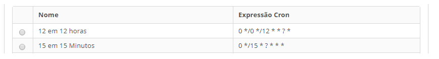
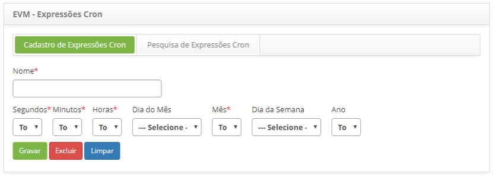

title: Cadastro e pesquisa de horários
Description: Esta funcionalidade tem como objetivo agendar tarefas.
# Cadastro e pesquisa de horários

Esta funcionalidade tem como objetivo agendar tarefas. São escolhidos filtros de horário e data e é gerada uma 
Expressão Cron que tem como objetivo criar agendas de disparo para serem executadas periodicamente nesses horários e 
datas estabelecidos. Por exemplo, para realizar um inventário da rede, deve ser selecionado um agendamento previamente
cadastrado para o sistema executar esse inventário de acordo com o horário escolhido.

Como acessar
--------------

1. Acesse a funcionalidade de horário através da navegação no menu principal **Processos ITIL > Gerência de Evento > Horário**.

Pré-condições
---------------

1. Não se aplica.

Filtros
---------

1. O seguinte filtro possibilita ao usuário restringir a participação de itens na listagem padrão da funcionalidade, facilitando
a localização dos itens desejados, conforme ilustrado na figura abaixo:

    - Nome.
    
    
    
    **Figura 1- Tela de pesquisa de horário**
    
2. Realize a pesquisa de horário:

    - Informe o nome do horário que deseja pesquisar e clique no botão "Pesquisar". Após isso, será exibido o registro de horário 
    conforme o nome informado;
    
    - Caso deseje listar todos os registros de horário, basta clicar diretamente no botão "Pesquisar".
    
Listagem de itens
-------------------

1. Os seguintes campos cadastrais estão disponíveis ao usuário para facilitar a identificação dos itens desejados na listagem 
padrão da funcionalidade: **Nome** e **Expressões Cron**, conforme ilustrado na figura abaixo:

    
    
    **Figura 2 - Tela de listagem de horário**
    
2. Após a pesquisa, selecione o registro desejado. Feito isso, será direcionado para a tela de cadastro exibindo o conteúdo 
referente ao registro selecionado;

3. Para alterar os dados do registro de horário, basta modificar as informações dos campos desejados e clicar no botão "Gravar" 
para que seja gravada a alteração realizada no registro, onde a data, hora e usuário serão gravados automaticamente para uma 
futura auditoria.

Preenchimento dos campos cadastrais
-------------------------------------

1. Acesse a funcionalidade, após isso, será apresentada a tela de **Cadastro de Horário**, conforme ilustrada na figura abaixo:

    
    
    **Figura 3 - Tela de cadastro de horário**
    
2. Preencha os campos conforme orientações abaixo:

    - **Nome**: informe o nome que desejar para o agendamento de horário;
    - Informe o tempo para o agendamento selecionando os **Segundos**, **Minutos** e **Horas** que desejar;
    - Informe a data para o agendamento, selecionando o **Dia do Mês** ou **Dia da Semana**, **Mês** e **Ano** que desejar.
    
    !!! note "NOTA"
    
        Informe somente uma das opções, Dia do Mês ou Dia da Semana.
        
3. Clique no botão "Gravar" para efetuar o registro, onde a data, hora e usuário serão gravados automaticamente para uma futura 
auditoria.

!!! tip "About"

    <b>Product/Version:</b> CITSmart | 7.00 &nbsp;&nbsp;
    <b>Updated:</b>07/18/2019 – Larissa Lourenço
