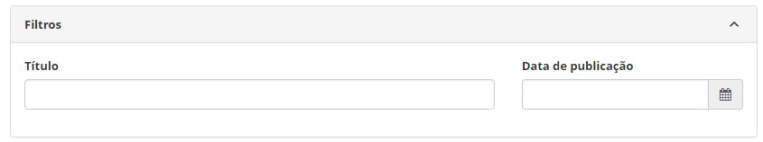
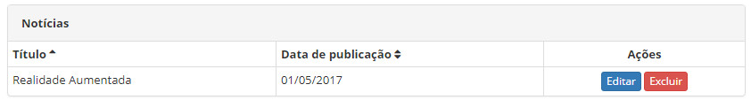
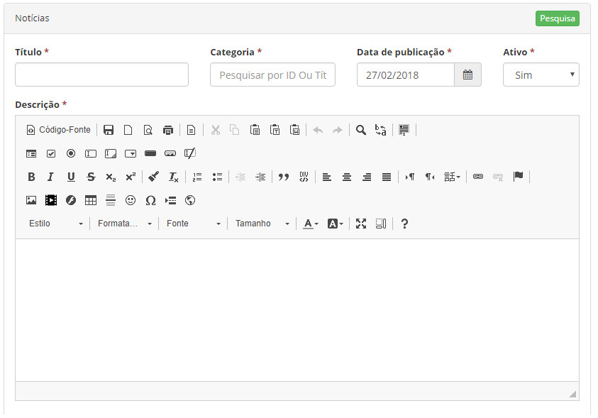

title:  Cadastro e pesquisa de notícias
Description: Tem o objetivo de cadastrar as notícias que serão publicadas no Smart Portal.. 
# Cadastro e pesquisa de notícias

Esta funcionalidade tem o objetivo de cadastrar as notícias que serão publicadas no Smart Portal.

Como acessar
--------------

1. Acesse a funcionalidade de **Cadastro de Notícias** através da navegação no menu principal **Cadastros Gerais > Cadastro de 
Notícias > Notícias**

Pré-condições
----------------

1. Ter a categoria de notícias cadastrada (ver conhecimento [Cadastro e pesquisa de categoria de notícias][1]).

Filtros
----------

1. Os seguintes filtros possibilitam ao usuário restringir a participação de itens na listagem padrão da funcionalidade, facilitando 
a localização dos itens desejados:

    - Título;
    - Data de publicação.

    
    
    **Figura 1 - Tela de notícias**
    
2. Para realizar a busca de uma notícia, informe o título e/ou data da publicação da mesma. Após isso, será exibido o registro 
conforme os dados informados.

Listagem de itens
---------------------

1. Os seguintes campos cadastrais estão disponíveis ao usuário para facilitar a identificação dos itens desejados na listagem 
padrão da funcionalidade: **Título** e **Data de publicação**.

    
    
    **Figura 2 - Tela de listagem de notícia**
    
2. Existem botões de ação disponíveis ao usuário em relação a cada item da listagem, são eles: "Editar" e "Excluir";

2. Para alterar os dados do registro de notícia, clique no botão "Editar". Feito isso, será direcionado para a tela de cadastro
exibindo o conteúdo referente ao registro selecionado.

Preenchimento dos campos cadastrais
-------------------------------------

1. Será apresentada a tela de **Notícias**;

2. Clique no botão de adicionar nova notícia . Feito isso, será apresentada a tela de **Cadastro de
Notícias**, conforme ilustrada na figura a seguir: 

    
    
    **Figura 3 - Tela de cadastro de notícias**
    
3. Preencha os campos conforme orientações abaixo:

    - **Título**: informe o título da notícia;
    - **Categoria**: informe a categoria da notícia;
    - **Data de publicação**: informe a data de publicação da notícia;
    - **Ativo**: informe a situação da notícia;
    - **Descrição**: descreva a notícia.
    
4. Após os dados informados, clique no botão de opções  e logo em seguida clique no botão 
 para gravar a notícia, onde a data, hora e usuário também serão gravados automaticamente para uma 
futura auditoria.

!!! note "NOTA"

    A notícia será exibida no Smart Portal na data de publicação informada.
    

!!! tip "About"

    <b>Product/Version:</b> CITSmart | 7.00 &nbsp;&nbsp;
    <b>Updated:</b>08/08/2019 - Larissa Lourenço

[1]:/pt-br/citsmart-platform-7/processes/portfolio-and-catalog/configuration/news-category.html
