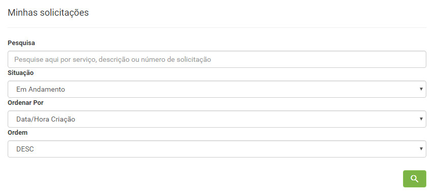
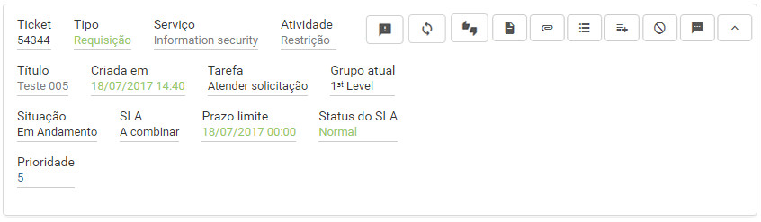
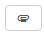
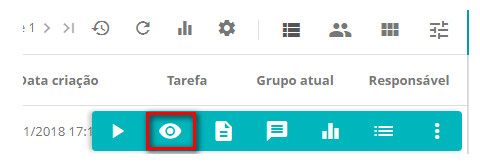
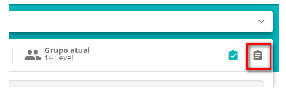
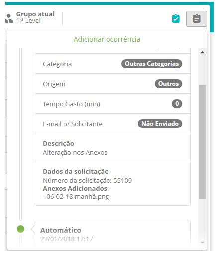

title:  Gerenciamento de anexos no Smart Portal
Description: Tem por objetivo o gerenciamento de anexos de solicitação via Smart Portal.. 
# Gerenciamento de anexos no Smart Portal

Como acessar
--------------

1. Na página inicial clique no ícone no canto superior esquerdo , selecione a opção Minhas
Solicitações.

Pré-condições
----------------

1. Informe o conteúdo abaixo nos parâmetros:

    - Parâmetro 44: Ex: Windows - C:/temp (ver conhecimento [Regras de parametrização - Sistema][1]);
    
    - Parâmetro 46: deverá estar setado em 'S' (ver conhecimento [Regras de parametrização - Smart portal][2]);
    
2. O usuário deverá possuir solicitações de serviço abertas em seu nome (ver conhecimento 
[Cadastro de solicitação de serviço via smart portal][3]);

3. A solicitação deverá estar com o status "aberta";

4. O acesso às pastas quando se sobe o JBOSS deve estar liberado.

Filtros
---------

1. Os seguintes filtros possibilitam ao usuário restringir a participação de itens na listagem padrão da funcionalidade, facilitando
a localização dos itens desejados, conforme ilustrado na figura abaixo:

    - Pesquisa;
    - Situação;
    - Ordenar por;
    - Ordem.
    
    
    
    **Figura 1 - Tela de pesquisa de solicitação**
    
Listagem de itens
--------------------

1. Os seguintes campos cadastrais estão disponíveis ao usuário para facilitar a identificação dos itens desejados na listagem padrão
da funcionalidade: **Ticket, Tipo, Serviço, Atividade, Criada em, Tarefa, Grupo atual, Situação, SLA, Prazo limite, Status do SLA**
e **Prioridade**.

2. Existem botões de ação disponíveis ao usuário em relação a cada item da listagem, são eles: *Registar opinião, Reabrir 
solicitação, Pesquisa de satisfação, Descrição, Anexos, Ocorrências, Registrar Ocorrência, Cancelar Solicitação* e *Mensagem*.

**Figura 2 - Lista de solicitação**

Preenchimento dos campos cadastrais
--------------------------------------

1. Não se aplica.

Gerenciando anexos
----------------------

1. Ao clicar no ícone  é possível anexar ou remover arquivos.

Visualizando o histórico de um ticket
----------------------------------------

1. Em **Processos ITIL > Gerência de Requisição e Incidente > Requisição de Serviços e Incidentes**, pesquise pela solicitação em que
foi adicionado o anexo e clique no botão "Visualizar", como na figura abaixo:

    
    
    **Figura 3 - Tela de solicitação**
    
2. Será aberta o ticket, clique no botão "Ocorrência da Solicitação", conforme figura abaixo:

    
    
    **Figura 4 - Tela de visualização de solicitação**
    
3. Então todo o histórico de registros do ticket será demonstrado:

    
    
    **Figura 5 -Tela de registros da solicitação**
    
!!! tip "About"

    <b>Product/Version:</b> CITSmart | 7.00 &nbsp;&nbsp;
    <b>Updated:</b>08/06/2019 - Larissa Lourenço

    
    
    
    
    
    
    
    
    
[1]:/pt-br/citsmart-platform-7/plataform-administration/parameters-list/parametrization-system.html
[2]:/pt-br/citsmart-platform-7/plataform-administration/parameters-list/parametrization-smart-portal.html
[3]:/pt-br/citsmart-platform-7/processes/portfolio-and-catalog/smart-portal/service-request.html
