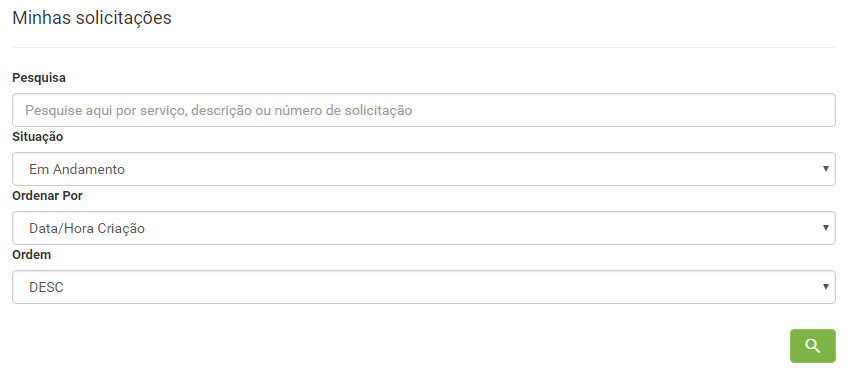
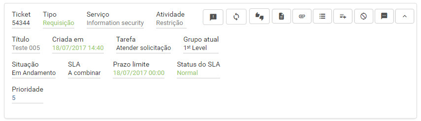
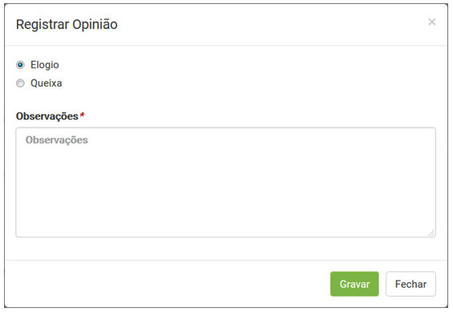

title:  Cadastro da satisfação sobre o atendimento de uma solicitação de serviço via Smart Portal
Description: Disponibiliza o cadastro de satisfação sobre o atendimento. 
# Cadastro da satisfação sobre o atendimento de uma solicitação de serviço via Smart Portal

Como acessar
---------------

1. Na tela inicial do **Smart Portal**, clique no botão de menu  e logo após clique em **Minhas
solicitações**. Após isso, serão exibidas as solicitações de serviço;

Pré-condições
---------------

1. A solicitação de serviço deverá estar com a situação “fechada” (ver conhecimento [Gerenciamento de ticket (serviços)][1], seção "Preenchimento Dos Campos Cadastrais - Cadastro De Ticket").

Filtros
----------

1. Os seguintes filtros possibilitam ao usuário restringir a participação de itens na listagem padrão da funcionalidade, facilitando a
localização dos itens desejados:

    - Pesquisa;
    - Situação;
    - Ordenar Por;
    - Ordem.
    
    
    
    **Figura 1 - Tela de pesquisa de solicitação**
    
Listagem de itens
---------------------

1. Os seguintes campos cadastrais estão disponíveis ao usuário para facilitar a identificação dos itens desejados na listagem padrão 
da funcionalidade: **Ticket, Tipo, Serviço, Atividade, Criada em, Tarefa, Grupo atual, Situação, SLA, Prazo limite, Status do SLA** e
**Prioridade**.

2. Existem botões de ação disponíveis ao usuário em relação a cada item da listagem, são eles: *Registar opinião, Reabrir solicitação,
Pesquisa de satisfação, Descrição, Anexos, Ocorrências, Registrar Ocorrência, Cancelar Solicitação* e *Mensagem*.

**Figura 2 - Tela de listagem de solicitação**

Preenchimento dos campos cadastrais
--------------------------------------

1. Busque a solicitação de serviço (fechada) que deseja avaliar e clique no ícone  da mesma. Feito
isso, será apresentada a tela de **Pesquisa de Satisfação**, conforme ilustrada na figura abaixo:

    
    
    **Figura 3 - Tela de registro de satisfação**
    
2. Registre as informações da pesquisa de satisfação;

    - **Avaliação**: selecione o grau de satisfação do atendimento da solicitação de serviço;
    - **Comentário/Sugestão de Melhoria**: descreva suas observações referente ao atendimento da solicitação de serviço, se achar 
    necessário.
    
3. Após os dados informados, clique no botão "Gravar" para efetuar o registro.

!!! info "IMPORTANTE"

    Caso o parâmetro “Reabrir Solicitação Pela Pesquisa de Satisfação” esteja habilitado, será apresentado no campo Avaliação a 
    opção “Não atendida” que ao ser selecionada exibe o botão que permite reabrir a solicitação de serviço.
    
!!! tip "About"

    <b>Product/Version:</b> CITSmart | 7.00 &nbsp;&nbsp;
    <b>Updated:</b>08/06/2019 - Larissa Lourenço

[1]:/pt-br/citsmart-platform-7/processes/tickets/ticket-management.html
