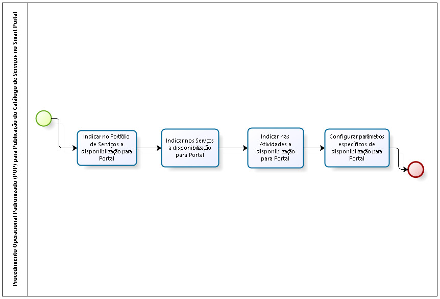

title:  Passos recomendados para publicar o catálogo de serviços no smart portal
Description: Disponibiliza os passos recomendados para publicar serviços no smart portal. 
# Passos recomendados para publicar o catálogo de serviços no smart portal

Procedimento operacional padronizado (POP) para publicação de catálogo de serviços no Smart Portal
-----------------------------------------------------------------------------------------------------

**Figura 1 - Diagrama do POP para publicar catálogo de serviços no Smart Portal**

Pré-condições
----------------

1. O Portfólio com seus Serviços e Atividades, desejados no Portal, já devem estar criados e disponíveis ao uso dentro do sistema (ver
conhecimento [Cadastro de portfólio de serviços][1]).

Detalhes das atividades/tarefas do fluxo
-------------------------------------------

*Indicar no portfólio de serviços a disponibilização para portal*

1. Acesse o menu (**Processos ITIL > Gerência de Portfólio e Catálogo > Gerenciamento de Portfólio**) e configure o portfólio de 
serviços para ser liberado no portal.

*Indicar nos serviços a disponibilização para portal*

1. Acesse o menu (**Processos ITIL > Gerência de Portfólio e Catálogo > Gerenciamento de Portfólio**), clique no botão avançar 
Portfólio e configure cada serviço para ser liberado no portal.

*Indicar nas atividades a disponibilização para portal*

1. Para cada Serviço de Negócio/TI são cadastradas as atividades de requisição e incidente. Acesse a tela de Gerenciamento de 
Portfólio (**Processos ITIL > Gerência de Portfólio e Catálogo > Gerenciamento de Portfólio**), clique no botão "Avançar Portfolio",
"Avançar Serviço" e configure cada atividade para ser liberada no portal.

*Configurar parâmetros específicos de disponibilização para portal*

1. Configurar o parâmetro "**Identifica o id do serviço para solicitações de serviços e incidentes**" informando a identificação do
serviço padrão para abertura da solicitação de serviços/incidentes;

2. Configurar o parâmetro "**Identifica o id de origem do chamado padrão da solicitação de serviço**" informando a identificação da
origem para abertura de solicitação de serviços/incidentes;

3. Configurar o parâmetro "**[Portal] ID do Contrato padrão para abertura de chamados**" informando a identificação do contrato 
padrão para abertura da solicitação de serviços/incidentes;

4. Configurar o parâmetro “**Habilitar Portal como tela inicial do Citsmart? (Ex: S ou N)**” deverá estar habilitado em 'S', para
apresentar a URL do Portal como página principal;

5. Configurar o parâmetro “**Vincula contratos a unidade (Ex: S ou N)**” esteja setado em 'S' , então a Unidade do usuário deverá 
estar vinculado ao contrato para que o mesmo possa abrir solicitação de serviço por meio do Portal;

6. Configurar o parâmetro “**Filtrar por Solicitação em Andamento**” retorna uma lista de solicitações somente com requisição cuja
tarefa atual esteja igual a 'Em Andamento';

7. Configurar o parâmetro “**Habilitar novo portal?**” Somente se o parâmetro estiver igual a N então pode usar esse outro 
parâmetro que não é obrigatório:

    - Configurar o parâmetro "**Ocultar Botão 'Nova Solicitação' no Portal**", o qual define a exibição do botão "Nova Solicitação".
    Informar o valor "N", para ser apresentado o botão "Nova Solicitação" para registro da solicitação de serviço.
    - Configurar o parâmetro "**Apresentar tela lista de serviço completa no Portal**", o qual define a exibição das colunas de
    "Serviço". Informar o valor "N" para serem exibidos as opções para responder questionário (caso esteja vinculado ao serviço) e 
    de anexo de arquivos;
    
8. Configurar o parâmetro “**Habilita permissão de acesso para grupos de usuário no portal - Valores: "S" ou "N" Default: "N**”

9. Configurar o parâmetro “**Habilita botão "Adicionar e continuar" na popup de nova solicitação no portal - Valores: "S" ou "N" 
Default: "N"**.

Anexos
-----------

!!! tip "About"

    <b>Product/Version:</b> CITSmart | 7.00 &nbsp;&nbsp;
    <b>Updated:</b>08/06/2019 - Larissa Lourenço

[1]:/pt-br/citsmart-platform-7/processes/portfolio-and-catalog/register.html
