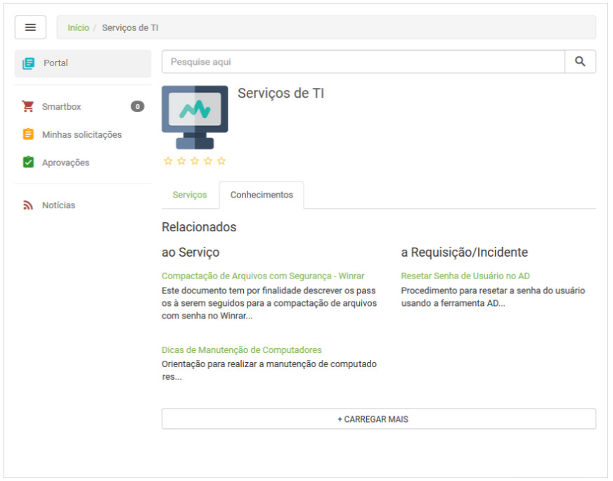
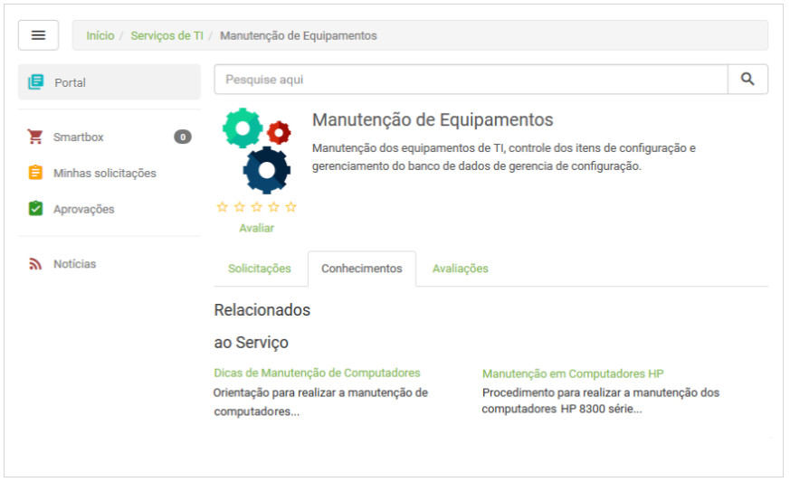

title:  Verificação dos conhecimentos relacionados aos serviços via Smart portal
Description: Disponibiliza a verificação dos conhecimentos relacionados aos serviços via Smart portal. 
# Verificação dos conhecimentos relacionados aos serviços via Smart portal

Como acessar
--------------

1. Na tela inicial do **Smart Portal**, clique no botão de menu   e logo em seguida em 
**Portal**.

Pré-condições
----------------

1. Ter o portfólio com os serviços e as atividades de requisição/incidente cadastrados e disponibilizados no Smart Portal (ver 
conhecimento [Cadastro de portfólio de serviços][1]; [Cadastro de serviços][2]; [Cadastro da atividade de serviço][3]);

2. Ter conhecimentos relacionados ao serviço (ver conhecimento [Configuração dos atributos do serviço][4], seção "Vinculando 
conhecimento ao serviço");

3. Ter conhecimentos relacionados à solicitação referente à atividade de requisição/incidente (ver conhecimento 
[Cadastro da atividade de serviço][5]).

Filtros
-----------

1. Não se aplica.

Listagem de itens
-------------------

1. Não se aplica.

Preenchimento dos campos cadastrais
--------------------------------------

1. Não se aplica.

Verificando os conhecimentos relacionados aos serviços
---------------------------------------------------------

1. Serão apresentados os Catálogos de Serviços;

2. Selecione o Catálogo desejado e clique na aba **Conhecimentos**, para verificar os conhecimentos relacionados aos serviços e 
atividades (requisição/incidente) do catálogo, conforme exemplo ilustrado na figura abaixo:

    
    
    **Figura 1 - Conhecimentos relacionados aos serviços do catálogo**
    
3. Para verificar os conhecimentos de um determinado serviço, clique na aba **Serviços**, selecione o serviço desejado e logo após 
clique na aba **Conhecimentos**;

4. Feito isso, serão apresentados os conhecimentos relacionados ao serviço e às atividades (requisição/incidente) do mesmo, conforme
exemplo ilustrado na figura abaixo:

**Figura 2 - Conhecimentos relacionados ao serviço**

!!! tip "About"

    <b>Product/Version:</b> CITSmart | 7.00 &nbsp;&nbsp;
    <b>Updated:</b>08/07/2019 - Larissa Lourenço
    
[1]:/pt-br/citsmart-platform-7/processes/portfolio-and-catalog/register.html

[2]:/pt-br/citsmart-platform-7/processes/portfolio-and-catalog/services.html

[3]:/pt-br/citsmart-platform-7/processes/portfolio-and-catalog/activity.html

[4]:/pt-br/citsmart-platform-7/processes/portfolio-and-catalog/configure-service-attribute.html

[5]:/pt-br/citsmart-platform-7/processes/portfolio-and-catalog/activity.html
