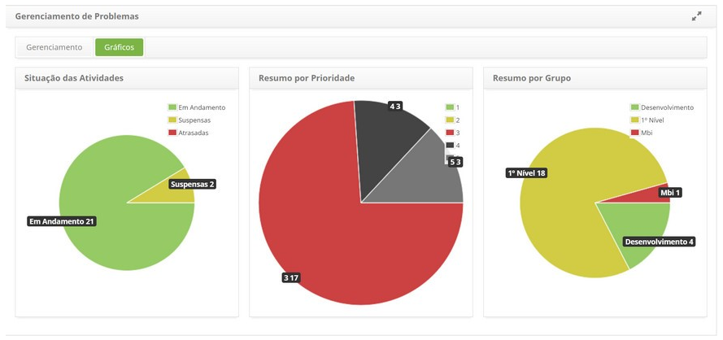

title: Visualização de gráficos de problemas
Description: Gráficos

# Visualização de gráficos de problemas

Como acessar
------------

1.  Acesse a funcionalidade de gráficos de problemas através da navegação no
    menu principal **Processos ITIL > Gerência de Problema > Gerência de
    Problema**.

Acessando gráficos
------------------

1.  Clique na guia **Gráficos** e será apresentado as informações dos registros
    de problemas por situação (em andamento, suspensas e atrasadas), por
    prioridade e por grupo executor, sendo essas demonstradas em gráficos
    conforme ilustrado na figura abaixo:

   

**Figura 1 - Tela de Gráficos de Problemas**

!!! tip "About"

    <b>Product/Version:</b> CITSmart | 8.00 &nbsp;&nbsp;
    <b>Updated:</b>07/16/2019 – Anna Martins
