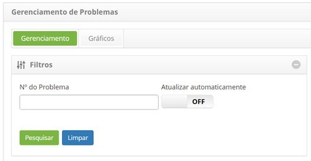
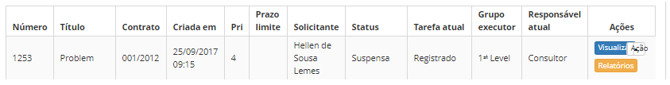
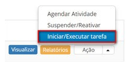
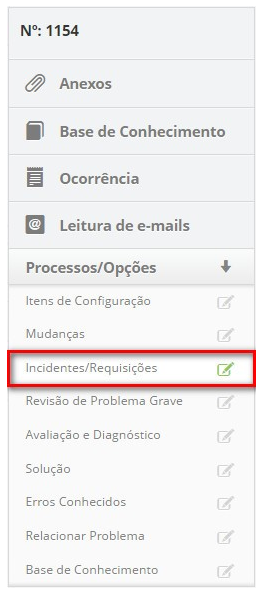
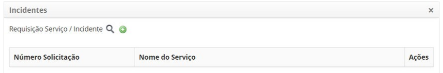
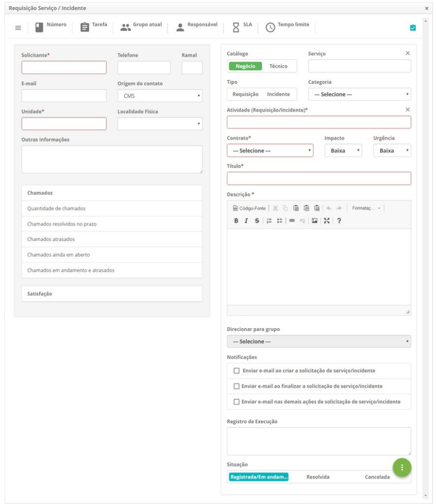
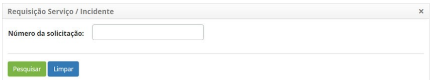

title:Cadastro de solicitação de serviço a partir de um problema
Description:Esta funcionalidade permite realizar o registro de uma solicitação de serviço a partir de um problema.

# Cadastro de solicitação de serviço a partir de um problema

Esta funcionalidade permite realizar o registro de uma solicitação de serviço a
partir de um problema.

Como acessar
------------

1.  Acesse a funcionalidade de registro de solicitação de serviço a partir de um
    problema através da navegação no menu principal **Processos
    ITIL > Gerência de Problema > Gerenciamento de Problema**.

Pré-condições
-------------

1.  Não se aplica.

Filtros
-------

1.  O seguinte filtro possibilita ao usuário restringir a participação de itens
    na listagem padrão da funcionalidade, facilitando a localização dos itens
    desejados:

    -   Número do Problema.

    

    **Figura 1 - Tela de pesquisa de problema**

Listagem de itens
-----------------

1.  Os seguintes campos cadastrais estão disponíveis ao usuário para facilitar a
    identificação dos itens desejados na listagem padrão da
    funcionalidade: Número, Título, Contrato, Criada em, Prioridade, Prazo
    limite, Solicitante, Status, Tarefa atual, Grupo executor e Responsável
    atual.

2.  Existem botões de ação disponíveis ao usuário em relação a cada item da
    listagem, são eles: *Visualizar*, *Relatórios* e *Ação*.

    

    **Figura 2 - Tela de listagem de problema**

Preenchimento dos campos cadastrais
-----------------------------------

1.  Na guia **Gerenciamento**, localize o problema desejado, clique no
    botão *Ação* e selecione a opção *Iniciar/Executar tarefa* do mesmo,
    conforme indicado na figura abaixo:

    

    **Figura 3 - Botão ação**

1.  Será exibida a tela de **Registro de Problema**, clique na
    guia **Processos/Opções** e logo em seguida em **Incidentes/Requisições**,
    localizada no canto direito da tela, conforme indicado na figura abaixo:

    

    **Figura 4 - Seleção de incidentes/requisições**

1.  É apresentada a tela de relacionamento de incidente/requisição;

    

    **Figura 5 - Relacionar incidentes/requisições**

1.  Para registrar uma solicitação de serviço, clique no ícone  . Será exibida a
    tela de registro de Requisição de Serviço/Incidente, conforme exemplo
    ilustrado na figura abaixo:

    

    **Figura 6 - Tela de registro de requisição de serviço/incidente**

-   Preencha o passo a passo com as informações necessárias e clique
    em *Gravar* para efetuar o registro;

-   Será exibida uma mensagem confirmando o sucesso do registro da nova
    solicitação de serviço.

Vinculando solicitação de serviço ao problema
---------------------------------------------

1.  Para vincular a solicitação de serviço ao problema clique no ícone .
    Será exibida a tela para pesquisa do mesmo, conforme exemplo ilustrado na
    figura abaixo:

       

    **Figura 7 - Tela de pesquisa de requisição de serviço/incidente**

-   Informe o número da solicitação de serviço que deseja pesquisar e clique no
    botão *Pesquisar*. Caso deseje listar todos os registros de
    requisições/incidentes, basta clicar diretamente no botão *Pesquisar*;

-   Selecione o registro desejado e o mesmo será apresentado na tela de
    relacionamento de incidente/requisição;

-   Feito isso, basta clicar no botão *Gravar e avançar o fluxo* ou *Gravar e
    manter a tarefa atual* caso queira gravar somente as informações registradas
    sobre o relacionamento da solicitação de serviço e manter a tarefa atual da
    solicitação.

!!! tip "About"

    <b>Product/Version:</b> CITSmart | 8.00 &nbsp;&nbsp;
    <b>Updated:</b>07/15/2019 – Anna Martins
