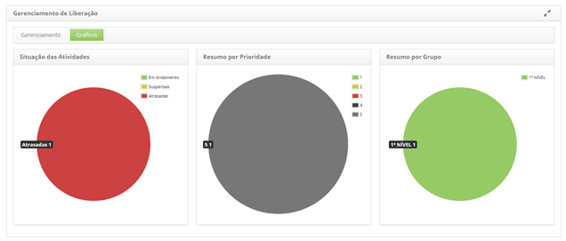

title: Visualização de gráficos de liberação
Description: Visualização de gráficos de liberação

# Visualização de gráficos de liberação

Como acessar
------------

1.  Acesse a funcionalidade de Gerenciamento de Liberação através da
    navegação no menu principal **Processos ITIL > Gerência de
    Liberação > Gerenciamento de Liberação**. Será apresentada a
    tela Gerenciamento de Liberação;

Visualizando os gráficos de liberação
-------------------------------------

1.  Clique na guia **Gráficos**. Feito isso, será apresentado as informações dos
    registros de liberação por situação (em andamento, suspensas e atrasadas),
    por prioridade e por grupo executor, sendo essas demonstradas em gráficos,
    conforme ilustrado na figura abaixo:

    

    **Figura 1 - Gráficos de liberação**

!!! tip "About"

    <b>Product/Version:</b> CITSmart | 8.00 &nbsp;&nbsp;
    <b>Updated:</b>07/15/2019 – Anna Martins
