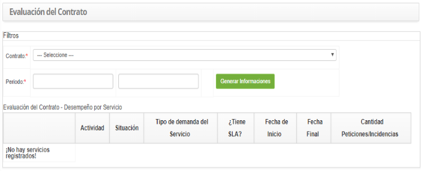

title: Evaluación de contrato
Description: Esta funcionalidad tiene por objeto verificar el desempeño del contrato por servicio.

# Evaluación de contrato

Esta funcionalidad tiene por objeto verificar el desempeño del contrato por servicio.

Cómo acceder
------------

1.  Acceda a la funcionalidad de Evaluación de Contrato mediante la navegación
    en el menú principal **Procesos ITIL > Gestión de Nivel de
    Servicio > Evaluación de Contrato**.

Condiciones previas
-------------------

1.  Tener el contrato registrado (ver conocimiento [Registro y consulta de
    contrato][1]);

2.  Tener actividades catastradas (ver conocimiento [Registro de la actividad de
    servicio][2]).

Filtros
-------

1.  Los siguientes filtros posibilitan al usuario restringir la participación de
    ítems en el listado default de la funcionalidad, facilitando la localización
    de los ítems deseados:

    -   Contrato;

    -   Período.

Listado de ítems
----------------

1.  El(Los) siguiente (s) campo (s) de registro está (n) disponible (s) para
    facilitar al usuario la identificación de los elementos deseados en el
    listado default de la funcionalidad: **Actividad, Situación, Tipo de demanda
    del Servicio, ¿Tiene SLA?, Fecha de Inicio, Fecha Final** y **Cantidad
    Solicitudes/Incidentes**.

2.  Se mostrará la pantalla de Evaluación de Contrato, como se muestra en la
    siguiente figura:

    
    
    **Figura 1 - Pantalla de Consulta de Desempeño del Contrato por Servicio**

3.  Seleccione el contrato e informe el período deseado;

4.  Después de los filtros definidos, haga clic en el botón *Generar
    información*. Hecho esto, se generará el informe de desempeño del contrato
    por servicio.

Completar los campos de registro
--------------------------------

1.  No se aplica.

[1]:/es-es/citsmart-platform-7/additional-features/contract-management/use/register-contract.html
[2]:/es-es/citsmart-platform-7/processes/portfolio-and-catalog/activity.html

!!! tip "About"

    <b>Product/Version:</b> CITSmart | 8.00 &nbsp;&nbsp;
    <b>Updated:</b>09/20/2019 - Anna Martins
