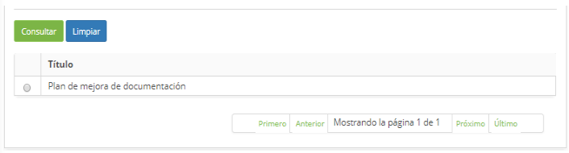
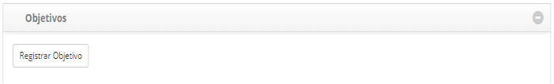

title: Registro y consulta del plan de mejora
Description: Esta funcionalidad tiene el objetivo de registrar los planes de mejora que pretende implementar mejoras al servicio de TI.

# Registro y consulta del plan de mejora

Esta funcionalidad tiene el objetivo de registrar los planes de mejora que
pretende implementar mejoras al servicio de TI.

Condiciones previas
-------------------

1.  Tener el proveedor registrado (ver conocimiento [Registro y consulta del
    proveedor][1]);

2.  Tener el contrato registrado (ver conocimiento [Registro y consulta de
    contrato][2]).

Cómo acceder
------------

1.  Acceda a la funcionalidad de Plan de mejora mediante la navegación en el
    menú principal **Procesos ITIL > Gestión de Nivel de
    Servicio > Plan de Mejora**.

Filtros
-------

1.  El siguiente filtro permite al usuario restringir la participación de
    elementos en el listado default de la funcionalidad, facilitando la
    localización de los elementos deseados:

    -   Título.

    
    
    **Figura 1 - Pantalla de búsqueda de planes de mejora**

2.  Realice la consulta del plan de mejora;

3.  Introduzca el título del plan de mejora que desea buscar y haga clic en el
    botón *Consultar*. Después de eso, se mostrará el registro del plan de
    mejora conforme el título informado.

4.  Si desea listar todos los registros de plan de mejora, simplemente haga clic
    directamente en el botón *Consultar*.

Listado de ítems
----------------

1.  El(Los) siguiente (s) campo (s) de registro está (n) disponible (s) para
    facilitar al usuario la identificación de los elementos deseados en el
    listado default de la funcionalidad: **Título**.

2.  En la pantalla de plan de mejora, haga clic en la ficha **Búsqueda**. Se
    mostrará la pantalla de búsqueda como se muestra en la figura siguiente:

    
    
    **Figura 2 - Listado de títulos de planes de mejora**

3.  Después de la búsqueda, seleccione el registro de plan de mejora deseado.
    Hecho esto, será dirigido a pantalla de registro mostrando el contenido
    referente al registro seleccionado.

4.  Para cambiar los datos del registro de plan de mejora, basta con modificar
    la información de los campos deseados y hacer clic en el botón *Grabar* para
    que se grabe el cambio realizado en el registro, donde la fecha, hora y
    usuario serán grabados automáticamente para una futura auditoría.

Completar los campos de registro
--------------------------------

1.  Se mostrará la pantalla de **Planes de Mejoramiento**, como se muestra en la
    siguiente figura:

    
    
    **Figura 3 - Pantalla de registro de plan de mejora**

2.  Rellene los campos según las instrucciones a continuación:

    -   **Título**: informe del título del plan de mejora;

    -   **Proveedor**: informe al proveedor;

    -   **Contrato**: informe del contrato;

    -   **Fecha Início**: informe la fecha de inicio del plan de mejora;

    -   **Fecha Final**: informe la fecha de cierre del plan de mejora;

    -   **Situación**: seleccione la situación en la que se encuentra el plan de
    mejora;

    -   **Meta**: describa el objetivo del plan de mejora, es decir, lo que se
    espera obtener tras la implantación del plan de mejora;

    -   **Visión general**: describa la visión general del plan de mejora;

    -   **Ámbito (Alcances, metas y procesos del proyecto)**: describa el alcance
    del plan de mejora;

    -   **Visión**: describa la visión del plan de mejora;

    -   **Misión**: describa la misión del plan de mejora;

    -   **Notas**: informe las notas del plan de mejora.

3.  Haga clic en el botón *Grabar* para realizar la operación, donde la fecha,
    hora y usuario se guardarán automáticamente para una futura auditoría.

Registrando objetivos del plan de mejora
----------------------------------------

1.  Después de la grabación del plan de mejora, se mostrará un área para
    registro del objetivo, como se muestra en la figura siguiente:

    
    
    **Figura 4 - Pantalla de registro de plan de mejora**

2.  Haga clic en el botón *Registrar Objetivo*. Hecho esto, aparecerá una
    pantalla para registro de las informaciones del objetivo del plan de mejora,
    como se muestra en la figura siguiente:

    
    
    **Figura 5 - Pantalla de registro de objetivos del plan de mejora**

    -   **Objetivo**: informe la descripción del objetivo específico del plan de
    mejora;

    -   **Detallamiento**: informe los detalles del objetivo del plan de mejora;

    -   **Resultado esperado**: informe el resultado esperado del objetivo del plan
    de mejora;

    -   **Medición**: informe la medición del objetivo del plan de mejora;

    -   **Tipo de Responsable**: informe el tipo de responsable por el objetivo del
    plan de mejora: usuario o grupo;

    -   **Responsable**: informe al responsable del objetivo del plan de mejora.

3.  Después de los datos informados, haga clic en el botón *Grabar* para grabar
    y añadir el objetivo en el registro de plan de mejora.

4.  Para cambiar la información del registro del objetivo del plan de mejora,
    haga clic en el icono  modifique los datos que desee y haga clic
    en *Guardar* para realizar el cambio, donde la fecha, la hora y el usuario
    se guardarán automáticamente para una futura auditoría.

5.  Para comprobar/registrar las acciones y monitoreo de la meta, haga clic en
    el icono    del mismo.

Registrando acciones y monitoreo del objetivo del plan de mejora
----------------------------------------------------------------

1.  Después de la definición del objetivo del plan de mejora, se presentará un
    área para registro de acciones y otra para registro de monitoreo como se
    muestra en la figura siguiente:

**Figura 6 - Área para Registro de Acciones y Monitoreo**

### Acciones

1.  Haga clic en el botón *Registrar Acción*. Hecho esto, aparecerá una pantalla
    para registrar la información de la acción como se muestra en la figura
    siguiente:

    
    
    **Figura 7 - Pantalla de registro de acción**:

    -   **Acción**: informe la descripción de la acción del objetivo del plan de
    mejora;

    -   **Fecha de inicio**: informe la fecha de inicio de la acción del objetivo
    del plan de mejora;

    -   **Fecha Final**: informe la fecha final de la acción del objetivo del plan
    de mejora

    -   **Tipo de Responsable**: informe el tipo de responsable de la acción del
    objetivo del plan de mejora: usuario o grupo;

    -   **Responsable**: informe al responsable de la acción del objetivo del plan
    de mejora;

    -   **Detallamiento**: describa lo que se hará para alcanzar el objetivo y cómo
    será hecho;

2.  Después de los datos informados, haga clic en el botón *Grabar* para grabar
    y agregar la acción del objetivo en el registro de plan de mejora.

3.  Para cambiar la información del registro de acción, haga clic en el
    icono  del mismo, modifique los datos que desee y haga clic
    en *Guardar* para realizar el cambio, donde la fecha, hora y usuario se
    guardarán automáticamente para una futura auditoría;

### Monitoramiento

1.  Haga clic en el botón *Registrar Monitoreo*. Hecho esto, aparecerá una
    pantalla para registro de las informaciones del monitoreo como se muestra en
    la figura siguiente:

    
    
    **Figura 8 - Pantalla de registro de monitoreo**

    -   **Título**: informe el título del monitoreo;

    -   **Factor Crítico de Suceso**: informe el factor crítico de éxito del
    monitoreo;

    -   **Tipo de Responsable**: informe el tipo de responsable por el monitoreo:
    usuario o grupo;

    -   **Responsable**: informe al responsable del monitoreo;

    -   **Métrica**: describa la métrica del monitoreo;

    -   **Medición**: describa la medición del monitoreo;

    -   **Informes**: informe el informe del monitoreo;

    -   **KPI**: informe al KPI del monitoreo y haga clic en el
    botón *Insertar* para insertar el KPI en el registro de seguimiento. Se
    pueden insertar varios KPI en el registro, cuantos sean necesarios.

2.  Después de los datos informados, haga clic en el botón *Grabar* para grabar
    y agregar el seguimiento del objetivo en el registro de plan de mejora.

3.  Para cambiar la información del registro de seguimiento, haga clic en el
    icono  del mismo, modifique los datos que desee y haga clic
    en *Guardar* para realizar el cambio, donde la fecha, la hora y el usuario
    se guardarán automáticamente para una futura auditoría.

[1]:/es-es/citsmart-platform-7/processes/portfolio-and-catalog/provider.html
[2]:/es-es/citsmart-platform-7/additional-features/contract-management/use/register-contract.html

!!! tip "About"

    <b>Product/Version:</b> CITSmart | 8.00 &nbsp;&nbsp;
    <b>Updated:</b>09/20/2019 – Anna Martins

