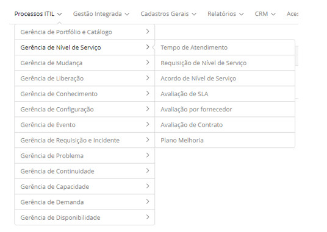

title:  Módulo Gerenciamento de Nível de Serviço
Description: O Gerenciamento de Nível de Serviço é um processo responsável por manter, melhorar e entregar a qualidade. 
# Módulo Gerenciamento de Nível de Serviço

Objetivo do módulo
---------------------

O Gerenciamento de Nível de Serviço é um processo responsável por manter, melhorar e entregar a qualidade esperada pelo negócio, 
através de acordos, contratos, medindo o desempenho, justificando os custos relacionados ao negócio. O mesmo tem como objetivo
assegurar que os serviços de TI atuais e planejados sejam entregues com as metas tangíveis. Isto pode ser feito com um ciclo
constante de negociação, acordo, monitoração, reporte e revisão de metas e resultados obtidos e por meio de ações para corrigir e 
melhorar o nível de serviço entregue.

As principais informações fornecidas pelo processo de Gerenciamento de Nível de Serviço incluem, Acordo de Nível de Serviço (SLA) e
Acordo de Nível Operacional (ANO). O SLA é a definição formal do nível de serviço entregue pelo departamento de TI ou por um 
provedor de serviços externo aos seus clientes. Ele deve incluir os objetivos de nível de serviços, que definirão a sua qualidade e
a sua disponibilidade. O ANO, por sua vez, é um acordo operacional estabelecido entre os provedores de serviços da empresa que 
compõe a prestação de um serviço de TI.

Onde estão suas funcionalidades
--------------------------------

1. Acesse o menu principal **Processos ITIL > Gerência de Nível de Serviço**.

**Figura 1 - Menu do Módulo Gerência de Nível de serviço**

Principal funcionalidade (em destaque)
---------------------------------------

Na seção "Veja também" é possível acessar a(s) funcionalidade(s) principal(is) deste módulo, desta forma se pode obter um
conhecimento mais detalhado.

Veja também
--------------

- [Cadastro e pesquisa de tempo de atendimento](/pt-br/citsmart-platform-7/processes/service-level/time-attendance.html);

- [Cadastro e pesquisa de requisito de acordo de nível de serviço](/pt-br/citsmart-platform-7/processes/service-level/sla-requiriment.html).

!!! tip "About"

    <b>Product/Version:</b> CITSmart | 7.00 &nbsp;&nbsp;
    <b>Updated:</b>07/29/2019 - Larissa Lourenço
